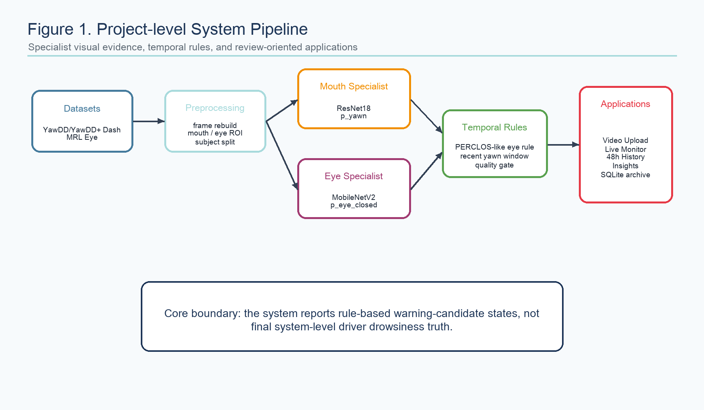
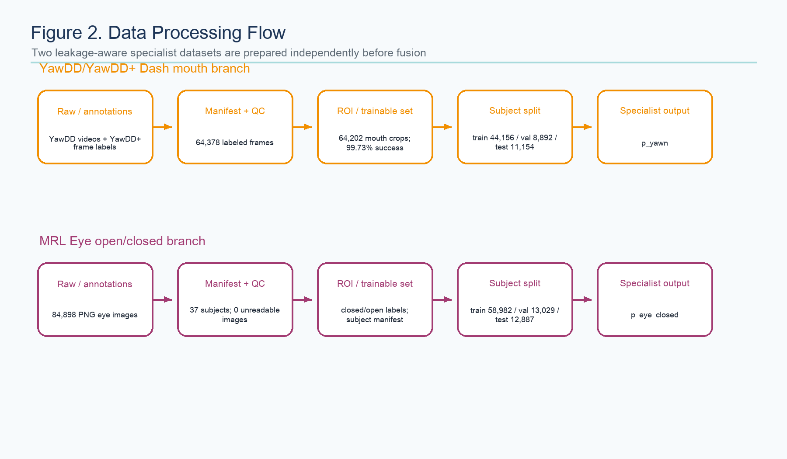
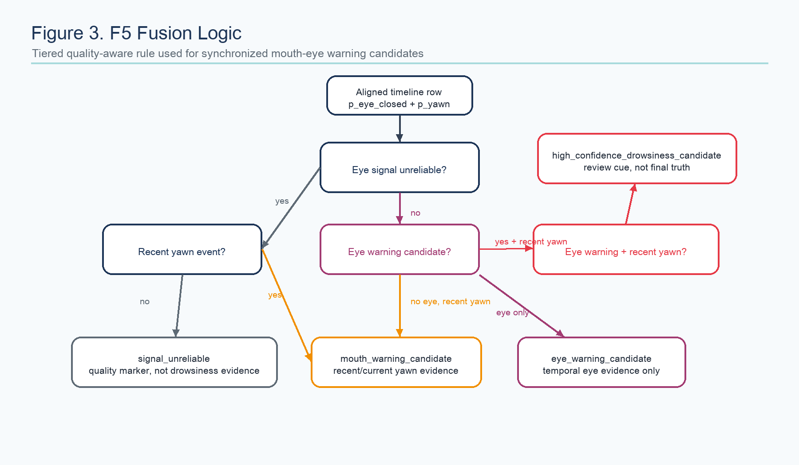
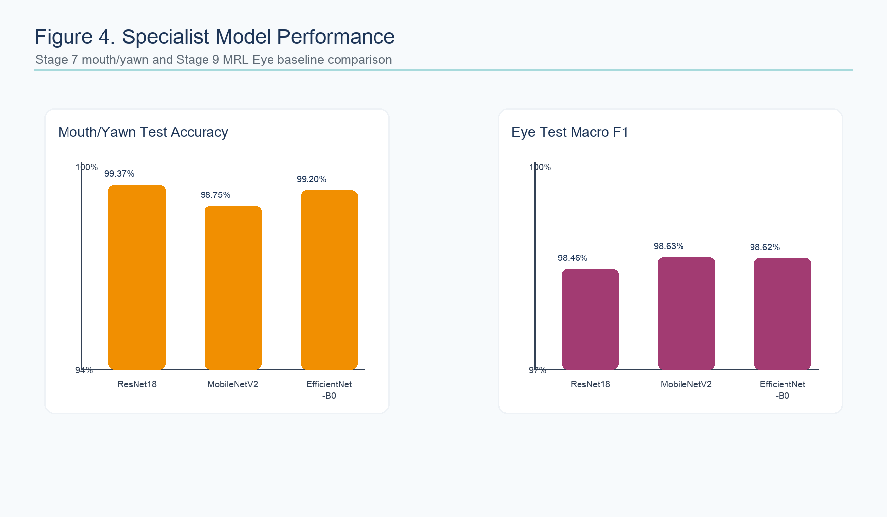
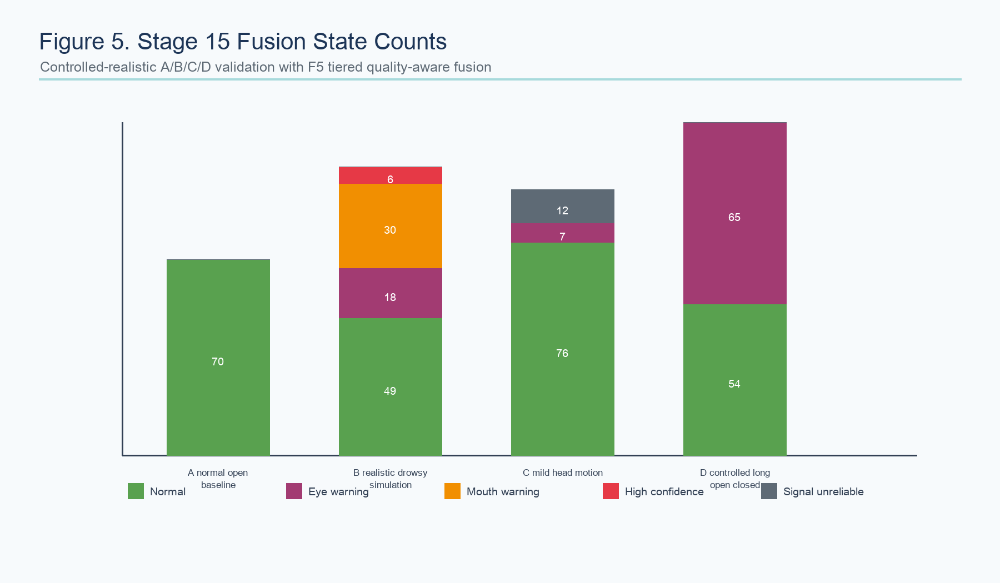

# 基于眼-嘴双通道证据融合的驾驶疲劳候选预警系统报告

作者：Drowsiness Detection Project Group  
生成位置：`docs/final/final_report.pdf`  
生成日期：2026-05-21  

## Abstract / 摘要

本文报告一个模块化驾驶疲劳检测原型系统。项目没有采用端到端“疲劳/非疲劳”单一分类器，而是将可见驾驶员行为拆分为两个可解释的视觉证据通道：基于 YawDD/YawDD+ Dash 数据的嘴部打哈欠识别模块输出 `p_yawn`，基于 MRL Eye 数据的眼部闭合识别模块输出 `p_eye_closed`。两个专门模型的结果再经过运行时 ROI 提取、时序平滑、PERCLOS-like 规则和质量门控，形成 rule-based warning-candidate timeline。当前系统已经扩展到 FastAPI 后端、Next.js 前端、视频上传分析、实时 webcam Live Monitor、本地 48h history/insights 页面与 SQLite 摘要归档，但所有输出仍限定为“疲劳候选预警”而非最终驾驶疲劳真值。

项目的核心训练结果来自 `colab_file/stage7_yawdd_training_r.ipynb` 和 `colab_file/stage9_mrl_eye_training_r.ipynb`。Stage 7 中，YawDD 嘴部模型以 ResNet18 取得最高测试准确率 99.37%，yawn F1 为 97.18%。Stage 9/9B 中，MRL Eye 眼部模型选择 MobileNetV2 作为主模型，测试准确率 98.63%，macro F1 为 98.63%，closed-eye recall 为 98.52%。后续 Stage 12-17 没有重新训练模型，而是围绕信号质量、时序持续性和人类审阅边界设计融合逻辑。该设计在 A/B/C/D 小规模受控视频上达成预期行为：正常视频不触发候选告警，真实打哈欠片段产生嘴部候选，长闭眼片段产生眼部候选，头部遮挡被标注为 signal-unreliable。

## 1. Introduction and Background / 引言与背景

驾驶疲劳检测的难点不只在分类模型本身，还在于“疲劳”这一状态很难由单帧视觉证据直接定义。困倦驾驶事故识别通常依赖事后调查和行为证据，漏报风险较高。PERCLOS 相关研究将眼睑闭合时间比例作为警觉性下降的重要指标，NHTSA 相关报告也将 Perclose/PERCLOS 与视觉注意力 lapses 建立了实验联系。本项目吸收这一思路，但没有直接测量真实眼睑开合百分比，而是将 CNN 的 `p_eye_closed` 作为闭眼概率代理，因此项目文档中使用 “PERCLOS-like” 或 “PERCLOS-inspired” 的表述更准确。

项目采用双通道行为证据的原因也较充分。打哈欠和眼部闭合都可作为疲劳相关行为线索，但单独使用任一信号都存在歧义：张嘴可能来自说话、表情或短暂动作，闭眼概率升高可能来自眨眼、眯眼、反光、眼镜、头部姿态和 ROI 偏差。将嘴部 yawn evidence 与眼部 temporal eye-warning evidence 分离建模，再在时序层进行规则融合，可以让每个模块的训练标签更清楚，也能把“模型分类结果”和“系统级解释”隔离开来。

本报告的写作边界与项目代码保持一致。训练指标只用于评价 specialist model，运行时状态只表示 warning-candidate，不能写成最终系统级驾驶疲劳准确率、临床结论、真实道路验证或部署就绪性。

## 2. Overview of the Architecture/System / 系统架构概述

项目整体结构以 `docs/PROJECT_STRUCTURE.md` 为主线。`dataset/` 存放本地原始或重建数据，`artifacts/` 存放映射表、划分文件和中间结果，`outputs/` 存放训练与运行时证据，`reports/` 存放各阶段人类可读报告，`src/` 负责数据处理、训练和运行时推理，`src/backend/` 提供 FastAPI 服务，`SystemUI/` 提供 Next.js 前端。

系统可概括为四层。数据层中，YawDD/YawDD+ Dash 被重建为 64,378 个带标签帧，并通过 MediaPipe Face Mesh 嘴唇 landmarks 生成 64,202 个可训练嘴部 crop；MRL Eye 则提供 84,898 张眼部图片，标签为 `0 = closed` 和 `1 = open`。训练层中，两个专门任务都使用 ResNet18、MobileNetV2、EfficientNet-B0 进行迁移学习 baseline 比较。运行时层中，MediaPipe FaceLandmarker 从完整人脸视频提取眼部和嘴部 ROI，眼部模型输出 `p_eye_closed`，嘴部模型输出 `p_yawn`，Stage 12 使用质量门控的 rolling PERCLOS-like 规则，Stage 13-15 使用 `F5_tiered_quality_aware_fusion` 生成融合状态。应用层中，Stage 17 负责上传视频分析，Stage 19 负责实时 webcam 原型，Stage 20-22 增加本地账号、主题、通知、history/insights 和 SQLite 摘要归档。

当前后端入口为 `src/backend/app.py`，关键接口包括 `POST /api/analyze-video`、`GET /api/realtime/health`、`POST /api/realtime/session/start`、`POST /api/realtime/frame`、`POST /api/realtime/session/stop` 以及本地 archive API。实时单帧证据由 `src/runtime/realtime_frame_inference.py` 生成，session-local temporal state 由 `src/runtime/realtime_temporal_state.py` 维护。视频上传完整流水线由 `src/runtime/system_video_upload_pipeline.py` 串联 Stage 10、Stage 11、Stage 12-style adapter、Stage 14、F5 fusion 和 keyframe extraction。

## 3. Data Processing and Model Training / 数据处理与模型训练

YawDD/YawDD+ Dash 嘴部数据处理质量较高。重建阶段得到 29 个 subject、64,378 个标注帧，其中 `no_yawn` 为 57,347 帧，`yawn` 为 7,031 帧。嘴部 crop 阶段处理 64,378 帧，MediaPipe Face Mesh 成功 crop 64,093 帧，fallback lower-face crop 109 帧，失败 176 帧，成功率为 99.73%。subject-level split 避免同一 subject 跨 train/val/test 泄漏：train 44,156 张，val 8,892 张，test 11,154 张，三个 split 的 yawn rate 均约 11%。

MRL Eye 数据集经本地检查包含 84,898 张图片、37 个 subject，closed 41,946 张，open 42,952 张。subject-level split 为 train 58,982、val 13,029、test 12,887，三个 split 均包含 closed/open，泄漏检查通过。MRL Eye 的类别比例整体接近均衡，但 subject 内部分布差异较大，因此 subject-level split 比随机 image-level split 更适合作为当前项目的保守评估策略。

两个训练 notebook 均使用 PyTorch / torchvision。Stage 7 嘴部训练采用 224×224 输入、Adam、学习率 `1e-4`、weighted cross entropy、ReduceLROnPlateau、early stopping patience 3，并使用训练集上的轻量旋转、亮度/对比度扰动和仿射缩放。Stage 9 眼部训练采用 224 输入、batch size 64、最多 10 个 epoch、freeze epoch 1、weighted cross entropy、validation macro F1 作为 checkpoint metric，并要求 pretrained weights 成功加载。

## 4. Fusion and Runtime Decision Logic / 融合层逻辑判断

Stage 12 的眼部时序规则选择为 `quality_gated_perclos_mean_ge_0.60_consec`。该规则要求 rolling PERCLOS-like mean-binary ratio 大于等于 0.60，并持续至少 2 个 sampled frames；若 5 帧窗口内 no-face ratio 大于 0.20，则标记为 `signal_unreliable`。这使系统避免把追踪失败当作疲劳证据，也能抑制正常视频中的短暂单帧波动。

Stage 14 的嘴部运行时逻辑从 full-face video 中提取 mouth/lip ROI，并使用恢复的 Stage 7 ResNet18 checkpoint 计算 `p_yawn = softmax(logits)[1]`。`p_yawn >= 0.50` 的 sampled row 记为 yawn event，后续时间窗口内会保留 recent-yawn context。recent-yawn context 是融合上下文，不等于当前帧必然正在打哈欠。

F5 fusion 的核心思想是分层处理质量、嘴部证据和眼部证据。若 eye signal 不可靠且没有 recent yawn，则输出 `signal_unreliable`；若 eye signal 不可靠但存在 recent yawn，则输出 `mouth_warning_candidate`；若 eye warning 与 recent yawn 共同出现，则输出 `high_confidence_drowsiness_candidate`；若只有 eye warning，则输出 `eye_warning_candidate`；若只有 recent yawn，则输出 `mouth_warning_candidate`；否则输出 `normal`。Stage 17.1/17.5 又增加持续眼部证据和强度门控，避免 brief blink-like 或 weak eye evidence 与 recent yawn 偶然重叠时被过度升级。

实时 Live Monitor 使用相同的模型语义，但处理方式更偏向 session-local state。单帧后端只返回 `p_eye_closed`、`p_yawn`、ROI 状态和 signal quality；时序状态由 `RealtimeTemporalState` 在当前会话内维护。Live Monitor 默认 2 FPS 采样，使用 yawn on/off hysteresis、eye warning enter/exit rolling mean、sustained eye-warning 判断、recent reminder 和 cooldown 逻辑驱动前端 overlay、sound cue、risk gauge 和 dashboard event。该路径不存储 raw frame、raw image、raw video 或 blob，只保存轻量 summary/event records。

## 5. Results and Evaluation / 结果与评估

Stage 7 训练结果直接来自 `colab_file/stage7_yawdd_training_r.ipynb` 与恢复后的 `artifacts/recovered_stage7_mouth_yawn/initial_results.csv`。ResNet18 因测试准确率和 yawn F1 表现最佳，被选为嘴部打哈欠专门模型。EfficientNet-B0 的 validation accuracy 更高，但测试集整体表现略低于 ResNet18。考虑到类别不平衡，报告不应只写 accuracy，yawn precision/recall/F1 和 confusion matrix 更能说明模型是否漏掉少数类 yawn。

| Mouth/Yawn Model | Train Acc | Val Acc | Test Acc | Yawn Precision | Yawn Recall | Yawn F1 |
|---|---:|---:|---:|---:|---:|---:|
| ResNet18 | 98.92% | 98.85% | 99.37% | 96.47% | 97.89% | 97.18% |
| MobileNetV2 | 98.97% | 98.48% | 98.75% | 91.74% | 97.48% | 94.52% |
| EfficientNet-B0 | 98.76% | 99.08% | 99.20% | 94.82% | 98.13% | 96.44% |

Stage 9/9B 训练和模型选择结果显示，MobileNetV2 是当前主眼部模型，因为默认阈值下 test accuracy、macro F1、误报/漏报平衡和实时部署适配性最好。ResNet18 at `p_eye_closed >= 0.30` 被保留为 safety-prioritized reference：closed recall 提升到 99.08%，false-open 降到 58，但 false-closed 增加到 251，因此不适合作为默认设置。这里的 false-open 是 true closed 被预测为 open，安全意义上更敏感；false-closed 是 true open 被预测为 closed，主要体现误报倾向。

| Eye Model | Test Acc | Test Macro F1 | Closed Recall | False Open | False Closed | Val-selected Threshold |
|---|---:|---:|---:|---:|---:|---:|
| ResNet18 | 98.46% | 98.46% | 98.59% | 89 | 109 | 0.30 |
| MobileNetV2 | 98.63% | 98.63% | 98.52% | 93 | 84 | 0.30 |
| EfficientNet-B0 | 98.62% | 98.62% | 98.24% | 111 | 67 | 0.30 |

Stage 15 使用真实 Stage 12 eye timeline 和真实 Stage 14 model-generated `p_yawn` timeline 完成同步融合。A/B/C/D 受控视频的 F5 融合结果如下。B 视频中，用户手动观察到 14.3s-16.8s 左右存在打哈欠；Stage 14 在该窗口内 12/12 行触发 yawn-event，mean `p_yawn` 约为 0.981。Stage 15 的 high-confidence candidate 出现在 recent-yawn evidence 与 eye-warning evidence 发生重叠的时段。C 视频中，头部运动、头发/手遮挡等问题被部分归入 signal quality，而不是直接升级为疲劳结论。

| Video | Normal | Eye Warning | Mouth Warning | High Confidence Candidate | Signal Unreliable |
|---|---:|---:|---:|---:|---:|
| A_normal_open_baseline | 70 | 0 | 0 | 0 | 0 |
| B_realistic_drowsy_simulation | 49 | 18 | 30 | 6 | 0 |
| C_mild_head_motion | 76 | 7 | 0 | 0 | 12 |
| D_controlled_long_open_closed | 54 | 65 | 0 | 0 | 0 |

Stage 17 将上述 pipeline 封装为 uploaded-video MVP。后端验证 `B_realistic_drowsy_simulation.mp4` 时得到 103 个 sampled frames、18 个 eye-warning candidate frames、30 个 yawn warning candidate frames、6 个 critical/high-confidence eye warning candidate frames、14 个 yawn events 和 3 个 keyframes。`upload_test/C_upload_test.mp4` 的本地 UI 验证 markers 包括 9 个 high-confidence warning candidate frames、8 个 suppressed brief-eye escalation frames、4 个 keyframes 和 3 张 figures。Stage 19 Live Monitor 则将同一模型证据链迁移到 webcam session，支持 2 FPS 自动采样、实时 frame endpoint、session-local temporal state、overlay、sound cue、risk gauge、history ingestion 和 SQLite summary archive。

## 6. Discussion and Conclusions / 讨论与结论

该项目的主要工程优势在于边界控制清楚。训练指标只声称为 specialist-module performance，运行时输出只声称为 warning-candidate，前端和后端也保留了永久解释文本，避免把单帧概率或规则状态误写成最终驾驶疲劳检测。数据划分采用 subject-level split，也比随机 frame split 更能降低身份和相邻帧泄漏风险。

系统的主要风险来自泛化能力和真实世界验证不足。YawDD 嘴部模型训练于重建 Dash mouth crops，MRL Eye 眼部模型训练于眼部 crop 图片，运行时视频再由 MediaPipe 生成 ROI；训练域和运行时域并不完全一致。Stage 10-15 的 A/B/C/D 视频说明 pipeline 能在小规模受控场景下工作，但 subject 数、光照、摄像头、遮挡、眼镜反光、头部姿态、真实驾驶环境和疲劳 ground truth 都不足。当前系统也没有训练 learned fusion classifier，F5 是规则融合，适合 demo 和审阅辅助，不适合写成生产级疲劳检测器。

结论上，本项目已经完成一个结构完整、证据链较清楚的本地驾驶疲劳候选预警原型：嘴部模型能识别打哈欠证据，眼部模型能识别闭眼证据，时序规则能处理持续性，质量门控能隔离 no-face/ROI failure，前后端能支持上传视频和实时 webcam 原型。若要把项目提升到可发表或可部署级别，下一步应采集更多同步眼-嘴视频，建立 temporal ground-truth fatigue/warning annotation，按 subject/camera/lighting 条件做分层评估，并在有足够标注后再考虑 learned temporal fusion。

## References / 参考文献

[1] NHTSA. Drowsy Driving: Countermeasures That Work. https://www.nhtsa.gov/book/countermeasures-that-work/drowsy-driving  
[2] Dinges, D. F., Mallis, M. M., Maislin, G., & Powell, J. W. Evaluation of techniques for ocular measurement as an index of fatigue and as the basis for alertness management. NHTSA, 1998. https://rosap.ntl.bts.gov/view/dot/2518  
[3] FMCSA/NHTSA. PERCLOS: A Valid Psychophysiological Measure of Alertness. https://ntlsearch.bts.gov/ntl/md.do?id=51369  
[4] Abtahi, S., Omidyeganeh, M., Shirmohammadi, S., & Hariri, B. YawDD: A Yawning Detection Dataset. ACM MMSys Workshop, 2014. https://www.site.uottawa.ca/~shervin/pubs/CogniVue-Dataset-ACM-MMSys2014.pdf  
[5] MRL. MRL Eye Dataset. https://mrl.cs.vsb.cz/eyedataset.html  
[6] Google MediaPipe. MediaPipe Face Mesh. https://github.com/google-ai-edge/mediapipe/wiki/MediaPipe-Face-Mesh  
[7] He, K., Zhang, X., Ren, S., & Sun, J. Deep Residual Learning for Image Recognition. CVPR 2016.  
[8] Sandler, M., Howard, A., Zhu, M., Zhmoginov, A., & Chen, L.-C. MobileNetV2: Inverted Residuals and Linear Bottlenecks. CVPR 2018.  
[9] Tan, M., & Le, Q. EfficientNet: Rethinking Model Scaling for Convolutional Neural Networks. ICML 2019.  
[10] Paszke, A. et al. PyTorch: An Imperative Style, High-Performance Deep Learning Library. NeurIPS 2019.

## Appendices / 附录

主要内部证据文件包括 `docs/PROJECT_STRUCTURE.md`、`docs/PROJECT_CURRENT_STATUS.md`、`reports/stage16_final_integration_summary_report.md`、`reports/stage15_real_mouth_eye_fusion_validation_report.md`、`reports/stage14_mouth_yawn_runtime_validation_report.md`、`reports/stage12_eye_alert_rule_analysis_report.md`、`reports/mrl_eye_stage9b_error_analysis.md`、`reports/yawdd_dash_split_report.md`、`reports/mrl_eye_split_report.md`、`colab_file/stage7_yawdd_training_r.ipynb` 和 `colab_file/stage9_mrl_eye_training_r.ipynb`。

能力使用审计：本次生成使用 research-writing-assistant、figures-diagram、figures-python、latex-output、documents 技能约束。实际产物包括 PDF、Markdown 源稿、5 张 PNG 可视化和构建脚本。验证包括生成脚本执行、PDF 文件完整性检查、PDF 文本抽取、页面渲染抽样和输出文件清单检查。剩余风险是该报告没有引入新的实验结果，所有项目结论均依赖现有 stage reports、notebook 输出和本地源码证据。
