# Beginner Roadmap and Glossary

## 1. Purpose of This Document

This document is the entry map for new VisionGuard readers. It does not replace the other technical documents. It explains:

- what order to read the documents in;
- what different reader roles should focus on;
- the mental model of the whole system;
- what project terms mean;
- which boundaries are most often misunderstood.

## 2. Recommended Reading Order

`docs/tech_learning/BACKEND_API_AND_ARCHIVE_GUIDE.md` was not found in the current tree. The table still reserves that position because backend/archive should be a chapter in the complete learning path, but the file needs to be written later.

| Order | Document | What You Learn | Why It Matters |
|---:|---|---|---|
| 1 | `PROJECT_LEARNING_GUIDE.md` | Overall goal, modular architecture, data/model/runtime/frontend overview | Build the global map first |
| 2 | `DATA_PREPROCESSING_TECHNICAL_GUIDE.md` | Datasets, manifests, label mapping, ROI crop, subject-level split | Understand where model inputs come from |
| 3 | `MODEL_TRAINING_TECHNICAL_GUIDE.md` | Transfer learning, CNN backbones, training settings, checkpoints | Understand how specialist models are trained |
| 4 | `MODEL_EVALUATION_AND_SELECTION_GUIDE.md` | Confusion matrix, precision/recall/F1, model selection boundary | Understand why MobileNetV2 and ResNet18 were selected |
| 5 | `RUNTIME_INFERENCE_AND_TEMPORAL_FUSION_GUIDE.md` | `p_eye_closed`, `p_yawn`, signal quality, temporal fusion | Understand how model evidence becomes warning-candidate output |
| 6 | `BACKEND_API_AND_ARCHIVE_GUIDE.md` | FastAPI endpoints, SQLite archive, payload safety | Currently missing; should be added later |
| 7 | `FRONTEND_PRODUCT_AND_UI_FLOW_GUIDE.md` | Next.js pages, UI flow, localStorage, History/Insights | Understand the product layer users see |
| 8 | `DEPLOYMENT_AND_LOCAL_OPERATION_GUIDE.md` | Local backend/frontend, Vercel, Cloudflare tunnel, env vars | Understand how to run and test remotely |
| 9 | `TESTING_VALIDATION_AND_TROUBLESHOOTING_GUIDE.md` | Health checks, upload validation, troubleshooting matrix | Understand how to debug safely |
| 10 | `REPORT_EVIDENCE_AND_CLAIMS_BOUNDARY_GUIDE.md` | How to describe evidence correctly in reports/viva/resume | Avoid overclaiming |

## 3. Learning Path by Role

| Reader role | Recommended path |
|---|---|
| Absolute beginner | 1 -> 2 -> 5 -> 7 -> 10; understand the system before training details |
| Model-focused reader | 2 -> 3 -> 4 -> 5 -> 10; focus on data, training, evaluation, and runtime boundary |
| Frontend/backend engineer | 5 -> 6 when available -> 7 -> 8 -> 9; focus on APIs, UI, deployment, validation |
| Report writer | 1 -> 2 -> 4 -> 5 -> 10; focus on avoiding metric overclaims |
| Demo/deployment operator | 7 -> 8 -> 9; focus on URLs, CORS, tunnel, preflight |
| Interviewer or portfolio reviewer | 1 -> 4 -> 5 -> 7 -> 10; quickly assess system design and claim boundaries |

## 4. One-Page Project Mental Model

```mermaid
flowchart LR
    A["Datasets"] --> B["Preprocessing"]
    B --> C["Trainable manifests"]
    C --> D["Specialist CNN training"]
    D --> E["Model evaluation and selection"]
    E --> F["Runtime inference"]
    F --> G["Temporal fusion"]
    G --> H["FastAPI backend"]
    H --> I["Next.js frontend"]
    I --> J["Live Monitor / Video Upload"]
    J --> K["Archive / History / Insights"]
    K --> L["Deployment / testing / report claims"]
```

One-sentence mental model:

> VisionGuard is not a single drowsy/not-drowsy classifier. It combines eye/yawn specialist evidence, MediaPipe ROI extraction, signal quality, and rule-based temporal fusion into a warning-candidate monitoring system.

## 5. Glossary

| Term | Definition |
|---|---|
| VisionGuard | The project’s modular driver drowsiness monitoring prototype |
| driver drowsiness monitoring | Monitoring fatigue-related visual cues in a driver; not medical diagnosis |
| specialist model | A model that solves one subtask, such as eye open/closed or no-yawn/yawn |
| `p_eye_closed` | Closed-eye evidence probability output by the eye specialist |
| `p_yawn` | Yawn evidence probability output by the mouth/yawn specialist |
| MRL Eye | Eye dataset used for the eye open/closed specialist |
| YawDD | One dataset source used for yawning-related experiments |
| YawDD+ | The YawDD+ Dash annotation/source branch used in this project |
| NTHUDDD2 | A dataset branch explored in the project; not the main final runtime specialist source |
| ROI | Region of Interest, the local image area a model should inspect |
| crop | ROI image cropped from a frame |
| landmark | Facial keypoint used to locate eyes, mouth, or other facial regions |
| MediaPipe | Tooling used for face/landmark detection |
| Face Mesh | MediaPipe facial mesh/keypoint concept used for ROI localization |
| manifest | CSV/table recording sample paths, labels, and metadata |
| trainable manifest | Manifest containing usable training samples with labels and split |
| label mapping | Mapping between class index and semantic label, such as `0=closed`, `1=open` |
| subject-level split | Train/val/test split by subject to avoid the same person crossing splits |
| data leakage | Validation/test information leaking into training and inflating metrics |
| train/validation/test split | Data split for training, tuning, and final evaluation |
| transfer learning | Fine-tuning a pretrained CNN backbone on a project-specific task |
| CNN | Convolutional Neural Network, commonly used for image classification |
| ResNet18 | Residual CNN backbone; used by the runtime mouth/yawn specialist |
| MobileNetV2 | Lightweight CNN backbone; used by the runtime eye specialist |
| EfficientNet-B0 | CNN backbone used for comparison, not the current final runtime default |
| checkpoint | Saved model weights from training |
| inference | Running a trained model on new input |
| runtime | Actual system operation, including camera/upload, backend, frontend, and archive |
| signal quality | Whether current visual input is reliable, such as face/ROI availability |
| temporal fusion | Combining multi-frame and multi-evidence signals over time |
| rule-based fusion | Human-designed fusion rules, not a trained fusion model |
| warning-candidate | Runtime attention state generated by rules; not a ground-truth drowsiness label |
| alert interval | Timeline segment where a warning-candidate state persists |
| keyframe | Representative frame selected from a warning interval |
| evidence figure | Figure showing runtime evidence over time, such as a fusion timeline |
| FastAPI | Python backend web framework |
| endpoint | API URL path, such as `/api/realtime/frame` |
| API | Interface used by frontend and backend to communicate |
| JSON | Structured data format used by APIs and summaries |
| SQLite archive | Backend local database for compact summary records |
| localStorage | Browser local key-value storage |
| History | Frontend page summarizing Live Monitor alert history |
| Insights | Frontend page summarizing Live Monitor alert patterns |
| Vercel | Current frontend deployment platform |
| Cloudflare Quick Tunnel | Temporary tunnel that forwards public HTTPS traffic to the local backend |
| CORS | Browser cross-origin access control |
| environment variable | Runtime configuration value such as `NEXT_PUBLIC_API_BASE_URL` |
| deployment preflight | Scripted checks for health, CORS, and archive readiness |
| model evaluation | Classification metric evaluation of specialist models |
| confusion matrix | Matrix of true/false positives/negatives for classification |
| precision | Of predicted positive samples, how many are correct |
| recall | Of true positive samples, how many are found |
| F1-score | Harmonic mean of precision and recall |
| ROC/AUC | Probability-ranking analysis tool; not runtime ground truth |
| overclaiming | Making a claim stronger than the evidence supports |

## 6. Most Important Boundaries to Remember

- VisionGuard is not a single end-to-end `drowsy/not-drowsy` classifier.
- Specialist metrics are not full-system accuracy.
- Warning-candidate intervals are not ground-truth drowsiness segments.
- History/Insights are product analytics, not model evaluation.
- Video Upload figures are runtime evidence figures, not accuracy figures.
- Vercel frontend deployment is not backend cloud deployment.
- Local MVP auth is not production authentication.
- The SQLite archive stores compact summaries and should not store raw frames/videos/base64/blob.

## 7. Beginner Self-Test

1. What is the difference between `p_eye_closed` and fatigue probability?
2. Why can `p_yawn` not prove fatigue by itself?
3. Why does subject-level split matter?
4. Why are MediaPipe landmarks and ROI crops needed?
5. What are MobileNetV2 and ResNet18 responsible for at runtime?
6. What is the main role of EfficientNet-B0 in this project?
7. What is the difference between warning-candidate output and ground-truth labels?
8. Where do History and Insights mainly get their data?
9. What can Video Upload evidence figures prove, and what can they not prove?
10. What is the relationship between Vercel frontend and Cloudflare tunnel/local backend?
11. What is the difference between localStorage and the SQLite archive?
12. What can `npm run build` validate, and what can it not validate?
13. Why should demo success not be written as final accuracy?
14. Where should a CORS error usually be investigated?
15. How can this system be described safely in a report?

## 8. Common Reading Mistakes

- Starting from frontend screenshots while ignoring the dataset/model/runtime flow.
- Reading metrics without understanding label mapping.
- Treating every warning as ground truth.
- Confusing localStorage and SQLite.
- Confusing Vercel frontend deployment with backend deployment.
- Skipping limitations.
- Treating upload demos as evaluation.
- Forgetting that the backend/archive guide is currently missing and should be added later.
