# Beginner Roadmap and Glossary

中文标题：初学者学习路线与术语表

## 1. 本文目的

本文是新读者进入 VisionGuard 项目的地图。它不替代其他技术文档，而是告诉你：

- 应该按什么顺序阅读；
- 不同角色应该重点读什么；
- 整个系统的 mental model 是什么；
- 项目术语是什么意思；
- 哪些边界最容易被误解。

## 2. 推荐阅读顺序

当前 `docs/tech_learning/` 中未发现 `BACKEND_API_AND_ARCHIVE_GUIDE_ZH.md`。下表仍保留该位置，因为 backend/archive 是完整学习路径中应有的一章，但当前文件需要后续补写。

| Order | Document | What You Learn | Why It Matters |
|---:|---|---|---|
| 1 | `PROJECT_LEARNING_GUIDE_ZH.md` | 项目整体目标、模块化架构、数据/模型/runtime/frontend 概览 | 先建立全局地图 |
| 2 | `DATA_PREPROCESSING_TECHNICAL_GUIDE_ZH.md` | 数据集、manifest、label mapping、ROI crop、subject-level split | 理解模型输入从哪里来 |
| 3 | `MODEL_TRAINING_TECHNICAL_GUIDE_ZH.md` | transfer learning、CNN backbones、训练设置、checkpoints | 理解 specialist models 如何训练 |
| 4 | `MODEL_EVALUATION_AND_SELECTION_GUIDE_ZH.md` | confusion matrix、precision/recall/F1、模型选择边界 | 理解为什么选 MobileNetV2 和 ResNet18 |
| 5 | `RUNTIME_INFERENCE_AND_TEMPORAL_FUSION_GUIDE_ZH.md` | `p_eye_closed`、`p_yawn`、signal quality、temporal fusion | 理解模型如何变成 warning-candidate |
| 6 | `BACKEND_API_AND_ARCHIVE_GUIDE_ZH.md` | FastAPI endpoints、SQLite archive、payload safety | 当前缺失；建议补写 |
| 7 | `FRONTEND_PRODUCT_AND_UI_FLOW_GUIDE_ZH.md` | Next.js 页面、UI flow、localStorage、History/Insights | 理解用户看到的产品层 |
| 8 | `DEPLOYMENT_AND_LOCAL_OPERATION_GUIDE_ZH.md` | local backend/frontend、Vercel、Cloudflare tunnel、env vars | 理解如何运行和远程测试 |
| 9 | `TESTING_VALIDATION_AND_TROUBLESHOOTING_GUIDE_ZH.md` | health checks、upload validation、故障矩阵 | 理解如何安全排查问题 |
| 10 | `REPORT_EVIDENCE_AND_CLAIMS_BOUNDARY_GUIDE_ZH.md` | 如何在报告/答辩/简历中正确表述证据 | 避免 overclaiming |

## 3. 按角色的学习路径

| Reader role | 推荐路径 |
|---|---|
| 绝对初学者 | 1 -> 2 -> 5 -> 7 -> 10，先理解系统再看训练细节 |
| 模型方向读者 | 2 -> 3 -> 4 -> 5 -> 10，重点理解数据、训练、评估和 runtime boundary |
| 前端/后端工程读者 | 5 -> 6（待补）-> 7 -> 8 -> 9，重点理解 API、UI、部署和验证 |
| 报告写作者 | 1 -> 2 -> 4 -> 5 -> 10，重点避免把 metrics 写成系统准确率 |
| Demo/部署操作者 | 7 -> 8 -> 9，重点看 URL、CORS、tunnel、preflight |
| 面试官/作品集读者 | 1 -> 4 -> 5 -> 7 -> 10，快速判断系统设计与声明边界 |

## 4. 一页项目 mental model

```mermaid
flowchart LR
    A["Datasets"] --> B["Preprocessing"]
    B --> C["Trainable manifests"]
    C --> D["Specialist CNN training"]
    D --> E["Model evaluation and selection"]
    E --> F["Runtime inference"]
    F --> G["Temporal fusion"]
    G --> H["FastAPI backend"]
    H --> I["Next.js frontend"]
    I --> J["Live Monitor / Video Upload"]
    J --> K["Archive / History / Insights"]
    K --> L["Deployment / testing / report claims"]
```

一句话理解：

> VisionGuard 不是一个单一 drowsy/not-drowsy classifier，而是一个把 eye/yawn specialist evidence、MediaPipe ROI、signal quality 和 rule-based temporal fusion 组合起来的 warning-candidate monitoring system。

## 5. Glossary

| Term | Definition |
|---|---|
| VisionGuard | 本项目的模块化 driver drowsiness monitoring prototype |
| driver drowsiness monitoring | 监测驾驶员疲劳相关视觉线索的系统任务，不等于医学诊断 |
| specialist model | 只解决一个子任务的模型，例如 eye open/closed 或 no-yawn/yawn |
| `p_eye_closed` | eye specialist 输出的 closed-eye evidence probability |
| `p_yawn` | mouth/yawn specialist 输出的 yawn evidence probability |
| MRL Eye | 用于 eye open/closed specialist 的眼部数据集 |
| YawDD | 用于 yawning 相关实验的数据集来源之一 |
| YawDD+ | 本项目使用的 YawDD+ Dash annotation/source 分支 |
| NTHUDDD2 | 项目中探索过的数据集分支；当前不是最终 runtime specialist 主要来源 |
| ROI | Region of Interest，模型关注的局部区域 |
| crop | 从 frame 中裁剪出的 ROI 图像 |
| landmark | 人脸关键点，用于定位眼睛、嘴巴等区域 |
| MediaPipe | 用于 face/landmark detection 的工具链 |
| Face Mesh | MediaPipe 人脸网格/关键点概念，用于 ROI 定位 |
| manifest | 记录样本路径、label、metadata 的 CSV/表格 |
| trainable manifest | 只包含可训练样本并带 split/label 的 manifest |
| label mapping | class index 与语义 label 的对应关系，例如 `0=closed`, `1=open` |
| subject-level split | 按 subject 分 train/val/test，避免同一人跨 split 泄漏 |
| data leakage | test/validation 信息进入训练导致指标虚高 |
| train/validation/test split | 训练、调参、最终评估的数据划分 |
| transfer learning | 使用预训练 CNN backbone 并在项目任务上微调 |
| CNN | Convolutional Neural Network，图像分类常用深度学习模型 |
| ResNet18 | residual CNN backbone；本项目 runtime mouth/yawn specialist 使用 |
| MobileNetV2 | lightweight CNN backbone；本项目 runtime eye specialist 使用 |
| EfficientNet-B0 | 用于比较的 CNN backbone，不是当前最终 runtime default |
| checkpoint | 训练得到的模型权重文件 |
| inference | 使用训练好的模型对新输入做预测 |
| runtime | 系统实际运行时，包括 camera/upload、backend、frontend 和 archive |
| signal quality | 当前视觉信号是否可靠，例如 face/ROI 是否可用 |
| temporal fusion | 把多帧、多证据按时间规则组合 |
| rule-based fusion | 人工设计规则的融合，不是训练得到的 fusion model |
| warning-candidate | runtime 规则生成的注意状态，不是 ground-truth drowsiness label |
| alert interval | 连续 warning-candidate 状态形成的一段 timeline |
| keyframe | 从 warning interval 中选出的代表性帧 |
| evidence figure | runtime evidence 随时间变化的图，例如 fusion timeline |
| FastAPI | Python backend web framework |
| endpoint | API URL path，例如 `/api/realtime/frame` |
| API | 前后端通信接口 |
| JSON | API 和 summary 常用结构化数据格式 |
| SQLite archive | backend local compact summary record database |
| localStorage | 浏览器本地 key-value storage |
| History | 前端页面，汇总 Live Monitor alert history |
| Insights | 前端页面，汇总 Live Monitor alert patterns |
| Vercel | 当前 frontend deployment platform |
| Cloudflare Quick Tunnel | 把公网 HTTPS URL 转发到本地 backend 的临时 tunnel |
| CORS | 浏览器跨域访问控制 |
| environment variable | 环境变量，例如 `NEXT_PUBLIC_API_BASE_URL` |
| deployment preflight | 部署前检查脚本，用于 health/CORS/archive checks |
| model evaluation | 对 specialist model 的分类指标评估 |
| confusion matrix | 分类结果中 true/false positive/negative 的矩阵 |
| precision | 预测为某类的样本中有多少是真的 |
| recall | 真实某类样本中有多少被找出 |
| F1-score | precision 和 recall 的调和平均 |
| ROC/AUC | probability ranking 分析工具，不等于 runtime ground truth |
| overclaiming | 把证据支持不了的强结论写进报告 |

## 6. 最重要的边界

- VisionGuard 不是单一 end-to-end `drowsy/not-drowsy` classifier。
- specialist metrics 不是 full-system accuracy。
- warning-candidate intervals 不是 ground-truth drowsiness segments。
- History/Insights 是 product analytics，不是 model evaluation。
- Video Upload figures 是 runtime evidence figures，不是 accuracy figures。
- Vercel frontend deployment 不等于 backend cloud deployment。
- local MVP auth 不是 production authentication。
- SQLite archive 保存 compact summaries，不应存 raw frames/videos/base64/blob。

## 7. Beginner Self-Test

1. `p_eye_closed` 和 fatigue probability 有什么区别？
2. `p_yawn` 为什么不能单独证明疲劳？
3. 为什么 subject-level split 很重要？
4. 为什么需要 MediaPipe landmarks 和 ROI crop？
5. MobileNetV2 和 ResNet18 在 runtime 中分别负责什么？
6. EfficientNet-B0 在项目中主要是什么角色？
7. warning-candidate 和 ground truth label 有什么区别？
8. History 和 Insights 的数据主要来自哪里？
9. Video Upload evidence figures 能证明什么，不能证明什么？
10. Vercel frontend 和 Cloudflare tunnel/local backend 是什么关系？
11. localStorage 和 SQLite archive 有什么区别？
12. `npm run build` 能验证什么，不能验证什么？
13. 为什么不能把 demo success 写成 final accuracy？
14. CORS error 通常应该从哪里查？
15. 报告中如何安全描述这个系统？

## 8. 常见阅读错误

- 从 frontend screenshot 开始理解，而忽略 dataset/model/runtime flow；
- 看 metric 前没有理解 label mapping；
- 把每个 warning 都当成 ground truth；
- 混淆 localStorage 和 SQLite；
- 混淆 Vercel frontend deployment 和 backend deployment；
- 跳过 limitations；
- 把 upload demo 当成 evaluation；
- 忘记 backend/archive guide 当前缺失，需要补写。
