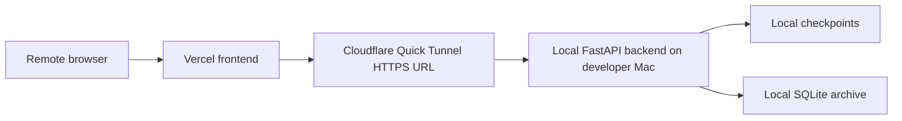

# Deployment and Local Operation Guide

## 1. Purpose of This Document

This guide explains how to run VisionGuard locally and how the current remote testing architecture works. It is not a model guide and not a cloud-native production deployment plan.

It focuses on:

- the local FastAPI backend;
- the local Next.js frontend;
- Vercel frontend deployment;
- Cloudflare Quick Tunnel remote testing;
- SQLite archive and environment variables;
- common operation failures.

Source: `docs/DEPLOYMENT_RUNBOOK.md`, `docs/DAILY_STARTUP_CHECKLIST.md`

## 2. Local Development Components

VisionGuard local operation includes:

| Component | Location | Role |
|---|---|---|
| Python backend | `src/backend/app.py` | FastAPI APIs, realtime frame inference, upload analysis, archive endpoints |
| Runtime code | `src/runtime/` | Specialist inference, temporal fusion, upload pipeline, keyframes |
| Next.js frontend | `SystemUI/` | Live Monitor, Video Upload, History, Insights UI |
| Checkpoints | `outputs/mrl_eye/checkpoints/`, `checkpoints/` | Runtime specialist model weights |
| SQLite archive | `data/visionguard_archive.sqlite` by default | Compact shared-record summaries |
| Deployment scripts | `scripts/` | Environment activation, startup, preflight checks |

Source: `docs/PROJECT_STRUCTURE.md`, `src/backend/app.py`, `src/backend/local_archive.py`

## 3. Local Backend Startup

The runbook confirms this backend startup command:

```bash
VISIONGUARD_ALLOWED_ORIGINS="https://visionguard-systemui.vercel.app,http://localhost:3000,http://127.0.0.1:3000" \
.venv-stage10/bin/python src/backend/app.py --host 127.0.0.1 --port 8000
```

Source: `docs/DEPLOYMENT_RUNBOOK.md`, `docs/DAILY_STARTUP_CHECKLIST.md`

Meaning:

- `127.0.0.1` means the backend listens on the local loopback interface;
- `8000` is the FastAPI backend port;
- `VISIONGUARD_ALLOWED_ORIGINS` controls browser CORS;
- if checkpoints are missing, realtime or upload inference may fail to load models;
- the backend is still running on the developer Mac, not as a Vercel serverless function.

`src/backend/app.py` also confirms:

- upload size limit: `750 * 1024 * 1024` bytes;
- realtime frame limit: `8 * 1024 * 1024` bytes;
- default CORS origins can be combined with environment-configured origins.

Source: `src/backend/app.py`

## 4. Local Frontend Startup

Confirmed frontend npm scripts:

```bash
cd SystemUI
npm run dev
npm run lint
npm run build
```

| Command | Purpose |
|---|---|
| `npm run dev` | Start the Next.js development server |
| `npm run lint` | Run ESLint |
| `npm run build` | Run the Next.js production build |

Source: `SystemUI/package.json`

The frontend API base URL comes from:

- `NEXT_PUBLIC_API_BASE_URL`;
- if unset, `http://127.0.0.1:8000`.

Source: `SystemUI/src/lib/apiConfig.ts`

## 5. Combined Startup / Makefile

`Makefile` confirms:

```bash
make stage17-ui
make deployment-preflight
```

Source: `Makefile`

`make stage17-ui` calls `scripts/start_stage17_ui.sh`. That script:

- sources `scripts/activate_deployment_env.sh`;
- checks `.venv-stage10/bin/python`;
- checks `SystemUI/package.json`;
- starts the backend: `python src/backend/app.py --host 127.0.0.1 --port 8000`;
- starts the frontend: `npm run dev -- --hostname 127.0.0.1 --port 3000`;
- waits for backend and frontend readiness;
- cleans up both processes on Ctrl+C.

Source: `scripts/start_stage17_ui.sh`

## 6. Environment Variables

Confirmed main environment variables:

| Variable | Source | Role |
|---|---|---|
| `NEXT_PUBLIC_API_BASE_URL` | `SystemUI/src/lib/apiConfig.ts`, deployment docs | Backend base URL used by the frontend |
| `VISIONGUARD_ALLOWED_ORIGINS` | `src/backend/app.py`, deployment docs | Backend CORS allowlist |
| `VISIONGUARD_ARCHIVE_ENABLED` | `src/backend/local_archive.py`, `scripts/activate_deployment_env.sh` | Enables/disables local archive |
| `VISIONGUARD_ARCHIVE_DB_PATH` | `src/backend/local_archive.py`, deployment docs | SQLite archive path |
| `VISIONGUARD_ARCHIVE_WRITE_TOKEN` | `src/backend/app.py`, `scripts/deployment_preflight.sh` | Optional archive write token; not production authentication |
| `VISIONGUARD_FRONTEND_ORIGIN` | `scripts/activate_deployment_env.sh` | Frontend origin used by preflight CORS checks |
| `VISIONGUARD_REMOTE_API_BASE_URL` | `scripts/activate_deployment_env.sh`, `scripts/deployment_preflight.sh` | Remote tunnel backend URL |

Source: `scripts/activate_deployment_env.sh`, `scripts/deployment_preflight.sh`

## 7. Current Remote Testing Architecture

The current remote testing setup is usually:



This is an external-access testing architecture, not a full cloud-native backend deployment.

Source: `docs/DEPLOYMENT_RUNBOOK.md`

## 8. Vercel Frontend

The deployment context confirms:

- the frontend deployment comes from `SystemUI/`;
- the production frontend URL uses `https://visionguard-systemui.vercel.app`;
- Vercel `NEXT_PUBLIC_API_BASE_URL` should point to the current Cloudflare tunnel URL;
- when the tunnel URL changes, update the Vercel environment variable and redeploy the frontend.

Source: `docs/DEPLOYMENT_RUNBOOK.md`, `docs/DAILY_STARTUP_CHECKLIST.md`

Key boundary: Vercel deploys the browser frontend. It does not automatically deploy the Python FastAPI backend, model checkpoints, or SQLite archive.

## 9. Cloudflare Quick Tunnel

Cloudflare Quick Tunnel forwards a public HTTPS URL to the local backend:

```bash
cloudflared tunnel --url http://localhost:8000
```

The runbook also uses `npx -y cloudflared tunnel --url http://localhost:8000`.

Quick Tunnel URLs may change. After a change:

1. Confirm local backend health.
2. Start a new tunnel.
3. Test tunnel `/api/realtime/health` and `/api/archive/health`.
4. Update Vercel `NEXT_PUBLIC_API_BASE_URL`.
5. Redeploy the frontend.
6. Run preflight.

Source: `docs/DEPLOYMENT_RUNBOOK.md`, `docs/TUNNEL_DIAGNOSTIC_REPORT.md`

## 10. Preflight and Validation

`scripts/deployment_preflight.sh` checks:

- local backend `/api/realtime/health`;
- local backend `/api/archive/health`;
- `NEXT_PUBLIC_API_BASE_URL` backend health, if set;
- `VISIONGUARD_REMOTE_API_BASE_URL` backend health/archive health, if set;
- CORS preflight, if `VISIONGUARD_FRONTEND_ORIGIN` is set;
- optional archive write test, only when `VISIONGUARD_ARCHIVE_PREFLIGHT_WRITE_TEST=1`.

Source: `scripts/deployment_preflight.sh`

Note: the archive write test writes a clearly marked summary record. It is not run by default because it requires an explicit environment variable.

## 11. Common Operation Failures

| Symptom | Likely cause | Where to check | Safe response |
|---|---|---|---|
| Frontend opens but backend calls fail | `NEXT_PUBLIC_API_BASE_URL` points to an old tunnel | Vercel env, browser network tab | Update env and redeploy |
| CORS error | Backend allowed origins do not include exact frontend origin | `VISIONGUARD_ALLOWED_ORIGINS` | Add origin and restart backend |
| Quick Tunnel creation fails | Cloudflare Quick Tunnel API/network/TLS issue | `docs/TUNNEL_DIAGNOSTIC_REPORT.md` | Switch network, retry, do not update Vercel |
| Archive record count missing | Backend uses wrong DB path | `/api/archive/health`, `VISIONGUARD_ARCHIVE_DB_PATH` | Stop and check DB path; do not delete DB |
| Upload fails | Backend stopped, video too large, pipeline error | backend logs, `outputs/system_video_upload_runs/` | Check logs and input size |
| Checkpoint missing | Runtime model cannot load | checkpoint paths | Restore checkpoint; do not retrain as the first response |
| Build fails | TypeScript/ESLint/Next build issue | `npm run build`, `npm run lint` | Fix frontend errors |
| Port conflict | 8000 or 3000 already occupied | terminal logs | Stop old process or use another port |

Source: `docs/DEPLOYMENT_RUNBOOK.md`, `scripts/deployment_preflight.sh`

## 12. What This Setup Is Not

The current setup is not:

- a production cloud backend;
- production authentication;
- a cloud database;
- a safety-certified deployment;
- a horizontally scalable production architecture;
- final drowsiness accuracy evaluation;
- a medical diagnosis system.

It is a local-model + local-backend + frontend deployment + tunnel remote testing architecture.

## 13. Beginner Startup Checklist

1. Confirm you are in the project root.
2. Confirm `.venv-stage10/bin/python` exists.
3. Confirm checkpoints exist.
4. Start the backend.
5. Confirm `/api/realtime/health` is reachable.
6. Start the frontend.
7. For remote testing, start Cloudflare Quick Tunnel.
8. Confirm tunnel health endpoints.
9. Update Vercel `NEXT_PUBLIC_API_BASE_URL` and redeploy.
10. Run `scripts/deployment_preflight.sh`.
11. Do not delete `data/visionguard_archive.sqlite` to “fix” counts.

## 14. Common Mistakes

- Deploying the frontend and assuming the backend is also deployed.
- Forgetting to update Vercel after the tunnel URL changes.
- Testing the Vercel page while the backend is not running.
- Confusing the local SQLite archive with a cloud database.
- Treating `VISIONGUARD_ARCHIVE_WRITE_TOKEN` as production authentication.
- Accidentally committing raw datasets, checkpoints, SQLite DB files, or archive exports.
- Updating Vercel env before tunnel health passes.
- Describing remote demo success as a production safety deployment.
