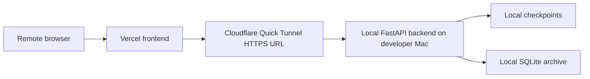

# Deployment and Local Operation Guide

中文标题：本地运行与远程测试部署指南

## 1. 本文目的

本文解释如何本地运行 VisionGuard，以及当前远程测试架构如何工作。它不是模型训练指南，也不是云原生生产部署方案。

本文重点：

- local FastAPI backend；
- local Next.js frontend；
- Vercel frontend deployment；
- Cloudflare Quick Tunnel remote testing；
- SQLite archive 和环境变量；
- 常见运行错误。

Source: `docs/DEPLOYMENT_RUNBOOK.md`, `docs/DAILY_STARTUP_CHECKLIST.md`

## 2. 本地开发组件

VisionGuard 本地运行至少涉及：

| 组件 | 位置 | 作用 |
|---|---|---|
| Python backend | `src/backend/app.py` | FastAPI API、realtime frame inference、upload analysis、archive endpoints |
| Runtime code | `src/runtime/` | specialist inference、temporal fusion、upload pipeline、keyframes |
| Next.js frontend | `SystemUI/` | Live Monitor、Video Upload、History、Insights UI |
| Checkpoints | `outputs/mrl_eye/checkpoints/`, `checkpoints/` | runtime specialist model weights |
| SQLite archive | `data/visionguard_archive.sqlite` by default | compact shared-record summaries |
| Deployment scripts | `scripts/` | environment activation、startup、preflight checks |

Source: `docs/PROJECT_STRUCTURE.md`, `src/backend/app.py`, `src/backend/local_archive.py`

## 3. 本地 backend 启动

Runbook 中确认的 backend 启动命令：

```bash
VISIONGUARD_ALLOWED_ORIGINS="https://visionguard-systemui.vercel.app,http://localhost:3000,http://127.0.0.1:3000" \
.venv-stage10/bin/python src/backend/app.py --host 127.0.0.1 --port 8000
```

Source: `docs/DEPLOYMENT_RUNBOOK.md`, `docs/DAILY_STARTUP_CHECKLIST.md`

含义：

- `127.0.0.1` 表示只在本机 loopback 监听；
- `8000` 是 FastAPI backend port；
- `VISIONGUARD_ALLOWED_ORIGINS` 控制浏览器 CORS；
- 如果 checkpoint 缺失，realtime 或 upload inference 可能无法正常加载模型；
- backend 仍运行在开发者 Mac 上，不是 Vercel serverless function。

`src/backend/app.py` 中也确认了：

- upload size limit: `750 * 1024 * 1024` bytes；
- realtime frame limit: `8 * 1024 * 1024` bytes；
- default CORS origins 可与 env origins 合并。

Source: `src/backend/app.py`

## 4. 本地 frontend 启动

确认的 frontend npm scripts：

```bash
cd SystemUI
npm run dev
npm run lint
npm run build
```

| Command | 作用 |
|---|---|
| `npm run dev` | 启动 Next.js development server |
| `npm run lint` | 运行 ESLint |
| `npm run build` | 运行 Next.js production build |

Source: `SystemUI/package.json`

frontend 默认 API base URL 来自：

- `NEXT_PUBLIC_API_BASE_URL`；
- 如果未设置，则使用 `http://127.0.0.1:8000`。

Source: `SystemUI/src/lib/apiConfig.ts`

## 5. Combined Startup / Makefile

`Makefile` 中确认了：

```bash
make stage17-ui
make deployment-preflight
```

Source: `Makefile`

`make stage17-ui` 调用 `scripts/start_stage17_ui.sh`。该脚本：

- source `scripts/activate_deployment_env.sh`；
- 检查 `.venv-stage10/bin/python`；
- 检查 `SystemUI/package.json`；
- 启动 backend: `python src/backend/app.py --host 127.0.0.1 --port 8000`；
- 启动 frontend: `npm run dev -- --hostname 127.0.0.1 --port 3000`；
- 等待 backend 和 frontend ready；
- Ctrl+C 时清理两个进程。

Source: `scripts/start_stage17_ui.sh`

## 6. 环境变量

确认的主要环境变量：

| Variable | 来源 | 作用 |
|---|---|---|
| `NEXT_PUBLIC_API_BASE_URL` | `SystemUI/src/lib/apiConfig.ts`, deployment docs | frontend build/runtime 使用的 backend base URL |
| `VISIONGUARD_ALLOWED_ORIGINS` | `src/backend/app.py`, deployment docs | backend CORS allowlist |
| `VISIONGUARD_ARCHIVE_ENABLED` | `src/backend/local_archive.py`, `scripts/activate_deployment_env.sh` | 是否启用 local archive |
| `VISIONGUARD_ARCHIVE_DB_PATH` | `src/backend/local_archive.py`, deployment docs | SQLite archive path |
| `VISIONGUARD_ARCHIVE_WRITE_TOKEN` | `src/backend/app.py`, `scripts/deployment_preflight.sh` | 可选 archive write token，不是 production auth |
| `VISIONGUARD_FRONTEND_ORIGIN` | `scripts/activate_deployment_env.sh` | preflight CORS 测试用 frontend origin |
| `VISIONGUARD_REMOTE_API_BASE_URL` | `scripts/activate_deployment_env.sh`, `scripts/deployment_preflight.sh` | remote tunnel backend URL |

Source: `scripts/activate_deployment_env.sh`, `scripts/deployment_preflight.sh`

## 7. 当前远程测试架构

当前远程测试通常是：



这是一种外部访问测试架构，不是完整 cloud-native backend deployment。

Source: `docs/DEPLOYMENT_RUNBOOK.md`

## 8. Vercel frontend

部署上下文确认：

- frontend 部署来自 `SystemUI/`；
- production frontend URL 使用 `https://visionguard-systemui.vercel.app`；
- Vercel `NEXT_PUBLIC_API_BASE_URL` 应指向当前 Cloudflare tunnel URL；
- tunnel URL 变化后，需要更新 Vercel env var 并 redeploy frontend。

Source: `docs/DEPLOYMENT_RUNBOOK.md`, `docs/DAILY_STARTUP_CHECKLIST.md`

关键边界：Vercel 部署的是 browser frontend，不自动部署 Python FastAPI backend、模型 checkpoints 或 SQLite archive。

## 9. Cloudflare Quick Tunnel

Cloudflare Quick Tunnel 把公网 HTTPS URL 转发到本机 backend：

```bash
cloudflared tunnel --url http://localhost:8000
```

或 runbook 中通过 `npx -y cloudflared tunnel --url http://localhost:8000`。

Quick Tunnel URL 可能变化。变化后应：

1. 确认 local backend health；
2. 启动新 tunnel；
3. 测试 tunnel `/api/realtime/health` 和 `/api/archive/health`；
4. 更新 Vercel `NEXT_PUBLIC_API_BASE_URL`；
5. redeploy frontend；
6. 运行 preflight。

Source: `docs/DEPLOYMENT_RUNBOOK.md`, `docs/archive/deployment/TUNNEL_DIAGNOSTIC_REPORT.md`

## 10. Preflight 和验证

`scripts/deployment_preflight.sh` 会检查：

- local backend `/api/realtime/health`；
- local backend `/api/archive/health`；
- `NEXT_PUBLIC_API_BASE_URL` backend health（如果设置）；
- `VISIONGUARD_REMOTE_API_BASE_URL` backend health/archive health（如果设置）；
- CORS preflight（如果设置 `VISIONGUARD_FRONTEND_ORIGIN`）；
- 可选 archive write test（仅当 `VISIONGUARD_ARCHIVE_PREFLIGHT_WRITE_TEST=1`）。

Source: `scripts/deployment_preflight.sh`

注意：archive write test 会写入一个明确标记的 summary record。默认不运行，因为它需要显式设置环境变量。

## 11. 常见运行失败

| 症状 | 常见原因 | 检查位置 | 安全处理 |
|---|---|---|---|
| 前端能打开但 backend calls fail | `NEXT_PUBLIC_API_BASE_URL` 指向旧 tunnel | Vercel env, browser network tab | 更新 env 并 redeploy |
| CORS error | backend allowed origins 缺少 exact frontend origin | `VISIONGUARD_ALLOWED_ORIGINS` | 加入 origin 后重启 backend |
| Quick Tunnel 创建失败 | Cloudflare Quick Tunnel API/network/TLS 问题 | `docs/archive/deployment/TUNNEL_DIAGNOSTIC_REPORT.md` | 换网络、重试、不要更新 Vercel |
| archive record count 丢失 | backend 使用了错误 DB path | `/api/archive/health`, `VISIONGUARD_ARCHIVE_DB_PATH` | 停止并核对 DB path，不要删除 DB |
| upload fails | backend 未运行、视频过大、pipeline error | backend logs, `outputs/system_video_upload_runs/` | 检查 logs 和 input size |
| checkpoint missing | runtime 模型无法加载 | checkpoint paths | 恢复 checkpoint，不要重新训练作为第一反应 |
| build fails | TypeScript/ESLint/Next build 问题 | `npm run build`, `npm run lint` | 按报错修复 frontend |
| port conflict | 8000 或 3000 被占用 | terminal logs | 停掉旧进程或换端口 |

Source: `docs/DEPLOYMENT_RUNBOOK.md`, `scripts/deployment_preflight.sh`

## 12. 这个 setup 不是什么

当前 setup 不是：

- 生产 cloud backend；
- 生产 authentication；
- cloud database；
- safety-certified deployment；
- 可水平扩展的生产架构；
- final drowsiness accuracy evaluation；
- 医疗诊断系统。

它是一个 local-model + local-backend + frontend deployment + tunnel remote testing 架构。

## 13. 初学者启动清单

1. 确认在 project root。
2. 确认 `.venv-stage10/bin/python` 存在。
3. 确认 checkpoints 存在。
4. 启动 backend。
5. 确认 `/api/realtime/health` 可访问。
6. 启动 frontend。
7. 如果远程测试，启动 Cloudflare Quick Tunnel。
8. 确认 tunnel health endpoints。
9. 更新 Vercel `NEXT_PUBLIC_API_BASE_URL` 并 redeploy。
10. 运行 `scripts/deployment_preflight.sh`。
11. 不要删除 `data/visionguard_archive.sqlite` 来“修复”计数问题。

## 14. 常见错误

- 部署 frontend 后以为 backend 也部署了；
- tunnel URL 改了但忘记更新 Vercel；
- backend 没运行就测试 Vercel 页面；
- 混淆 local SQLite archive 和 cloud database；
- 把 `VISIONGUARD_ARCHIVE_WRITE_TOKEN` 当成生产认证；
- 把 raw datasets、checkpoints、SQLite DB 或 archive exports 误提交到 GitHub；
- tunnel health 没通过就更新 Vercel env；
- 把 remote demo success 写成 production safety deployment。
