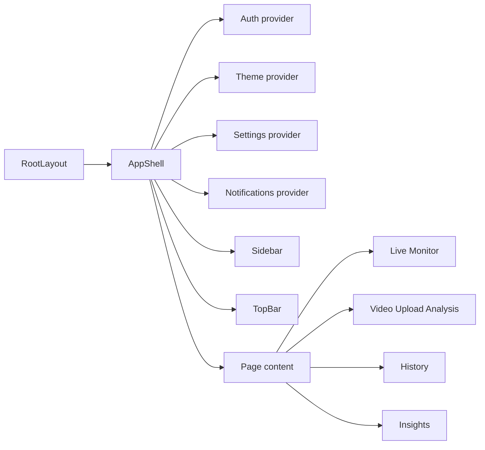

# Frontend Product and UI Flow Guide

## 1. Purpose of This Document

This document explains how the VisionGuard Next.js frontend presents runtime evidence to users. It is not a model-training guide and not an internal backend API guide. It focuses on:

- what pages users see;
- what backend/runtime data each page connects to;
- what is product presentation versus technical evidence;
- which UI outputs must not be interpreted as model accuracy or safety certification.

Source: `SystemUI/src/app/layout.tsx`, `SystemUI/src/components/dashboard/AppShell.tsx`

## 2. Frontend Role in VisionGuard

`SystemUI/` is the VisionGuard product frontend. It uses:

| Technology | Role in this project |
|---|---|
| Next.js App Router | Defines pages such as `/`, `/video-upload`, `/history-48h`, and `/insights` |
| React | Organizes AppShell, pages, and interactive components |
| TypeScript | Defines frontend types, API response types, and store shapes |
| Tailwind CSS | Provides layout and visual styling |
| lucide-react | Provides icons |
| Recharts | Supports some UI chart presentation |

The frontend should be understood as a product interface over runtime evidence. It does not train models, modify checkpoints, change temporal fusion thresholds, or turn UI risk scores into true drowsiness probabilities.

Source: `SystemUI/package.json`

## 3. High-Level Frontend Architecture



Route and page mapping:

| Route file | Route | Visible page | Purpose |
|---|---|---|---|
| `SystemUI/src/app/page.tsx` | `/` | `Live Monitor` | Realtime webcam monitoring, mounted directly by `AppShell` |
| `SystemUI/src/app/video-upload/page.tsx` | `/video-upload` | `Video Upload Analysis` | Upload a video and inspect backend-generated evidence |
| `SystemUI/src/app/history-48h/page.tsx` | `/history-48h` | `History` | View recent Live Monitor alert history, default 48h scope |
| `SystemUI/src/app/insights/page.tsx` | `/insights` | `Insights` | Summarize recent Live Monitor alert analytics |

Note: the `/` route page returns `null` because `LiveMonitorPage` is rendered directly by `AppShell` based on the pathname.

Source: `SystemUI/src/app/page.tsx`, `SystemUI/src/components/dashboard/AppShell.tsx`

## 4. App Shell and Navigation

`AppShell` wraps the full frontend application:

- if the local MVP user is not ready, it shows loading;
- if there is no current user, it shows `LoginScreen`;
- if the user is logged in, it shows the sidebar, top bar, and page content;
- `/` shows `LiveMonitorPage`;
- other routes show their route `children`.

Source: `SystemUI/src/components/dashboard/AppShell.tsx`

Current visible sidebar navigation:

| Label | Route |
|---|---|
| `Live Monitor` | `/` |
| `Video Upload Analysis` | `/video-upload` |
| `History` | `/history-48h` |
| `Insights` | `/insights` |

`History` can still use the `/history-48h` route because the route is a compatibility path while the product-facing page name is `History`.

Source: `SystemUI/src/components/dashboard/Sidebar.tsx`, `SystemUI/src/components/dashboard/TopBar.tsx`

## 5. Live Monitor Page

Live Monitor is the realtime webcam workflow. The core path is:

```text
browser webcam -> canvas JPEG frame -> /api/realtime/frame
-> backend frame inference -> temporal state
-> frontend risk display / overlay / sound / history ingestion
```

Confirmed frontend behavior:

- opens the camera with `getUserMedia`;
- default sampling FPS is 2;
- sampled frames are capped at about `640 x 360`;
- JPEG quality is `0.85`;
- calls `/api/realtime/session/start`, `/api/realtime/frame`, and `/api/realtime/session/stop`;
- converts backend temporal/fusion response into frontend alerts;
- stores stable Live Monitor records through notification/history ingestion;
- sound alerts and critical acknowledgement are UI/driver-feedback behavior, not model training logic.

Source: `SystemUI/src/components/dashboard/LiveVideoCard.tsx`, `SystemUI/src/components/dashboard/LiveMonitorPage.tsx`, `SystemUI/src/lib/liveMonitorAlertUtils.ts`

Minimal Live Monitor Mode boundary:

- it hides camera preview, recent events, charts, and extra dashboard panels;
- it does not disable frame sampling;
- it does not change backend inference;
- it does not change temporal fusion;
- it does not disable sound alerts;
- it does not disable visual warning overlays;
- it does not change critical warning acknowledgement.

Source: `SystemUI/src/components/dashboard/UserProfileMenu.tsx`, `SystemUI/src/lib/settingsStore.tsx`, `SystemUI/src/components/dashboard/LiveVideoCard.tsx`

## 6. Video Upload Analysis Page

Video Upload Analysis is an evidence-oriented workspace. It lets a user upload a local video and calls the backend upload pipeline.

Confirmed flow:

1. User selects a video file.
2. Frontend calls `/api/analyze-video`.
3. Backend runs the upload pipeline.
4. Frontend displays `Analysis Summary`.
5. Frontend displays `Alert Intervals`.
6. Frontend displays backend-generated `Evidence Timeline` figures.
7. Frontend displays backend-selected keyframes.
8. Technical artifacts are placed in `Technical Details`.
9. `Download report` generates an HTML report.

Source: `SystemUI/src/components/video-upload/VideoUploadAnalysis.tsx`, `SystemUI/src/lib/videoUploadUtils.ts`

Evidence Timeline tabs come from backend artifact URLs:

- Fusion timeline;
- `p_eye_closed` over time;
- `p_yawn` over time.

These figures are runtime evidence visualizations, not ROC/PR/accuracy charts, and should not be replaced with frontend-only charts.

Source: `SystemUI/src/components/video-upload/EvidenceFigures.tsx`, `SystemUI/src/lib/videoUploadUtils.ts`

## 7. History Page

The visible page name is `History`, while the route remains `/history-48h`. The default filter is `timeWindowHours: 48`, and the source is `live_monitor`.

The History page:

- reads `visionguard.history48h.v1` from browser localStorage;
- fetches backend archive records with source=`live_monitor`;
- merges the local store and archive store;
- deduplicates events and sessions;
- filters by time window, alert type, and selected drive/session;
- shows a limited Recent Drives list by default, with expansion for more drives;
- downloads HTML summary, CSV, and raw JSON.

Source: `SystemUI/src/components/history-48h/History48hPage.tsx`, `SystemUI/src/components/history-48h/RecentSessionsSummary.tsx`, `SystemUI/src/lib/history48hStorage.ts`, `SystemUI/src/lib/history48hExportUtils.ts`

History is runtime/product analytics, not model evaluation. It shows Live Monitor warning-candidate records, not ground-truth drowsiness labels.

## 8. Insights Page

Insights summarizes product-level patterns from recent Live Monitor alerts:

- Key Insight Summary;
- Drive Highlights;
- Alert Mix;
- Time of Day;
- Camera Signal;
- Attention Areas;
- `Download insights report` HTML report.

Insights data is also limited to Live Monitor records through `liveMonitorOnly(...)` and archive `source: "live_monitor"`.

Source: `SystemUI/src/components/insights/InsightsPage.tsx`, `SystemUI/src/lib/insightsUtils.ts`, `SystemUI/src/lib/insightsExportUtils.ts`

Insights is not a model accuracy report. It answers “what recent Live Monitor alert patterns appeared,” not “what is the final true model accuracy.”

## 9. Local MVP Auth, Settings, Theme, and Notifications

The current frontend uses local MVP account behavior, not production authentication.

| Feature | Implementation | Meaning |
|---|---|---|
| Local auth | `SystemUI/src/lib/authStore.tsx` | Stores a local MVP user in localStorage |
| Settings | `SystemUI/src/lib/settingsStore.tsx` | Currently includes Minimal Live Monitor Mode |
| Theme | `SystemUI/src/lib/themeStore.tsx` | Day/night UI theme |
| Notifications | `SystemUI/src/lib/notificationStore.tsx` | Top-right notification center |
| Profile menu | `SystemUI/src/components/dashboard/UserProfileMenu.tsx` | Opens Settings / Logout |

Do not claim the current implementation includes production registration, password reset, email verification, billing, cloud sync, or production authentication.

## 10. Frontend Storage Keys

Confirmed localStorage keys:

| Key | Source | Role |
|---|---|---|
| `visionguard.auth.v1` | `SystemUI/src/lib/authStore.tsx` | Local MVP user state |
| `visionguard.settings.v1` | `SystemUI/src/lib/settingsStore.tsx` | Minimal Live Monitor Mode and local settings |
| `visionguard.theme.v1` | `SystemUI/src/lib/themeStore.tsx` | Day/night theme |
| `visionguard.notifications.v1` | `SystemUI/src/lib/notificationStore.tsx` | Notification center records |
| `visionguard.liveMonitorDashboard.v1` | `SystemUI/src/lib/liveMonitorDashboardStore.ts` | Live Monitor dashboard events and risk points |
| `visionguard.history48h.v1` | `SystemUI/src/lib/history48hStorage.ts` | History events and sessions |
| `visionguard.videoUpload.backendUrl` | `SystemUI/src/components/video-upload/VideoUploadAnalysis.tsx` | Video Upload page backend URL preference |
| `visionguard.archiveClientId.v1` | `SystemUI/src/lib/archiveClientId.ts` | Browser archive client identifier |

These storage keys are frontend local state. They are not the backend SQLite archive.

## 11. API Base URL and Frontend/Backend Integration

The frontend calls the backend through `NEXT_PUBLIC_API_BASE_URL`, or defaults to `http://127.0.0.1:8000`.

Source: `SystemUI/src/lib/apiConfig.ts`

Local development is typically:

```text
Next.js frontend on localhost:3000
-> FastAPI backend on 127.0.0.1:8000
```

Remote Vercel testing is typically:

```text
Vercel frontend
-> Cloudflare Quick Tunnel HTTPS URL
-> local FastAPI backend on developer Mac
```

This means Vercel deploys the frontend. It does not mean the backend has been deployed as a cloud-native backend.

Source: `docs/DEPLOYMENT_RUNBOOK.md`

## 12. UI Boundaries and Non-Goals

The frontend should not:

- claim medical diagnosis;
- claim final driving safety judgment;
- treat the UI risk score as model probability;
- describe specialist metrics as full-system accuracy;
- change backend thresholds or temporal logic during UI polishing;
- store raw webcam frames, raw uploaded videos, base64, or blobs in History/Insights;
- describe local MVP auth as production authentication;
- treat History/Insights as model evaluation results.

## 13. Beginner Checklist

- Can I explain why `/` renders `LiveMonitorPage` through `AppShell`?
- Can I explain why the `History` label still uses `/history-48h`?
- Can I distinguish localStorage from the SQLite archive?
- Can I explain that Video Upload evidence figures come from backend artifacts?
- Can I explain why Insights is not a model accuracy report?
- Can I explain that Minimal Live Monitor Mode changes display but not inference?
- Can I explain the relationship between the Vercel frontend and local backend tunnel?

## 14. Common Mistakes

- Treating the frontend risk gauge as raw model probability.
- Assuming History automatically includes Video Upload results.
- Confusing `localStorage` with the SQLite archive.
- Assuming Vercel deployment also deploys the Python backend.
- Changing runtime thresholds while editing UI copy.
- Treating upload evidence figures as ROC/accuracy figures.
- Describing the local MVP account as production authentication.
