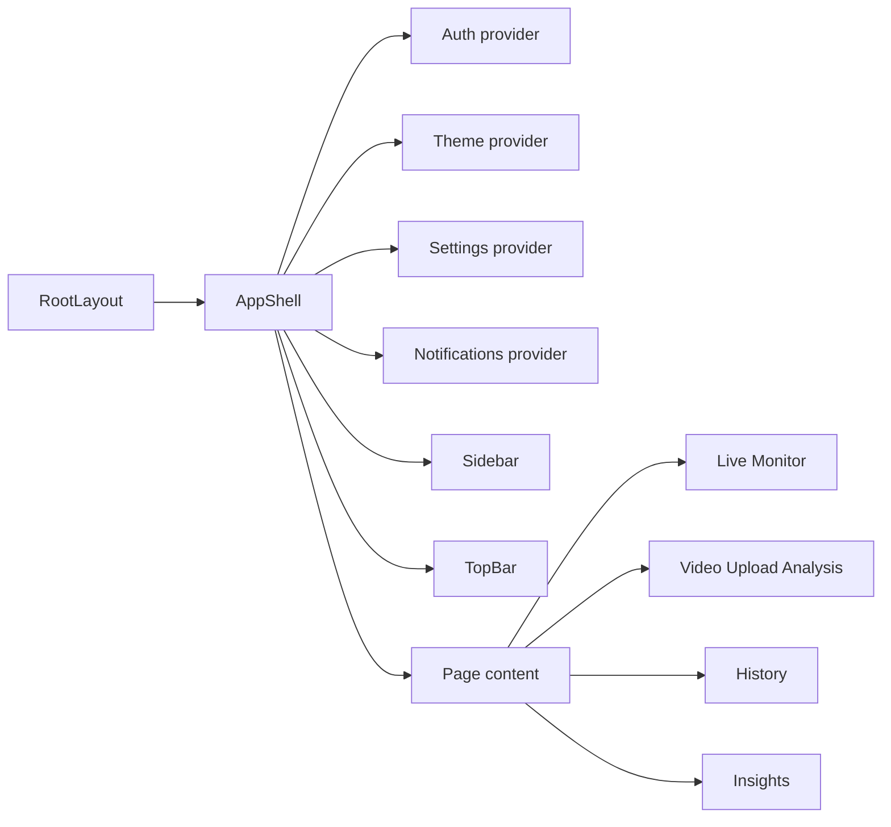

# Frontend Product and UI Flow Guide

中文标题：前端产品界面与用户流程技术指南

## 1. 本文目的

本文解释 VisionGuard 的 Next.js 前端如何把底层 runtime evidence 展示给用户。它不是模型训练文档，也不是后端 API 内部实现文档，而是关注：

- 用户看到哪些页面；
- 每个页面连接哪些 backend/runtime 数据；
- 哪些内容是产品展示，哪些内容是技术 evidence；
- 哪些界面不应该被解释成模型准确率或安全认证。

Source: `SystemUI/src/app/layout.tsx`, `SystemUI/src/components/dashboard/AppShell.tsx`

## 2. 前端在 VisionGuard 中的角色

`SystemUI/` 是 VisionGuard 的产品前端。它使用：

| 技术 | 项目中的作用 |
|---|---|
| Next.js App Router | 定义 `/`, `/video-upload`, `/history-48h`, `/insights` 等页面 |
| React | 组织 AppShell、页面和交互组件 |
| TypeScript | 定义前端类型、API response 类型和 store 结构 |
| Tailwind CSS | 页面布局和视觉样式 |
| lucide-react | 图标 |
| Recharts | 用于部分 UI 图表展示 |

前端应被理解为 runtime evidence 的产品界面。它不训练模型，不改变 checkpoint，不应修改 temporal fusion 阈值，也不应把 UI risk score 写成真实 drowsiness probability。

Source: `SystemUI/package.json`

## 3. 高层前端架构



路由和页面映射：

| Route file | Route | 用户看到的页面 | 主要目的 |
|---|---|---|---|
| `SystemUI/src/app/page.tsx` | `/` | `Live Monitor` | 实时 webcam monitoring 页面由 `AppShell` 直接挂载 |
| `SystemUI/src/app/video-upload/page.tsx` | `/video-upload` | `Video Upload Analysis` | 上传视频并查看 backend-generated evidence |
| `SystemUI/src/app/history-48h/page.tsx` | `/history-48h` | `History` | 查看最近 Live Monitor alert history，默认 48h scope |
| `SystemUI/src/app/insights/page.tsx` | `/insights` | `Insights` | 汇总最近 Live Monitor alerts 的产品 analytics |

注意：`/` route 的 `page.tsx` 返回 `null`，因为 `LiveMonitorPage` 是在 `AppShell` 根据 pathname 直接渲染的。

Source: `SystemUI/src/app/page.tsx`, `SystemUI/src/components/dashboard/AppShell.tsx`

## 4. App Shell 和导航

`AppShell` 包装了整个前端应用：

- 如果 local MVP user 尚未 ready，显示 loading；
- 如果没有 current user，显示 `LoginScreen`；
- 如果已登录，显示 sidebar、top bar 和页面内容；
- `/` 路由显示 `LiveMonitorPage`；
- 其他路由显示对应 `children`。

Source: `SystemUI/src/components/dashboard/AppShell.tsx`

Sidebar 当前可见导航：

| Label | Route |
|---|---|
| `Live Monitor` | `/` |
| `Video Upload Analysis` | `/video-upload` |
| `History` | `/history-48h` |
| `Insights` | `/insights` |

`History` 可以继续使用 `/history-48h` route，因为 route 是兼容性路径，页面产品名已经是 `History`。

Source: `SystemUI/src/components/dashboard/Sidebar.tsx`, `SystemUI/src/components/dashboard/TopBar.tsx`

## 5. Live Monitor 页面

Live Monitor 是实时 webcam 工作流。核心路径是：

```text
browser webcam -> canvas JPEG frame -> /api/realtime/frame
-> backend frame inference -> temporal state
-> frontend risk display / overlay / sound / history ingestion
```

前端确认行为：

- 使用 `getUserMedia` 打开 camera；
- 默认 sampling FPS 为 2；
- 采样 frame 最大约 `640 x 360`；
- JPEG quality 为 `0.85`；
- 调用 `/api/realtime/session/start`, `/api/realtime/frame`, `/api/realtime/session/stop`；
- 根据 backend temporal/fusion response 生成前端 alert；
- 通过 notification/history ingestion 保存稳定 Live Monitor records；
- sound alert 和 critical acknowledgement 是 UI/driver-feedback 行为，不是模型训练逻辑。

Source: `SystemUI/src/components/dashboard/LiveVideoCard.tsx`, `SystemUI/src/components/dashboard/LiveMonitorPage.tsx`, `SystemUI/src/lib/liveMonitorAlertUtils.ts`

Minimal Live Monitor Mode 的边界：

- 它隐藏 camera preview、recent events、charts 和额外 dashboard panels；
- 它不关闭 frame sampling；
- 它不改变 backend inference；
- 它不改变 temporal fusion；
- 它不关闭 sound alerts；
- 它不关闭 visual warning overlays；
- 它不改变 critical warning acknowledgement。

Source: `SystemUI/src/components/dashboard/UserProfileMenu.tsx`, `SystemUI/src/lib/settingsStore.tsx`, `SystemUI/src/components/dashboard/LiveVideoCard.tsx`

## 6. Video Upload Analysis 页面

Video Upload Analysis 是 evidence-oriented workspace。它让用户上传本地视频，然后调用 backend upload pipeline。

确认流程：

1. 用户选择视频文件；
2. 前端调用 `/api/analyze-video`；
3. 后端运行 upload pipeline；
4. 前端展示 `Analysis Summary`；
5. 前端展示 `Alert Intervals`；
6. 前端展示 backend-generated `Evidence Timeline` figures；
7. 前端展示 backend-selected keyframes；
8. 技术 artifacts 放入 `Technical Details`；
9. `Download report` 生成 HTML report。

Source: `SystemUI/src/components/video-upload/VideoUploadAnalysis.tsx`, `SystemUI/src/lib/videoUploadUtils.ts`

Evidence Timeline 的 tabs 来自 backend artifact URL：

- Fusion timeline；
- `p_eye_closed` over time；
- `p_yawn` over time。

这些图是 runtime evidence visualization，不是 ROC/PR/accuracy chart，也不应被前端自制图替代。

Source: `SystemUI/src/components/video-upload/EvidenceFigures.tsx`, `SystemUI/src/lib/videoUploadUtils.ts`

## 7. History 页面

History 的可见页面名是 `History`，但 route 仍为 `/history-48h`。默认 filter 是 `timeWindowHours: 48`，source 是 `live_monitor`。

History 页面处理：

- 从 browser localStorage 读取 `visionguard.history48h.v1`；
- 从 backend archive 读取 source=`live_monitor` 的记录；
- 合并 local store 和 archive store；
- 对 events/sessions 做 dedupe；
- 按 time window、alert type、selected drive/session 过滤；
- Recent Drives 默认只显示有限数量，用户可展开查看更多；
- 下载 HTML summary、CSV、raw JSON。

Source: `SystemUI/src/components/history-48h/History48hPage.tsx`, `SystemUI/src/components/history-48h/RecentSessionsSummary.tsx`, `SystemUI/src/lib/history48hStorage.ts`, `SystemUI/src/lib/history48hExportUtils.ts`

History 是 runtime/product analytics，不是模型 evaluation。它展示 Live Monitor warning-candidate records，而不是 ground-truth drowsiness labels。

## 8. Insights 页面

Insights 汇总最近 Live Monitor alerts 的产品层模式：

- Key Insight Summary；
- Drive Highlights；
- Alert Mix；
- Time of Day；
- Camera Signal；
- Attention Areas；
- `Download insights report` HTML report。

Insights 的数据同样通过 `liveMonitorOnly(...)` 和 archive `source: "live_monitor"` 限定为 Live Monitor records。

Source: `SystemUI/src/components/insights/InsightsPage.tsx`, `SystemUI/src/lib/insightsUtils.ts`, `SystemUI/src/lib/insightsExportUtils.ts`

Insights 不等于模型准确率报告。它回答“最近 Live Monitor alert patterns 是什么”，不回答“模型最终真实准确率是多少”。

## 9. Local MVP Auth、Settings、Theme 和 Notifications

当前前端是 local MVP account 行为，不是生产级 authentication。

| 功能 | 实现位置 | 说明 |
|---|---|---|
| Local auth | `SystemUI/src/lib/authStore.tsx` | 使用 localStorage 保存本地 MVP user |
| Settings | `SystemUI/src/lib/settingsStore.tsx` | 当前包含 Minimal Live Monitor Mode |
| Theme | `SystemUI/src/lib/themeStore.tsx` | day/night UI theme |
| Notifications | `SystemUI/src/lib/notificationStore.tsx` | top-right notification center |
| Profile menu | `SystemUI/src/components/dashboard/UserProfileMenu.tsx` | 打开 Settings / Logout |

不应声称当前实现包含 production registration、password reset、email verification、billing、cloud sync 或 production auth。

## 10. 前端 storage keys

确认的 localStorage keys：

| Key | 来源 | 作用 |
|---|---|---|
| `visionguard.auth.v1` | `SystemUI/src/lib/authStore.tsx` | 本地 MVP user 状态 |
| `visionguard.settings.v1` | `SystemUI/src/lib/settingsStore.tsx` | Minimal Live Monitor Mode 等 local settings |
| `visionguard.theme.v1` | `SystemUI/src/lib/themeStore.tsx` | day/night theme |
| `visionguard.notifications.v1` | `SystemUI/src/lib/notificationStore.tsx` | notification center records |
| `visionguard.liveMonitorDashboard.v1` | `SystemUI/src/lib/liveMonitorDashboardStore.ts` | Live Monitor dashboard events and risk points |
| `visionguard.history48h.v1` | `SystemUI/src/lib/history48hStorage.ts` | History events and sessions |
| `visionguard.videoUpload.backendUrl` | `SystemUI/src/components/video-upload/VideoUploadAnalysis.tsx` | Video Upload page backend URL preference |
| `visionguard.archiveClientId.v1` | `SystemUI/src/lib/archiveClientId.ts` | Browser archive client identifier |

这些 storage keys 是前端本地状态，不等于 backend SQLite archive。

## 11. API base URL 和前后端集成

前端通过 `NEXT_PUBLIC_API_BASE_URL` 或默认 `http://127.0.0.1:8000` 调用后端。

Source: `SystemUI/src/lib/apiConfig.ts`

本地开发通常是：

```text
Next.js frontend on localhost:3000
-> FastAPI backend on 127.0.0.1:8000
```

远程 Vercel 测试通常是：

```text
Vercel frontend
-> Cloudflare Quick Tunnel HTTPS URL
-> local FastAPI backend on developer Mac
```

这意味着：Vercel 部署的是 frontend，不代表 backend 已经 cloud-native 部署。

Source: `docs/DEPLOYMENT_RUNBOOK.md`

## 12. UI 边界和 non-goals

前端不应该：

- 声称医疗诊断；
- 声称最终驾驶安全判断；
- 把 UI risk score 当作 model probability；
- 在 UI 文案里把 specialist metrics 写成 full-system accuracy；
- 随 UI 调整改变 backend threshold 或 temporal logic；
- 保存 raw webcam frames、raw uploaded videos、base64 或 blobs 到 History/Insights；
- 把 local MVP auth 描述为生产认证；
- 把 History/Insights 当作模型评估结果。

## 13. 初学者检查清单

- 能否说明 `/` 为什么由 `AppShell` 渲染 `LiveMonitorPage`？
- 能否说明 `History` label 为什么仍使用 `/history-48h` route？
- 能否区分 localStorage 和 SQLite archive？
- 能否说明 Video Upload evidence figures 来自 backend artifacts？
- 能否说明 Insights 为什么不是 model accuracy report？
- 能否说明 Minimal Live Monitor Mode 只改变显示，不改变推理？
- 能否说明 Vercel frontend 和 local backend tunnel 的关系？

## 14. 常见错误

- 把 frontend risk gauge 当作 raw model probability；
- 以为 History 自动包含 Video Upload results；
- 混淆 `localStorage` 和 SQLite archive；
- 以为部署 Vercel 就部署了 Python backend；
- 为了 UI 文案去改 runtime threshold；
- 把 upload evidence figures 当作 ROC/accuracy 图；
- 把 local MVP account 写成 production authentication。
