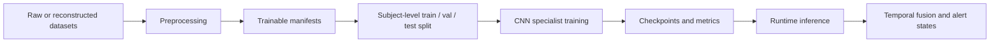

# Model Training Technical Guide

This guide is for readers who are new to VisionGuard. It explains the model training process, the core deep learning concepts behind it, and how the trained models are used by the final runtime system.

Recommended prerequisites:

- `docs/AI_PROJECT_CONTEXT.md`
- `docs/PROJECT_CURRENT_STATUS.md`
- `docs/PROJECT_STRUCTURE.md`
- `docs/tech_learning/PROJECT_LEARNING_GUIDE.md`
- `docs/tech_learning/DATA_PREPROCESSING_TECHNICAL_GUIDE.md`

---

## 1. Purpose of This Document

This guide answers three questions:

1. What models were trained in VisionGuard?
2. How were those models trained from preprocessed data?
3. What role do the trained models play in the final system?

The most important boundary is that VisionGuard is not a single end-to-end `drowsy / not-drowsy` classifier. It trains two specialist visual evidence models:

- an eye open/closed specialist that outputs `p_eye_closed`
- a mouth no-yawn/yawn specialist that outputs `p_yawn`

The final Live Monitor and Video Upload Pipeline combine these probabilities with signal-quality checks and rule-based temporal fusion to produce warning-candidate / alert states. Therefore, specialist model test accuracy must not be reported as full-system drowsiness accuracy.

---

## 2. Where Model Training Fits in VisionGuard

The overall project pipeline can be understood as:



Training learns visual evidence from single ROI images:

- Eye ROI: estimate the probability that the eye is closed.
- Mouth ROI: estimate the probability that the mouth crop shows yawning.

The runtime system then combines evidence over time. A single closed-eye frame does not equal fatigue. Sustained eye closure, stronger `p_eye_closed`, recent `p_yawn`, and camera signal reliability all affect later alert states.

Project sources:

- Runtime eye and mouth model loading: `src/runtime/realtime_frame_inference.py`
- Video upload fusion logic: `src/runtime/system_video_upload_pipeline.py`

---

## 3. Training Tasks in This Project

### 3.1 Eye Open/Closed Classification

The eye specialist is a binary classifier:

| Item | Value |
|---|---|
| Dataset | MRL Eye |
| Label mapping | `0 = closed`, `1 = open` |
| Runtime output | `p_eye_closed = softmax(logits)[0]` |
| Final runtime model | MobileNetV2 |
| Checkpoint | `outputs/mrl_eye/checkpoints/best_mobilenet_v2_mrl_eye.pt` |

Closed-eye evidence is important because sustained closure, frequent closure, or a strong closed-eye probability can be fatigue-related visual evidence. However, eye closure alone is not drowsiness. Blinking, looking down, lighting changes, glasses reflection, and ROI misalignment can affect single-frame classification. The eye model is therefore only an evidence source for later temporal fusion.

Main sources:

- `artifacts/mappings/mrl_eye_trainable_with_split.csv`
- `src/training/train_mrl_eye_baselines.py`
- `outputs/mrl_eye/results/mrl_eye_stage9b_model_selection.json`
- `src/runtime/stage10_eye_roi_consistency.py`

### 3.2 Mouth/Yawn Classification

The mouth specialist is also a binary classifier:

| Item | Value |
|---|---|
| Dataset | YawDD/YawDD+ Dash reconstructed mouth crops |
| Label mapping | `0 = no_yawn`, `1 = yawn` |
| Runtime output | `p_yawn = softmax(logits)[1]` |
| Final runtime model | ResNet18 |
| Checkpoint | `checkpoints/resnet18_best.pt`; the recovered artifact also includes `artifacts/recovered_stage7_mouth_yawn/resnet18_best.pt` |

Yawning evidence also cannot prove fatigue by itself. Talking, laughing, mouth opening, head pose changes, and failed mouth crops can affect `p_yawn`. The mouth model outputs a specialist probability, and temporal fusion uses it as recent yawn context.

Main sources:

- `artifacts/splits/yawdd_dash_subject_split.csv`
- `artifacts/mappings/yawdd_dash_all_mouth_crops_trainable.csv`
- `colab_file/stage7_yawdd_training_r.ipynb`
- `src/training/train_classifier.py`
- `artifacts/recovered_stage7_mouth_yawn/metrics_summary.json`
- `src/runtime/stage14_mouth_yawn_runtime.py`

---

## 4. From Preprocessed Data to Trainable Inputs

The training scripts do not read raw videos or raw image folders directly. They read manifests. A manifest is a CSV file that tells the training code:

- where each image is located
- what its label is
- which subject / video / split it belongs to
- how the crop was produced
- whether the sample passed quality filtering

### 4.1 MRL Eye Manifest

`artifacts/mappings/mrl_eye_trainable_with_split.csv` is the central eye training manifest.

Confirmed information:

| Field | Value |
|---|---|
| Total samples | 84,898 |
| Split | train 58,982; val 13,029; test 12,887 |
| Label distribution | label `1` open: 42,952; label `0` closed: 41,946 |
| Important fields | `image_path`, `subject_id`, `label`, `label_name`, `split` |

Source: `artifacts/mappings/mrl_eye_trainable_with_split.csv`

### 4.2 YawDD/YawDD+ Dash Mouth Manifest

Mouth/yawn training uses a subject-level split manifest.

Confirmed information:

| File | Samples | Split | Label distribution |
|---|---:|---|---|
| `artifacts/splits/yawdd_dash_subject_split.csv` | 64,202 | train 44,156; val 8,892; test 11,154 | no_yawn 57,171; yawn 7,031 |
| `artifacts/mappings/yawdd_dash_all_mouth_crops_trainable.csv` | 64,202 | train 44,156; val 8,892; test 11,154 | same as above |

Sources:

- `artifacts/splits/yawdd_dash_subject_split.csv`
- `artifacts/mappings/yawdd_dash_all_mouth_crops_trainable.csv`

### 4.3 Why Subject-Level Splitting Matters

If frames are randomly split, neighboring frames from the same person can appear in both train and test. The model may learn a subject, video, lighting condition, or camera angle rather than a general visual pattern. This is data leakage or subject leakage.

For facial behavior recognition, subject-level splitting is safer: the same subject should not appear in both training and testing. This makes test performance closer to generalization to a new driver.

---

## 5. Transfer Learning

Transfer learning means using a CNN backbone pretrained on a large dataset, then replacing the final classification head with a task-specific binary classifier.

VisionGuard uses ImageNet-pretrained CNNs because:

- the datasets are not large enough to make training large CNNs from scratch ideal
- pretrained models already learn useful visual features such as edges, textures, and local shapes
- eye and mouth ROI images still contain natural-image visual patterns
- transfer learning reduces training cost for a student project

Two common modes are:

| Mode | Meaning | Risk |
|---|---|---|
| Feature extraction | Freeze the backbone and train only the new classifier head | May adapt poorly to the new domain |
| Fine-tuning | Unfreeze part or all of the backbone after initial training | More flexible, but easier to overfit |

The project scripts include freeze epochs, meaning the backbone can be frozen at the beginning and unfrozen later.

Sources:

- `src/training/train_classifier.py`
- `src/training/train_mrl_eye_baselines.py`
- `colab_file/stage7_yawdd_training_r.ipynb`

---

## 6. CNN Backbones Used or Compared

### 6.1 ResNet18

ResNet18 is built around residual connections. Deeper plain networks can be difficult to optimize, while skip connections let the model learn residual mappings and improve training stability.

In VisionGuard:

- ResNet18 is the final runtime model for the mouth/yawn specialist.
- In Stage 7 mouth/yawn results, it achieved the highest test accuracy and highest yawn F1.
- Its checkpoint is used by the runtime mouth/yawn inference code.

Sources:

- `artifacts/recovered_stage7_mouth_yawn/metrics_summary.json`
- `src/runtime/stage14_mouth_yawn_runtime.py`
- `src/runtime/realtime_frame_inference.py`

### 6.2 MobileNetV2

MobileNetV2 is a lightweight CNN. It uses depthwise separable convolution and inverted residual blocks to reduce computation.

For beginners: a normal convolution learns spatial patterns and channel mixing together. A depthwise separable convolution first learns spatial patterns per channel, then uses a lightweight 1x1 convolution to mix channels.

In VisionGuard:

- MobileNetV2 is the final runtime model for the eye open/closed specialist.
- It is suitable for realtime or lightweight inference.
- The project selects it as the default eye runtime checkpoint.

Sources:

- `outputs/mrl_eye/results/mrl_eye_stage9b_model_selection.json`
- `outputs/mrl_eye/checkpoints/best_mobilenet_v2_mrl_eye.pt`
- `src/runtime/stage10_eye_roi_consistency.py`

### 6.3 EfficientNet-B0

EfficientNet-B0 is based on compound scaling: network depth, width, and input resolution are scaled together instead of only increasing one dimension.

In this project, EfficientNet-B0 is a comparison model, not the current runtime default:

- Eye: `best_efficientnet_b0_mrl_eye.pt` exists, but the runtime eye model is MobileNetV2.
- Mouth/yawn: EfficientNet-B0 had the highest yawn recall in Stage 7, but ResNet18 had stronger overall test accuracy and yawn F1, so the runtime mouth/yawn model is ResNet18.

Sources:

- `outputs/mrl_eye/checkpoints/`
- `outputs/mrl_eye/results/mrl_eye_initial_results.csv`
- `artifacts/recovered_stage7_mouth_yawn/metrics_summary.json`

---

## 7. Image Input Pipeline

### 7.1 Input Size and Normalization

Both specialist tasks use 224x224 inputs.

Confirmed sources:

- Stage 7 Colab: `DEFAULT_IMAGE_SIZE = 224`, source: `colab_file/stage7_yawdd_training_r.ipynb`
- MRL Eye script: `--image-size` default `224`, source: `src/training/train_mrl_eye_baselines.py`
- Mouth/yawn script: `--image-size` default `224`, source: `src/training/train_classifier.py`

Both training scripts use ImageNet normalization:

```text
mean = [0.485, 0.456, 0.406]
std  = [0.229, 0.224, 0.225]
```

Sources:

- `src/training/train_classifier.py`
- `src/training/train_mrl_eye_baselines.py`

### 7.2 Training Augmentation and Evaluation Transforms

Training uses light augmentation. Evaluation uses deterministic resize/crop behavior.

| Task | Train transform | Eval transform |
|---|---|---|
| Mouth/yawn | RandomResizedCrop, RandomRotation, RandomAffine scaling, ColorJitter, ToTensor, Normalize | Resize to 224x224, ToTensor, Normalize |
| MRL Eye | RandomResizedCrop, RandomRotation, RandomAffine translate/scale, RandomHorizontalFlip, ColorJitter, optional GaussianBlur, ToTensor, Normalize | Resize to 240 then CenterCrop 224, ToTensor, Normalize |

Sources:

- `src/training/train_classifier.py`
- `src/training/train_mrl_eye_baselines.py`

### 7.3 Why Training and Runtime Input Consistency Matters

If training uses RGB, 224x224, and ImageNet normalization, but runtime crops use a different size, channel order, or normalization, model probabilities can become unstable. The runtime `p_eye_closed` and `p_yawn` values should be interpreted only when preprocessing is consistent with training.

---

## 8. Loss Function, Optimizer, Scheduler, and Early Stopping

### 8.1 Loss Function

Both specialist tasks are binary classification tasks, but the scripts use PyTorch multi-class `CrossEntropyLoss` with class weights to handle class imbalance.

Sources:

- Mouth/yawn: `src/training/train_classifier.py`
- MRL Eye: `src/training/train_mrl_eye_baselines.py`

### 8.2 Optimizer

Confirmed project usage:

| Task | Optimizer | Source |
|---|---|---|
| Mouth/yawn Stage 7 | Adam | `colab_file/stage7_yawdd_training_r.ipynb`; `src/training/train_classifier.py` |
| MRL Eye Stage 9/9B | AdamW | `src/training/train_mrl_eye_baselines.py` |

Adam and AdamW are adaptive optimizers. AdamW decouples weight decay from Adam's gradient update, which is commonly preferred when explicit regularization is needed.

### 8.3 Scheduler

Both training scripts use `ReduceLROnPlateau`, which reduces the learning rate when validation performance stops improving.

Sources:

- `src/training/train_classifier.py`
- `src/training/train_mrl_eye_baselines.py`
- `colab_file/stage7_yawdd_training_r.ipynb`

### 8.4 Early Stopping and Checkpoints

Early stopping reduces overfitting when the training set continues improving but validation performance stops improving. Checkpoints save the model with the best validation performance.

The Stage 7 mouth/yawn configuration needs special care:

| Item | Confirmed value | Source |
|---|---:|---|
| completed Colab run `DEFAULT_EPOCHS` | 8 | `colab_file/stage7_yawdd_training_r.ipynb` |
| completed Colab run `DEFAULT_PATIENCE` | 2 | `colab_file/stage7_yawdd_training_r.ipynb` |
| local reusable script default `--epochs` | 12 | `src/training/train_classifier.py` |
| local reusable script default `--patience` | 3 | `src/training/train_classifier.py` |

When describing the completed Stage 7 Colab run, use `8 / 2`. When describing the reusable local training script default, `12 / 3` can be mentioned only with that distinction. The Stage 7 notebook also contains narrative text mentioning 12/3; that should be treated as old narrative/default wording, not as overriding the actual constants.

---

## 9. Eye Model Training Workflow

Eye training workflow:

1. Use the MRL Eye dataset.
2. Build `artifacts/mappings/mrl_eye_trainable_with_split.csv`.
3. Use a subject-level train/val/test split.
4. Compare ResNet18, MobileNetV2, and EfficientNet-B0.
5. Train with weighted cross entropy, AdamW, ReduceLROnPlateau, and early stopping.
6. Output checkpoints, histories, metrics, figures, and error analysis.
7. Select MobileNetV2 as the runtime eye specialist.

Key artifacts:

| Artifact | Role |
|---|---|
| `artifacts/mappings/mrl_eye_trainable_with_split.csv` | Eye training manifest |
| `src/training/train_mrl_eye_baselines.py` | MRL Eye training script |
| `outputs/mrl_eye/results/mrl_eye_initial_results.csv` | Candidate model comparison |
| `outputs/mrl_eye/results/mrl_eye_stage9b_model_selection.json` | Final model selection |
| `outputs/mrl_eye/checkpoints/best_mobilenet_v2_mrl_eye.pt` | Runtime eye checkpoint |
| `outputs/mrl_eye/figures/` | Confusion matrices, PR curves, training curves |
| `outputs/mrl_eye/error_analysis/` | False open / false closed examples |

At runtime, the MobileNetV2 eye model outputs `p_eye_closed`.

Sources:

- `outputs/mrl_eye/results/mrl_eye_stage9b_model_selection.json`
- `src/runtime/realtime_frame_inference.py`
- `src/runtime/stage10_eye_roi_consistency.py`

---

## 10. Mouth/Yawn Model Training Workflow

Mouth/yawn training workflow:

1. Reconstruct labelled frames from YawDD/YawDD+ Dash videos and annotations.
2. Extract mouth ROIs with MediaPipe Face Mesh lip landmarks; use lower-face fallback crops when needed.
3. Generate trainable mouth crops.
4. Use the subject-level split manifest.
5. Compare ResNet18, MobileNetV2, and EfficientNet-B0.
6. Train with weighted cross entropy, Adam, ReduceLROnPlateau, and early stopping.
7. Select ResNet18 as the runtime mouth/yawn specialist.

Key artifacts:

| Artifact | Role |
|---|---|
| `artifacts/splits/yawdd_dash_subject_split.csv` | Stage 7 subject-level split manifest |
| `artifacts/mappings/yawdd_dash_all_mouth_crops_trainable.csv` | Trainable mouth crop manifest |
| `colab_file/stage7_yawdd_training_r.ipynb` | Completed Stage 7 Colab training run |
| `src/training/train_classifier.py` | Local reusable mouth/yawn training script |
| `artifacts/recovered_stage7_mouth_yawn/metrics_summary.json` | Recovered Stage 7 model comparison |
| `artifacts/recovered_stage7_mouth_yawn/resnet18_best.pt` | Recovered ResNet18 checkpoint |
| `checkpoints/resnet18_best.pt` | Runtime mouth/yawn checkpoint |
| `report_assets/mouth_yawn_evaluation_refresh/` | Refreshed metrics and report figures |
| Google Drive `Drowsiness_Detection_Colab/outputs/results/*_history.json` | Original Stage 7 training history |
| Google Drive `Drowsiness_Detection_Colab/outputs/figures/*_training_curve.png` | Original Stage 7 training curve figures |

At runtime, the ResNet18 mouth/yawn model outputs `p_yawn = softmax(logits)[1]`.

Sources:

- `src/runtime/stage14_mouth_yawn_runtime.py`
- `src/runtime/realtime_frame_inference.py`
- Google Drive folder: `Drowsiness_Detection_Colab/outputs/results`
- Google Drive folder: `Drowsiness_Detection_Colab/outputs/figures`

Note: the local `report_assets/mouth_yawn_evaluation_refresh/skipped/training_curve_status.md` file says the evaluation-refresh folder itself did not contain enough source data to reconstruct the real training curve. However, the original Stage 7 Google Drive outputs do contain `resnet18_history.json`, `mobilenet_v2_history.json`, `efficientnet_b0_history.json`, and matching training curve PNG files. If the report needs a mouth/yawn training curve, use those original Stage 7 Drive outputs rather than fabricating a curve or inferring it from refreshed metrics.

---

## 11. Training Risks and How This Project Handles Them

| Risk | Meaning | Project handling |
|---|---|---|
| Data leakage | Train and test share near-duplicate samples | Split manifests; subject-level split emphasis |
| Subject leakage | Same subject appears in train and test | Subject metadata used for splitting |
| Overfitting | Training improves but validation does not | Augmentation, early stopping, scheduler, validation monitoring |
| Class imbalance | Unequal class counts distort learning | Weighted cross entropy |
| Annotation noise | Labels may not be perfect | Error analysis and conservative reporting |
| Runtime distribution shift | Real camera differs from training data | Runtime signal-quality gates and ROI consistency checks |
| Crop failure | Face, landmark, mouth, or eye ROI fails | Preprocessing quality filtering; runtime no-face/invalid ROI handling |
| False confidence | High test score is misread as system accuracy | Documentation states specialist metrics are not full-system accuracy |

---

## 12. Training Outputs and Artifacts

| Type | Example path | Later use |
|---|---|---|
| Checkpoint | `outputs/mrl_eye/checkpoints/best_mobilenet_v2_mrl_eye.pt` | Runtime eye inference |
| Checkpoint | `checkpoints/resnet18_best.pt` | Runtime mouth/yawn inference |
| Metrics JSON | `outputs/mrl_eye/results/mrl_eye_stage9b_model_selection.json` | Eye model selection |
| Metrics JSON | `artifacts/recovered_stage7_mouth_yawn/metrics_summary.json` | Mouth/yawn model comparison |
| Metrics JSON | `report_assets/mouth_yawn_evaluation_refresh/metrics/resnet18_metrics_summary.json` | Final mouth/yawn evaluation refresh |
| Training history JSON | Google Drive `Drowsiness_Detection_Colab/outputs/results/resnet18_history.json` | Original Stage 7 ResNet18 training curve source |
| Training history JSON | Google Drive `Drowsiness_Detection_Colab/outputs/results/mobilenet_v2_history.json` | Original Stage 7 MobileNetV2 training curve source |
| Training history JSON | Google Drive `Drowsiness_Detection_Colab/outputs/results/efficientnet_b0_history.json` | Original Stage 7 EfficientNet-B0 training curve source |
| CSV results | `outputs/mrl_eye/results/mrl_eye_initial_results.csv` | Eye candidate comparison |
| Figures | `outputs/mrl_eye/figures/` | Report figures |
| Figures | `report_assets/mouth_yawn_evaluation_refresh/figures/` | Mouth/yawn report figures |
| Figures | Google Drive `Drowsiness_Detection_Colab/outputs/figures/*_training_curve.png` | Original Stage 7 mouth/yawn training curves |
| Error analysis | `outputs/mrl_eye/error_analysis/` | Qualitative inspection |
| Predictions | `report_assets/mouth_yawn_evaluation_refresh/predictions/` | Threshold and ranking analysis |

---

## 13. What Training Does Not Prove

Training results do not prove:

- VisionGuard has a full-system driving-fatigue accuracy of a given percentage.
- A single closed-eye frame always indicates fatigue.
- A single yawn frame always indicates fatigue.
- Offline test performance always transfers to in-car runtime behavior.
- Alert intervals are ground-truth drowsiness labels.

A safer description is:

> The trained specialist models provide visual evidence probabilities for eye closure and yawning. VisionGuard then combines these probabilities with signal-quality and temporal rules to produce conservative alert candidates.

---

## 14. Beginner Checklist

You should be able to answer:

- Which model is trained with MRL Eye?
- Which model is trained with YawDD/YawDD+ Dash mouth crops?
- Which task uses `0 = closed`, `1 = open`?
- Which task uses `0 = no_yawn`, `1 = yawn`?
- Why is subject-level splitting safer than frame-level random splitting?
- Where is the runtime eye checkpoint?
- Where is the runtime mouth/yawn checkpoint?
- Why is MobileNetV2 the eye runtime model?
- Why is ResNet18 the mouth/yawn runtime model?
- Why is specialist accuracy not full-system drowsiness accuracy?

---

## 15. Common Mistakes

| Mistake | Correct understanding |
|---|---|
| Calling VisionGuard a single drowsy/not-drowsy classifier | It is a modular system with two specialist models plus temporal fusion |
| Saying MRL Eye label `1` is closed | Incorrect. MRL Eye uses `0 = closed`, `1 = open` |
| Saying mouth/yawn label `0` is yawn | Incorrect. Mouth/yawn uses `0 = no_yawn`, `1 = yawn` |
| Saying ResNet18 is the final eye runtime model | Incorrect. The eye runtime model is MobileNetV2 |
| Saying MobileNetV2 is the final mouth runtime model | Incorrect. The mouth runtime model is ResNet18 |
| Treating EfficientNet-B0 as the runtime default | It is a comparison model, not the current runtime default |
| Saying the completed Stage 7 run used 12 epochs / patience 3 | The completed Colab constants are 8 / 2; 12 / 3 is a local script default or old narrative wording |
| Reporting specialist test accuracy as full-system accuracy | It is only a specialist image-level classification metric |
