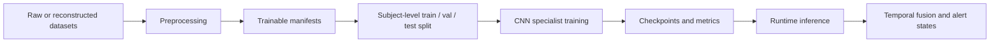

# 模型训练技术学习指南

本文件面向第一次接触 VisionGuard 的读者，解释本项目的模型训练流程、核心深度学习概念，以及这些训练结果如何进入最终运行系统。

建议先阅读：

- `docs/AI_PROJECT_CONTEXT.md`
- `docs/PROJECT_CURRENT_STATUS.md`
- `docs/PROJECT_STRUCTURE.md`
- `docs/tech_learning/PROJECT_LEARNING_GUIDE_ZH.md`
- `docs/tech_learning/DATA_PREPROCESSING_TECHNICAL_GUIDE_ZH.md`

---

## 1. 本文档的目的

本文档回答三个问题：

1. VisionGuard 训练了什么模型？
2. 这些模型如何从预处理数据训练得到？
3. 训练结果在最终系统中扮演什么角色？

最重要的边界是：VisionGuard 不是一个单一的 `drowsy / not-drowsy` 端到端分类器。它训练的是两个视觉证据 specialist model：

- 眼部 open/closed specialist，输出 `p_eye_closed`
- 嘴部 no-yawn/yawn specialist，输出 `p_yawn`

最终 Live Monitor 和 Video Upload Pipeline 会把这两个概率、信号质量检查和规则式 temporal fusion 合并，生成 warning-candidate / alert 状态。因此，单个 specialist model 的测试准确率不能写成完整系统的 drowsiness accuracy。

---

## 2. 模型训练在 VisionGuard 中的位置

项目整体链路可以理解为：



训练阶段只负责学习“单张 ROI 图像中的视觉证据”：

- 眼部 ROI：判断眼睛闭合概率。
- 嘴部 ROI：判断打哈欠概率。

运行时系统再把连续时间窗口内的证据合并。例如，短暂一帧的闭眼不等于疲劳，连续闭眼、更强的 `p_eye_closed`、最近是否有 `p_yawn`、摄像头信号是否可靠，才会影响后续 alert 状态。

项目证据来源：

- 运行时眼部模型路径：`src/runtime/realtime_frame_inference.py`
- 运行时嘴部模型路径：`src/runtime/realtime_frame_inference.py`
- 视频上传融合逻辑：`src/runtime/system_video_upload_pipeline.py`

---

## 3. 本项目中的训练任务

### 3.1 眼部 open/closed classification

眼部 specialist 的任务是二分类：

| 项目 | 内容 |
|---|---|
| 数据集 | MRL Eye |
| 标签映射 | `0 = closed`, `1 = open` |
| 运行时输出 | `p_eye_closed = softmax(logits)[0]` |
| 最终 runtime model | MobileNetV2 |
| checkpoint | `outputs/mrl_eye/checkpoints/best_mobilenet_v2_mrl_eye.pt` |

眼部闭合证据很重要，因为长时间闭眼、频繁闭眼或强闭眼概率都可能是疲劳相关视觉 cue。但是闭眼本身并不等于 drowsiness：眨眼、看下方、光照变化、眼镜反光、ROI 偏移都会影响单帧分类。因此它只作为 later temporal fusion 的证据输入。

主要来源：

- `artifacts/mappings/mrl_eye_trainable_with_split.csv`
- `src/training/train_mrl_eye_baselines.py`
- `outputs/mrl_eye/results/mrl_eye_stage9b_model_selection.json`
- `src/runtime/stage10_eye_roi_consistency.py`

### 3.2 嘴部 no-yawn/yawn classification

嘴部 specialist 的任务也是二分类：

| 项目 | 内容 |
|---|---|
| 数据集 | YawDD/YawDD+ Dash reconstructed mouth crops |
| 标签映射 | `0 = no_yawn`, `1 = yawn` |
| 运行时输出 | `p_yawn = softmax(logits)[1]` |
| 最终 runtime model | ResNet18 |
| checkpoint | `checkpoints/resnet18_best.pt`；恢复 artifact 中也有 `artifacts/recovered_stage7_mouth_yawn/resnet18_best.pt` |

打哈欠证据也不能单独证明疲劳。说话、大笑、张嘴、头部姿态变化或嘴部 crop 失败，都可能影响 `p_yawn`。因此嘴部模型输出的是一个 specialist probability，后续 fusion 只把它作为 recent yawn context。

主要来源：

- `artifacts/splits/yawdd_dash_subject_split.csv`
- `artifacts/mappings/yawdd_dash_all_mouth_crops_trainable.csv`
- `colab_file/stage7_yawdd_training_r.ipynb`
- `src/training/train_classifier.py`
- `artifacts/recovered_stage7_mouth_yawn/metrics_summary.json`
- `src/runtime/stage14_mouth_yawn_runtime.py`

---

## 4. 从预处理数据到可训练输入

本项目不是直接把原始视频或原始图片喂给训练脚本，而是先生成 manifest。Manifest 是一个 CSV 表，告诉训练脚本：

- 图像路径在哪里
- 标签是什么
- 属于哪个 subject / video / split
- crop 方法或 ROI 信息是什么
- 是否已经通过质量过滤

### 4.1 MRL Eye manifest

`artifacts/mappings/mrl_eye_trainable_with_split.csv` 是眼部训练的核心 manifest。

已检查到的基本信息：

| 字段 | 值 |
|---|---|
| 总样本数 | 84,898 |
| split | train 58,982；val 13,029；test 12,887 |
| 标签分布 | label `1` open: 42,952；label `0` closed: 41,946 |
| 重要字段 | `image_path`, `subject_id`, `label`, `label_name`, `split` |

Source: `artifacts/mappings/mrl_eye_trainable_with_split.csv`

### 4.2 YawDD/YawDD+ Dash mouth manifest

嘴部训练使用 subject-level split manifest。

已检查到的基本信息：

| 文件 | 样本数 | split | 标签分布 |
|---|---:|---|---|
| `artifacts/splits/yawdd_dash_subject_split.csv` | 64,202 | train 44,156；val 8,892；test 11,154 | no_yawn 57,171；yawn 7,031 |
| `artifacts/mappings/yawdd_dash_all_mouth_crops_trainable.csv` | 64,202 | train 44,156；val 8,892；test 11,154 | 同上 |

Source:

- `artifacts/splits/yawdd_dash_subject_split.csv`
- `artifacts/mappings/yawdd_dash_all_mouth_crops_trainable.csv`

### 4.3 为什么 subject-level split 很重要

如果按 frame 随机切分，同一个人的相邻帧可能同时出现在 train 和 test 中。模型可能学到的是某个人、某个视频、某种光照或摄像头角度，而不是真正可泛化的眼部/嘴部视觉模式。这叫 data leakage 或 subject leakage。

在人脸行为识别任务中，subject-level split 更严格：同一个 subject 的数据不应同时出现在训练和测试中。这样测试结果更接近“遇到新驾驶者”时的泛化能力。

---

## 5. Transfer Learning

Transfer learning 指使用在大规模数据集上预训练过的 CNN backbone，然后把最后的分类头替换成项目自己的二分类头。

本项目使用 ImageNet-pretrained CNN 的原因：

- 数据规模有限，不适合从零训练大型 CNN。
- 预训练模型已经学到边缘、纹理、局部形状等通用视觉特征。
- 眼睛和嘴巴 ROI 图像仍然属于自然图像视觉模式，预训练特征有帮助。
- 对学生项目来说，transfer learning 能明显降低训练成本。

常见做法有两种：

| 方式 | 含义 | 风险 |
|---|---|---|
| Feature extraction | 冻结 backbone，只训练新分类头 | 适应新领域能力有限 |
| Fine-tuning | 解冻部分或全部 backbone 继续训练 | 更灵活，但更容易过拟合 |

项目脚本中包含 freeze epoch 的概念，即训练早期可先冻结 backbone，之后再解冻训练。

Source:

- `src/training/train_classifier.py`
- `src/training/train_mrl_eye_baselines.py`
- `colab_file/stage7_yawdd_training_r.ipynb`

---

## 6. 使用或比较过的 CNN backbone

### 6.1 ResNet18

ResNet18 的核心思想是 residual connection。普通深层网络可能因为梯度传播困难而难训练，ResNet 通过 skip connection 让网络学习 residual mapping，使训练更稳定。

在 VisionGuard 中：

- ResNet18 是 mouth/yawn specialist 的最终 runtime model。
- 它在 Stage 7 mouth/yawn 结果中取得最高 test accuracy 和最高 yawn F1。
- 它的 checkpoint 被运行时嘴部推理使用。

Source:

- `artifacts/recovered_stage7_mouth_yawn/metrics_summary.json`
- `src/runtime/stage14_mouth_yawn_runtime.py`
- `src/runtime/realtime_frame_inference.py`

### 6.2 MobileNetV2

MobileNetV2 是轻量 CNN。它使用 depthwise separable convolution 和 inverted residual 思想，减少参数量和计算量。

初学者可以这样理解：普通卷积同时学习空间模式和通道组合；depthwise separable convolution 先按通道学习空间模式，再用较轻的 1x1 convolution 混合通道，从而节省计算。

在 VisionGuard 中：

- MobileNetV2 是 eye open/closed specialist 的最终 runtime model。
- 它适合实时或轻量推理。
- 项目选择它作为默认眼部 runtime checkpoint。

Source:

- `outputs/mrl_eye/results/mrl_eye_stage9b_model_selection.json`
- `outputs/mrl_eye/checkpoints/best_mobilenet_v2_mrl_eye.pt`
- `src/runtime/stage10_eye_roi_consistency.py`

### 6.3 EfficientNet-B0

EfficientNet-B0 的思想是 compound scaling：同时按比例扩展网络深度、宽度和输入分辨率，而不是只加深或只加宽网络。

在本项目中，EfficientNet-B0 用于候选模型比较，不是当前 runtime 默认模型：

- 眼部：有 `best_efficientnet_b0_mrl_eye.pt`，但最终 runtime eye model 是 MobileNetV2。
- 嘴部：EfficientNet-B0 在 Stage 7 中 yawn recall 最高，但 ResNet18 的 overall test accuracy 和 yawn F1 更强，因此最终 mouth/yawn runtime model 是 ResNet18。

Source:

- `outputs/mrl_eye/checkpoints/`
- `outputs/mrl_eye/results/mrl_eye_initial_results.csv`
- `artifacts/recovered_stage7_mouth_yawn/metrics_summary.json`

---

## 7. 图像输入 pipeline

### 7.1 输入尺寸和 normalization

本项目两个训练任务都使用 224x224 输入尺寸。

已确认来源：

- Stage 7 Colab: `DEFAULT_IMAGE_SIZE = 224`，source: `colab_file/stage7_yawdd_training_r.ipynb`
- MRL Eye script: `--image-size` default `224`，source: `src/training/train_mrl_eye_baselines.py`
- Mouth/yawn script: `--image-size` default `224`，source: `src/training/train_classifier.py`

两个训练脚本都使用 ImageNet normalization：

```text
mean = [0.485, 0.456, 0.406]
std  = [0.229, 0.224, 0.225]
```

Source:

- `src/training/train_classifier.py`
- `src/training/train_mrl_eye_baselines.py`

### 7.2 训练增强和评估 transform

训练时使用轻量 augmentation，评估时使用确定性 resize/crop。

| 任务 | train transform | eval transform |
|---|---|---|
| Mouth/yawn | RandomResizedCrop, RandomRotation, RandomAffine scaling, ColorJitter, ToTensor, Normalize | Resize to 224x224, ToTensor, Normalize |
| MRL Eye | RandomResizedCrop, RandomRotation, RandomAffine translate/scale, RandomHorizontalFlip, ColorJitter, optional GaussianBlur, ToTensor, Normalize | Resize to 240 then CenterCrop 224, ToTensor, Normalize |

Source:

- `src/training/train_classifier.py`
- `src/training/train_mrl_eye_baselines.py`

### 7.3 为什么 train 和 runtime 输入一致性重要

如果训练时使用 RGB、224x224、ImageNet normalization，而运行时 crop 不是同样的尺寸、通道顺序或 normalization，模型输出概率会不稳定。VisionGuard runtime 中的 `p_eye_closed` 和 `p_yawn` 必须使用与训练相匹配的预处理方式，才有合理解释。

---

## 8. Loss、optimizer、scheduler 和 early stopping

### 8.1 Loss function

两个 specialist 任务都是二分类，但训练脚本使用的是 PyTorch 的 multi-class `CrossEntropyLoss`，并通过 class weights 处理类别不均衡。

Source:

- Mouth/yawn: `src/training/train_classifier.py`
- MRL Eye: `src/training/train_mrl_eye_baselines.py`

### 8.2 Optimizer

已确认项目使用：

| 任务 | Optimizer | Source |
|---|---|---|
| Mouth/yawn Stage 7 | Adam | `colab_file/stage7_yawdd_training_r.ipynb`; `src/training/train_classifier.py` |
| MRL Eye Stage 9/9B | AdamW | `src/training/train_mrl_eye_baselines.py` |

Adam 和 AdamW 都是自适应学习率优化器。AdamW 把 weight decay 从 Adam 的梯度更新中解耦，通常更适合现代深度学习训练中的显式正则化。

### 8.3 Scheduler

两个训练脚本都使用 `ReduceLROnPlateau`，并以验证集指标为依据降低学习率。含义是：如果验证表现一段时间没有提升，就把 learning rate 降低，让模型更细致地收敛。

Source:

- `src/training/train_classifier.py`
- `src/training/train_mrl_eye_baselines.py`
- `colab_file/stage7_yawdd_training_r.ipynb`

### 8.4 Early stopping 和 checkpoint

Early stopping 用来避免模型在训练集继续变好但验证集不再变好的过拟合。Checkpoint 只保存验证表现最好的模型。

需要特别注意 Stage 7 mouth/yawn 的配置：

| 项目 | 已确认值 | Source |
|---|---:|---|
| completed Colab run `DEFAULT_EPOCHS` | 8 | `colab_file/stage7_yawdd_training_r.ipynb` |
| completed Colab run `DEFAULT_PATIENCE` | 2 | `colab_file/stage7_yawdd_training_r.ipynb` |
| local reusable script default `--epochs` | 12 | `src/training/train_classifier.py` |
| local reusable script default `--patience` | 3 | `src/training/train_classifier.py` |

因此，报告中描述“完成的 Stage 7 Colab run”时应写 `8 / 2`。如果讨论 reusable local training script 的默认值，可以写 `12 / 3`，但必须说明这是脚本默认值，不是已完成 Colab run 的真实配置。`colab_file/stage7_yawdd_training_r.ipynb` 中也存在叙述性文字提到 12/3，应视为旧叙述或默认说明，不能覆盖实际 constants。

---

## 9. 眼部模型训练 workflow

眼部训练流程：

1. 使用 MRL Eye 数据集。
2. 根据预处理结果生成 `artifacts/mappings/mrl_eye_trainable_with_split.csv`。
3. 使用 subject-level train/val/test split。
4. 比较 ResNet18、MobileNetV2、EfficientNet-B0。
5. 使用 weighted cross entropy、AdamW、ReduceLROnPlateau、early stopping。
6. 输出每个模型的 checkpoint、history、metrics、figures 和 error analysis。
7. 选择 MobileNetV2 作为 runtime eye specialist。

主要 artifacts：

| Artifact | 作用 |
|---|---|
| `artifacts/mappings/mrl_eye_trainable_with_split.csv` | 眼部可训练 manifest |
| `src/training/train_mrl_eye_baselines.py` | MRL Eye 训练脚本 |
| `outputs/mrl_eye/results/mrl_eye_initial_results.csv` | 初始模型比较结果 |
| `outputs/mrl_eye/results/mrl_eye_stage9b_model_selection.json` | 最终模型选择说明 |
| `outputs/mrl_eye/checkpoints/best_mobilenet_v2_mrl_eye.pt` | runtime eye checkpoint |
| `outputs/mrl_eye/figures/` | confusion matrix、PR curve、training curve |
| `outputs/mrl_eye/error_analysis/` | false open / false closed 样例 |

运行时，MobileNetV2 eye model 输出 `p_eye_closed`，之后进入实时系统或视频上传 pipeline。

Source:

- `outputs/mrl_eye/results/mrl_eye_stage9b_model_selection.json`
- `src/runtime/realtime_frame_inference.py`
- `src/runtime/stage10_eye_roi_consistency.py`

---

## 10. Mouth/yawn 模型训练 workflow

Mouth/yawn 训练流程：

1. 从 YawDD/YawDD+ Dash 视频和标注重建 labelled frames。
2. 通过 MediaPipe Face Mesh lip landmarks 提取 mouth ROI；失败时使用 lower-face fallback crop。
3. 生成 trainable mouth crops。
4. 使用 subject-level split manifest。
5. 比较 ResNet18、MobileNetV2、EfficientNet-B0。
6. 使用 weighted cross entropy、Adam、ReduceLROnPlateau、early stopping。
7. 选择 ResNet18 作为 runtime mouth/yawn specialist。

主要 artifacts：

| Artifact | 作用 |
|---|---|
| `artifacts/splits/yawdd_dash_subject_split.csv` | Stage 7 subject-level split manifest |
| `artifacts/mappings/yawdd_dash_all_mouth_crops_trainable.csv` | 可训练 mouth crop manifest |
| `colab_file/stage7_yawdd_training_r.ipynb` | 完成的 Stage 7 Colab training run |
| `src/training/train_classifier.py` | 本地 reusable mouth/yawn training script |
| `artifacts/recovered_stage7_mouth_yawn/metrics_summary.json` | 恢复的 Stage 7 三模型结果 |
| `artifacts/recovered_stage7_mouth_yawn/resnet18_best.pt` | 恢复的 ResNet18 checkpoint |
| `checkpoints/resnet18_best.pt` | runtime mouth/yawn checkpoint |
| `report_assets/mouth_yawn_evaluation_refresh/` | 后续评估刷新图表和指标 |
| Google Drive `Drowsiness_Detection_Colab/outputs/results/*_history.json` | 原始 Stage 7 training history |
| Google Drive `Drowsiness_Detection_Colab/outputs/figures/*_training_curve.png` | 原始 Stage 7 training curve 图 |

运行时，ResNet18 mouth/yawn model 输出 `p_yawn = softmax(logits)[1]`。

Source:

- `src/runtime/stage14_mouth_yawn_runtime.py`
- `src/runtime/realtime_frame_inference.py`
- Google Drive folder: `Drowsiness_Detection_Colab/outputs/results`
- Google Drive folder: `Drowsiness_Detection_Colab/outputs/figures`

注意：本地 `report_assets/mouth_yawn_evaluation_refresh/skipped/training_curve_status.md` 说明 evaluation refresh 目录自身没有足够 source 重建真实 training curve；但云端原始 Stage 7 输出中确实存在 `resnet18_history.json`、`mobilenet_v2_history.json`、`efficientnet_b0_history.json` 以及对应 training curve PNG。因此如果报告需要 mouth/yawn training curve，应引用云端原始 Stage 7 输出，而不是伪造或从 refresh metrics 反推。

---

## 11. 训练风险以及本项目如何处理

| 风险 | 含义 | 本项目处理方式 |
|---|---|---|
| Data leakage | 训练和测试共享近似样本 | 使用 split manifest；强调 subject-level split |
| Subject leakage | 同一 subject 同时出现在 train/test | 使用 subject metadata 做 split |
| Overfitting | 训练集高、验证集不提升 | augmentation、early stopping、scheduler、validation monitoring |
| Class imbalance | 类别数量差异影响模型 | weighted cross entropy |
| Annotation noise | 标签可能不完美 | 使用 error analysis 和 conservative wording |
| Runtime distribution shift | 真实摄像头画面和训练集不同 | runtime signal-quality gate、ROI consistency checks |
| Crop failure | face/landmark/mouth/eye ROI 失败 | preprocessing quality filtering；runtime no-face/invalid ROI handling |
| False confidence | 高测试分数被误解成系统准确率 | 文档明确 specialist metrics 不等于 full-system drowsiness accuracy |

---

## 12. 训练输出和 artifacts

| 类型 | 示例路径 | 后续用途 |
|---|---|---|
| Checkpoint | `outputs/mrl_eye/checkpoints/best_mobilenet_v2_mrl_eye.pt` | runtime eye inference |
| Checkpoint | `checkpoints/resnet18_best.pt` | runtime mouth/yawn inference |
| Metrics JSON | `outputs/mrl_eye/results/mrl_eye_stage9b_model_selection.json` | eye model selection |
| Metrics JSON | `artifacts/recovered_stage7_mouth_yawn/metrics_summary.json` | mouth/yawn model comparison |
| Metrics JSON | `report_assets/mouth_yawn_evaluation_refresh/metrics/resnet18_metrics_summary.json` | final mouth/yawn evaluation refresh |
| Training history JSON | Google Drive `Drowsiness_Detection_Colab/outputs/results/resnet18_history.json` | 原始 Stage 7 ResNet18 training curve source |
| Training history JSON | Google Drive `Drowsiness_Detection_Colab/outputs/results/mobilenet_v2_history.json` | 原始 Stage 7 MobileNetV2 training curve source |
| Training history JSON | Google Drive `Drowsiness_Detection_Colab/outputs/results/efficientnet_b0_history.json` | 原始 Stage 7 EfficientNet-B0 training curve source |
| CSV results | `outputs/mrl_eye/results/mrl_eye_initial_results.csv` | eye candidate comparison |
| Figures | `outputs/mrl_eye/figures/` | report figures |
| Figures | `report_assets/mouth_yawn_evaluation_refresh/figures/` | mouth/yawn report figures |
| Figures | Google Drive `Drowsiness_Detection_Colab/outputs/figures/*_training_curve.png` | 原始 Stage 7 mouth/yawn training curves |
| Error analysis | `outputs/mrl_eye/error_analysis/` | qualitative inspection |
| Predictions | `report_assets/mouth_yawn_evaluation_refresh/predictions/` | threshold and ranking analysis |

---

## 13. 训练不能证明什么

训练结果不能证明：

- VisionGuard 对“驾驶疲劳”的整体准确率是某个百分比。
- 单帧闭眼一定表示疲劳。
- 单帧打哈欠一定表示疲劳。
- offline test set 表现一定等于真实车内运行表现。
- alert interval 就是 ground-truth drowsiness label。

更准确的说法是：

> The trained specialist models provide visual evidence probabilities for eye closure and yawning. VisionGuard then combines these probabilities with signal-quality and temporal rules to produce conservative alert candidates.

---

## 14. 初学者检查清单

你应该能够回答：

- MRL Eye 用来训练哪个模型？
- YawDD/YawDD+ Dash mouth crops 用来训练哪个模型？
- `0 = closed`, `1 = open` 属于哪个任务？
- `0 = no_yawn`, `1 = yawn` 属于哪个任务？
- 为什么 subject-level split 比 frame-level random split 更安全？
- runtime 眼部 checkpoint 在哪里？
- runtime 嘴部 checkpoint 在哪里？
- 为什么 MobileNetV2 是眼部 runtime model？
- 为什么 ResNet18 是嘴部 runtime model？
- 为什么 specialist accuracy 不能写成 full-system drowsiness accuracy？

---

## 15. 常见错误

| 错误说法 | 正确理解 |
|---|---|
| VisionGuard 是一个单一 drowsy/not-drowsy classifier | 它是两个 specialist model + temporal fusion 的 modular system |
| MRL Eye 标签 `1` 是 closed | 错。MRL Eye 中 `0 = closed`, `1 = open` |
| Mouth/yawn 标签 `0` 是 yawn | 错。mouth/yawn 中 `0 = no_yawn`, `1 = yawn` |
| ResNet18 是眼部最终 runtime model | 错。眼部 runtime model 是 MobileNetV2 |
| MobileNetV2 是嘴部最终 runtime model | 错。嘴部 runtime model 是 ResNet18 |
| EfficientNet-B0 是最终 runtime default | 当前项目中它是 comparison model，不是 runtime default |
| Stage 7 完成训练是 12 epochs / patience 3 | 已完成 Colab run constants 是 8 / 2；12 / 3 是 local script 默认或旧叙述 |
| 模型测试准确率等于系统疲劳检测准确率 | 错。它只是 specialist image-level classification metric |
