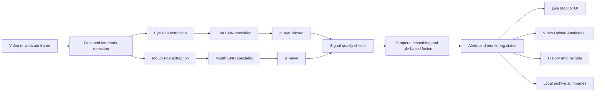

# VisionGuard Technical Learning Guide

Last updated: 2026-05-26

## 1. Purpose of This Guide

This guide is for a beginner who wants to understand VisionGuard before reading the code in detail. It explains the project background, the architecture, the deep-learning pipeline, the runtime logic, the major development stages, and the safest way to read the repository.

The guide is not an API reference and it does not document every function. Its goal is to explain how the pieces fit together and why the project was built as a modular monitoring system rather than as a single black-box classifier.

## 2. Project Overview

VisionGuard is a modular driver drowsiness detection and monitoring system. It uses deep-learning models to identify fatigue-related visual cues, then applies rule-based temporal fusion to turn frame-level evidence into monitoring states and warning candidates.

The system focuses on two visual cues:

| Cue | Specialist task | Runtime output |
| --- | --- | --- |
| Eye state | Closed vs open eye classification | `p_eye_closed` |
| Mouth/yawn state | No-yawn vs yawn classification | `p_yawn` |

These probabilities are not treated as final driver-state truth by themselves. They are evidence signals. The runtime layer checks whether the face and regions of interest are reliable, smooths evidence over time, and combines eye and mouth evidence into states such as normal monitoring, eye warning candidate, mouth warning candidate, high-confidence warning candidate, or signal-unreliable.

## 3. Problem Definition

Driver drowsiness is difficult to infer from a single image because many short-lived visual patterns are normal. A blink can look like eye closure for one or two frames. Talking, turning the head, or poor lighting can affect the mouth region. A camera may briefly lose the face or produce poor landmarks.

VisionGuard therefore treats drowsiness monitoring as a visual evidence problem:

- Detect fatigue-related cues such as sustained eye closure and yawning.
- Separate poor signal quality from fatigue evidence.
- Reduce false alarms from brief blinks or short mouth movements.
- Produce explainable warning candidates rather than claiming a clinical diagnosis or guaranteed driver-state label.

The current system supports both live webcam monitoring and uploaded-video analysis. It also stores compact local summaries for history and insight views.

## 4. Why a Modular Pipeline

VisionGuard is intentionally modular. It does not use one monolithic drowsy/not-drowsy classifier.

The modular design has several advantages:

- Eye closure and yawning are different visual tasks, so each can use its own dataset, crop strategy, model selection, and error analysis.
- Specialist model outputs are easier to inspect. A developer can ask whether an alert came from eye evidence, mouth evidence, or signal quality.
- Runtime rules can handle time. A single frame is often ambiguous, but a sequence can reveal sustained closure, repeated yawning, or unreliable tracking.
- Safety boundaries are clearer. The system can say "signal unreliable" instead of treating a missing face as drowsiness.
- The UI can present evidence-based monitoring states without overstating the result as final driver truth.

This structure also makes the project easier to improve. The eye specialist, mouth specialist, temporal logic, UI, and archive can evolve independently as long as their contracts remain stable.

## 5. High-Level Architecture

The main data flow is:



At a code level, the system is organized around these layers:

| Layer | Main responsibility | Representative locations |
| --- | --- | --- |
| Data and preprocessing | Build manifests, reconstruct frames, crop ROIs, create leakage-safe splits | `src/data/`, `src/preprocessing/` |
| Model training | Train and compare eye and mouth specialist CNNs | `src/training/` |
| Runtime evidence | Extract ROIs from live frames or uploaded videos and run specialist inference | `src/runtime/` |
| Backend API | Serve upload analysis, realtime frame analysis, and local archive endpoints | `src/backend/app.py` |
| Frontend UI | Present Live Monitor, Video Upload Analysis, History, and Insights | `SystemUI/` |
| Local archive | Store compact analysis summaries in SQLite | `src/backend/local_archive.py` |

## 6. Dataset Layer

VisionGuard uses separate datasets for separate visual problems.

### YawDD / YawDD+ Dash

YawDD and the reconstructed YawDD+ Dash material support the mouth/yawn specialist. The task is binary classification:

- `no_yawn`
- `yawn`

The project reconstructs usable frame-level material, extracts mouth crops with face landmarks and fallback logic, and builds subject-level train/validation/test splits. The documented YawDD Dash mouth-crop pipeline produced about 64,202 trainable mouth crops after quality filtering. The subject-level split uses 20 training subjects, 4 validation subjects, and 5 test subjects.

### MRL Eye

MRL Eye supports the eye open/closed specialist. The task is binary classification:

- closed eye
- open eye

The project builds a manifest and subject-level split before training. The documented split contains 25 training subjects, 6 validation subjects, and 6 test subjects, with about 84,898 images total.

### NTHUDDD2

NTHUDDD2 was explored as part of dataset investigation, but it is not the main implemented direction for the current working system. The current architecture relies on the MRL Eye specialist, the YawDD/YawDD+ Dash mouth specialist, and runtime fusion.

### Why Subject-Level Splits Matter

A subject-level split means images or frames from the same person do not appear in both training and test sets. This is important because face, eye, and mouth images can contain identity-specific patterns. If the same subject appears in training and testing, the model may look artificially strong by recognizing that person's appearance rather than learning a robust visual cue.

For VisionGuard, leakage prevention is central to the validity of specialist-model metrics. It does not make the runtime system perfect, but it makes the training evaluation more trustworthy.

## 7. Deep Learning Model Layer

The deep-learning layer uses transfer learning. Instead of training large CNNs from scratch, the project starts from pretrained image-classification backbones and adapts them to smaller specialist tasks.

### Eye Specialist

The eye model predicts whether an eye crop is closed or open.

| Item | Value |
| --- | --- |
| Dataset | MRL Eye |
| Task | Closed vs open eye classification |
| Output | `p_eye_closed` |
| Selected model | MobileNetV2 |
| Documented result | About 98.63% test accuracy, 98.63% macro F1, 98.52% closed-eye recall |

MobileNetV2 was selected because it provided strong specialist performance while remaining suitable for a realtime-oriented system.

### Mouth/Yawn Specialist

The mouth model predicts whether a mouth crop shows yawning.

| Item | Value |
| --- | --- |
| Dataset | YawDD / YawDD+ Dash |
| Task | No-yawn vs yawn classification |
| Output | `p_yawn` |
| Selected model | ResNet18 |
| Documented result | About 99.37% test accuracy, 97.18% yawn F1 |

ResNet18 was selected for the mouth/yawn branch based on the documented training and validation results.

### Metric Boundary

These metrics are specialist-model results on their own test splits. They are not final system-level drowsiness accuracy. The runtime system adds face detection, ROI extraction, signal quality handling, temporal smoothing, and fusion, all of which introduce a different evaluation problem.

The correct interpretation is:

- The eye specialist is strong at classifying prepared eye crops as open or closed.
- The mouth specialist is strong at classifying prepared mouth crops as no-yawn or yawn.
- The full VisionGuard system produces fatigue-related visual cue monitoring and warning candidates, not a definitive driver-state diagnosis.

## 8. Runtime Evidence Layer

The runtime layer turns live frames or uploaded video frames into evidence signals.

For each sampled frame, the system attempts to:

1. Detect a face.
2. Locate landmarks.
3. Extract eye and mouth regions of interest.
4. Check whether the extracted regions are usable.
5. Run the eye and mouth specialist models.
6. Produce frame-level evidence such as `p_eye_closed`, `p_yawn`, and signal-quality flags.

This layer is important because model training usually uses prepared crops, while runtime input is messier. In live use, the driver may move, lighting may change, the camera may lose the face, or landmarks may fail. VisionGuard treats these cases as signal-quality issues, not automatic drowsiness evidence.

For Live Monitor, the frontend keeps webcam sampling active and sends frames to the backend realtime endpoint. Minimal Live Monitor Mode is only a display mode: it hides the raw camera preview and extra panels while keeping sampling, backend realtime calls, warning overlays, sound alerts, and critical-warning acknowledgement behavior active.

## 9. Temporal Logic and Fusion Layer

Frame-level probabilities are noisy. VisionGuard therefore uses temporal logic and rule-based fusion.

### Eye Evidence

Eye closure is not enough by itself. A blink can produce a high `p_eye_closed` for a short time. The runtime looks for sustained closure patterns using rolling evidence, consecutive-frame behavior, and PERCLOS-like logic. PERCLOS-like evidence means the system watches how much of a recent time window appears eye-closed rather than reacting to one isolated frame.

### Mouth Evidence

Mouth movements are also ambiguous. Speaking, expressions, and brief mouth opening are not the same as yawning. The mouth branch produces `p_yawn`, and the runtime considers recent yawn evidence over time instead of treating every frame independently.

### Signal Quality

Face-not-visible and ROI failure states are handled separately. This prevents the system from confusing missing or unreliable visual input with drowsiness evidence.

### Fusion

The fusion layer combines eye evidence, mouth evidence, and signal quality into monitoring states. The documented Stage 13-15 direction uses a tiered, quality-aware rule set. At a high level:

- Sustained eye closure can produce an eye warning candidate.
- Recent yawn evidence can produce a mouth warning candidate.
- Eye and mouth evidence together can produce a higher-confidence warning candidate.
- Poor face or ROI reliability can produce a signal-unreliable state.

This is rule-based temporal fusion, not a trained fusion model.

## 10. System Implementation Layer

VisionGuard has a Python backend and a Next.js frontend.

### Backend

The backend is a FastAPI application under `src/backend/app.py`. It exposes endpoints for:

- Uploaded-video analysis.
- Realtime live-frame analysis.
- Realtime session lifecycle and summaries.
- Local archive health, record listing, record creation, review updates, and export.

The local archive logic lives in `src/backend/local_archive.py`. The default SQLite file is `data/visionguard_archive.sqlite`. The archive stores compact summaries only. It must not store raw webcam frames, raw uploaded videos, base64 payloads, blobs, or large binaries.

### Frontend

The frontend is a Next.js App Router application under `SystemUI/`.

| Route | Product area | Purpose |
| --- | --- | --- |
| `/` | Live Monitor | Realtime webcam monitoring, risk gauge, alerts, current-session evidence |
| `/video-upload` | Video Upload Analysis | Upload a video, run backend analysis, inspect warning intervals and evidence |
| `/history-48h` | History | View recent Live Monitor sessions, alerts, and compact archive summaries; the default scope is still the last 48 hours |
| `/insights` | Insights | Summarize Live Monitor alert analytics, alert mix, time-of-day patterns, and signal-quality patterns |

History and Insights should currently be understood as product views over Live Monitor runtime records. Video Upload Analysis can create separate analysis results and artifacts, but unless the implementation explicitly changes, uploaded-video results should not be treated as Live Monitor statistics inside History/Insights.

The Live Monitor page includes the Drowsiness Risk gauge, live evidence, warning overlays, sound behavior, and session/history ingestion. Minimal Live Monitor Mode keeps the Drowsiness Risk gauge as the main visible UI while hiding the raw camera preview, recent events, charts, and extra dashboard panels.

### Deployment Context

The current remote-access setup allows a Vercel-hosted frontend to call a local FastAPI backend through a Cloudflare Quick Tunnel. This is useful for demonstration and external testing:

```text
Browser -> Vercel frontend -> Cloudflare Quick Tunnel -> local FastAPI backend -> local models/archive
```

Quick Tunnel URLs change, and the backend still runs locally. The current limitation is tunnel stability and local-service availability, not the core model pipeline. This should not be described as a fully cloud-native production deployment.

## 11. Stage-by-Stage Project Progression

The table below summarizes the documented progression at a learning-guide level. Earlier dataset work is summarized cautiously where the reports are less detailed than later stages.

| Stage / area | Purpose | Main output | Why it matters |
| --- | --- | --- | --- |
| Dataset inspection and preparation | Understand available drowsiness-related datasets and their labels | Dataset notes, raw organization, feasibility direction | Establishes what visual cues can be trained and evaluated |
| YawDD / YawDD+ Dash reconstruction | Rebuild usable frame-level dash material for mouth/yawn work | Reconstructed labeled frames | Creates the basis for mouth/yawn specialist training |
| Mouth crop preprocessing | Extract mouth ROIs from reconstructed YawDD Dash frames | Trainable mouth-crop dataset | Converts full frames into the input expected by the mouth CNN |
| YawDD subject-level split | Split mouth data by subject | Train/validation/test subjects with leakage checks | Prevents identity leakage across splits |
| Mouth/yawn training | Train and compare CNN backbones for no-yawn vs yawn | Selected ResNet18 mouth specialist | Produces `p_yawn` evidence for runtime |
| MRL Eye inspection and manifest | Build a clean eye image manifest | Labelled MRL Eye metadata | Prepares the eye task for reproducible training |
| MRL Eye subject-level split | Split eye data by subject | Train/validation/test subjects with leakage checks | Prevents inflated eye metrics from subject overlap |
| MRL Eye training and selection | Train and compare eye specialist models | Selected MobileNetV2 eye specialist | Produces `p_eye_closed` evidence for runtime |
| Runtime eye ROI consistency validation | Check whether runtime eye crops are compatible with training assumptions | Eye ROI validation evidence | Connects prepared training crops to real runtime frames |
| Eye temporal analysis | Explore sustained-closure and PERCLOS-like behavior | Eye evidence timelines and alert-rule candidates | Reduces false alarms from brief blinks |
| Eye alert rule selection | Choose a quality-gated temporal eye rule | Eye warning candidate logic | Makes eye alerts more conservative and explainable |
| Mouth-eye fusion design | Design quality-aware fusion rules | F5-style rule set | Defines how eye, mouth, and signal quality interact |
| Runtime mouth/yawn validation | Validate mouth/yawn inference on runtime video evidence | Runtime `p_yawn` timelines | Checks whether the mouth specialist behaves sensibly outside static crops |
| Real synchronized fusion validation | Combine real eye and mouth evidence on the same videos | Fusion-state timelines | Tests the integrated logic without synthetic mouth decisions |
| Final integration package | Summarize selected models, rules, and boundaries | Integration report | Provides a stable evidence package for system development |
| Video Upload Analysis MVP | Run the backend pipeline on uploaded videos | `/api/analyze-video`, warning intervals, keyframes, UI evidence | Turns model and fusion work into a usable video evidence-analysis workflow |
| Upload interpretation refinements | Calibrate uploaded-video evidence display and wording | Safer interval summaries and evidence panels | Prevents overclaiming and makes analysis output easier to interpret |
| Live Monitor realtime prototype | Add realtime webcam sampling and backend frame calls | Live Monitor route with current-session evidence | Moves from offline uploads to live monitoring |
| Live Monitor warning behavior | Add overlays, sound alerts, critical-warning acknowledgement, and risk display | Realtime user-facing warning workflow | Makes live monitoring actionable while preserving runtime logic |
| Local account and app-shell foundation | Add local MVP identity, navigation, theme, and notifications | Dashboard shell and local user state | Improves product structure without claiming production authentication |
| Live Monitor history ingestion | Persist compact local session/event summaries | History-ready local records | Allows recent live monitoring activity to appear outside the live page |
| History / Insights split | Separate runtime history from analytics-style insight views | `/history-48h` and `/insights` routes | Makes the UI easier to navigate and understand |
| Local backend SQLite archive | Store compact summaries through FastAPI | `data/visionguard_archive.sqlite` and archive endpoints | Provides a backend-owned local archive without storing raw media |
| Settings and Minimal Live Monitor Mode | Add display setting for simplified live view | Settings popover and minimal live layout | Keeps realtime monitoring active while making the risk gauge the main visible UI |
| Remote access / deployment preparation | Connect hosted frontend to local backend through a tunnel | Vercel frontend plus Cloudflare Quick Tunnel workflow | Enables external testing while retaining clear non-production boundaries |

## 12. Repository Learning Path

A beginner should not begin by reading every function. The more efficient path is to build the evidence-flow mental model first, then move layer by layer through data, models, runtime, backend, frontend, deployment, and claim boundaries.

| Order | Learning topic | Key files | Content summary / purpose |
| --- | --- | --- | --- |
| 1 | Current project state and boundaries | `docs/AI_PROJECT_CONTEXT.md`; `docs/PROJECT_CURRENT_STATUS.md`; this file `docs/tech_learning/PROJECT_LEARNING_GUIDE.md` | Confirm that VisionGuard is a modular monitoring system, not a single `drowsy / not-drowsy` classifier. Identify the eye specialist, mouth/yawn specialist, runtime fusion, frontend/backend, and deployment state. |
| 2 | Repository layout and code-entry map | `docs/PROJECT_STRUCTURE.md`; `Makefile`; `SystemUI/package.json` | Build a directory map: what `src/runtime/`, `src/backend/`, `SystemUI/`, `artifacts/`, `outputs/`, `report_assets/`, and `docs/` are responsible for. |
| 3 | Beginner route and terminology | `docs/tech_learning/BEGINNER_ROADMAP_AND_GLOSSARY_ZH.md`; `docs/tech_learning/BEGINNER_ROADMAP_AND_GLOSSARY.md` | Learn core terms such as `p_eye_closed`, `p_yawn`, ROI, MediaPipe, temporal fusion, warning-candidate, SQLite archive, and localStorage. |
| 4 | Data preprocessing overview | `docs/tech_learning/DATA_PREPROCESSING_TECHNICAL_GUIDE_ZH.md`; `docs/tech_learning/DATA_PREPROCESSING_TECHNICAL_GUIDE.md` | Understand how raw data becomes trainable manifests, mouth crops, eye manifests, and subject-level splits. Focus on why subject leakage must be avoided. |
| 5 | Mouth/yawn data and artifacts | `artifacts/preprocessed/yawdd_dash_mouth/preprocessing_summary.json`; `artifacts/recovered_stage7_mouth_yawn/README_stage7_training.md`; `artifacts/recovered_stage7_mouth_yawn/metrics_summary.json` | Inspect how YawDD/YAWDD+ Dash mouth/yawn data was reconstructed, cropped, trained, and recovered. Confirm the label mapping `0 = no_yawn`, `1 = yawn`. |
| 6 | Eye data and artifacts | `outputs/mrl_eye/README.md`; `outputs/mrl_eye/results/mrl_eye_stage9b_model_selection.json`; `outputs/mrl_eye/results/mrl_eye_metrics_summary.json`; `outputs/mrl_eye/checkpoints/best_mobilenet_v2_mrl_eye.pt` | Inspect MRL Eye training results, model selection, and final checkpoint. Confirm the label mapping `0 = closed`, `1 = open`, and that the runtime eye model is MobileNetV2. |
| 7 | Model training process | `docs/tech_learning/MODEL_TRAINING_TECHNICAL_GUIDE_ZH.md`; `docs/tech_learning/MODEL_TRAINING_TECHNICAL_GUIDE.md`; `colab_file/stage7_yawdd_training_r.ipynb`; `src/training/train_classifier.py`; `src/training/train_mrl_eye_baselines.py` | Learn transfer learning, CNN backbones, loss, optimizer, scheduler, early stopping, and checkpointing. Keep the completed Stage 7 Colab run `8 / 2` separate from the local script default `12 / 3`. |
| 8 | Model evaluation and selection | `docs/tech_learning/MODEL_EVALUATION_AND_SELECTION_GUIDE_ZH.md`; `docs/tech_learning/MODEL_EVALUATION_AND_SELECTION_GUIDE.md`; `outputs/mrl_eye/results/*.json`; `report_assets/mouth_yawn_evaluation_refresh/metrics/resnet18_metrics_summary.json` | Learn confusion matrix, precision, recall, F1, ROC/AUC, and model selection. Understand why MobileNetV2 is used for eye runtime inference, why ResNet18 is used for mouth/yawn runtime inference, and why EfficientNet-B0 is only a comparison model. |
| 9 | Runtime inference and temporal fusion | `docs/tech_learning/RUNTIME_INFERENCE_AND_TEMPORAL_FUSION_GUIDE_ZH.md`; `docs/tech_learning/RUNTIME_INFERENCE_AND_TEMPORAL_FUSION_GUIDE.md`; `src/runtime/realtime_frame_inference.py`; `src/runtime/realtime_temporal_state.py`; `src/runtime/system_video_upload_pipeline.py` | Connect `p_eye_closed`, `p_yawn`, signal quality, rolling windows, debounce/cooldown, and warning-candidate state. Make clear that this is rule-based fusion, not a trained fusion classifier. |
| 10 | Stage-level runtime evidence reports | `docs/STAGE10_RUNTIME_EYE_ROI_DESIGN.md`; `docs/STAGE10_11_MULTI_VIDEO_VALIDATION_LOG.md`; `docs/STAGE13_MOUTH_EYE_FUSION_DESIGN.md`; `docs/STAGE14_MOUTH_YAWN_RUNTIME_LOG.md`; `docs/STAGE15_REAL_MOUTH_EYE_FUSION_LOG.md`; `outputs/stage15_real_mouth_eye_fusion/stage15_real_fusion_summary.json` | Read the evidence chain for eye ROI consistency, eye temporal behavior, mouth-eye fusion, and real synchronized fusion. Understand how research validation supports later system integration. |
| 11 | Video Upload Analysis systemization | `docs/STAGE17_VIDEO_UPLOAD_RESULT_SCHEMA.md`; `docs/STAGE17_3_VIDEO_UPLOAD_UI_PAGE_REPORT.md`; `docs/STAGE17_5_VIDEO_UPLOAD_UI_EVIDENCE_REVIEW_PAGE.md`; `src/runtime/keyframe_extractor.py`; `outputs/system_video_upload_runs/*/summary.json` | Understand how uploaded videos generate summaries, timelines, alert intervals, keyframes, and backend-generated evidence figures. Treat this as runtime evidence demonstration, not a ground-truth accuracy report. |
| 12 | Backend API and local archive | `src/backend/app.py`; `src/backend/local_archive.py`; `docs/LOCAL_BACKEND_ARCHIVE.md`; `docs/STAGE17_3_LOCAL_LAUNCH_GUIDE.md` | Learn FastAPI endpoints, realtime sessions, video-upload run artifacts, SQLite archive behavior, and write-token boundaries. Confirm that the archive stores compact summaries, not raw frames/videos/base64/blob payloads. |
| 13 | Frontend product UI flow | `docs/tech_learning/FRONTEND_PRODUCT_AND_UI_FLOW_GUIDE_ZH.md`; `docs/tech_learning/FRONTEND_PRODUCT_AND_UI_FLOW_GUIDE.md`; `SystemUI/src/app/page.tsx`; `SystemUI/src/app/video-upload/page.tsx`; `SystemUI/src/app/history-48h/page.tsx`; `SystemUI/src/app/insights/page.tsx`; `SystemUI/src/components/dashboard/LiveMonitorPage.tsx`; `SystemUI/src/components/video-upload/VideoUploadAnalysis.tsx` | Learn how Live Monitor, Video Upload Analysis, History, and Insights present runtime evidence. Minimal Live Monitor Mode changes display only; it does not change inference, sound, or warning logic. |
| 14 | History / Insights data boundary | `SystemUI/src/components/history-48h/History48hPage.tsx`; `SystemUI/src/components/insights/InsightsPage.tsx`; `SystemUI/src/lib/history48hStorage.ts`; `SystemUI/src/lib/liveMonitorHistoryIngestion.ts`; `SystemUI/src/lib/insightsUtils.ts` | Confirm that History/Insights mainly summarize Live Monitor records. Do not assume Video Upload results are Live Monitor statistics inside History/Insights. These pages are product analytics, not model evaluation. |
| 15 | Local state, settings, and notifications | `SystemUI/src/lib/authStore.tsx`; `SystemUI/src/lib/settingsStore.tsx`; `SystemUI/src/lib/notificationStore.tsx`; `SystemUI/src/components/dashboard/UserProfileMenu.tsx` | Understand the local MVP account, theme/settings, Minimal Live Monitor Mode, and Notification Center. These are local UI states, not production authentication, cloud sync, or model logic. |
| 16 | Local operation, remote testing, and deployment boundary | `docs/tech_learning/DEPLOYMENT_AND_LOCAL_OPERATION_GUIDE_ZH.md`; `docs/tech_learning/DEPLOYMENT_AND_LOCAL_OPERATION_GUIDE.md`; `docs/DEPLOYMENT_RUNBOOK.md`; `docs/DAILY_STARTUP_CHECKLIST.md`; `docs/TUNNEL_DIAGNOSTIC_REPORT.md`; `scripts/deployment_preflight.sh` | Learn the relationship between the local backend, Next.js frontend, Vercel frontend, and Cloudflare Quick Tunnel. The current setup is external-access testing, not a full cloud-native backend deployment. |
| 17 | Testing, validation, and troubleshooting | `docs/tech_learning/TESTING_VALIDATION_AND_TROUBLESHOOTING_GUIDE_ZH.md`; `docs/tech_learning/TESTING_VALIDATION_AND_TROUBLESHOOTING_GUIDE.md`; `artifacts/audits/stage17_video_upload_mvp_2026-05-09/stage17_systemui_backend_audit.md` | Learn how to validate backend health, upload analysis, Live Monitor, History/Insights, build/lint, and deployment connectivity. Avoid “fixing” issues by deleting archive/localStorage data or changing thresholds. |
| 18 | Report evidence and claim boundaries | `docs/tech_learning/REPORT_EVIDENCE_AND_CLAIMS_BOUNDARY_GUIDE_ZH.md`; `docs/tech_learning/REPORT_EVIDENCE_AND_CLAIMS_BOUNDARY_GUIDE.md`; `docs/final/final_report.md`; `docs/final/final_report_en.md`; `report_assets/all_figures/`; `report_assets/mouth_yawn_evaluation_refresh/` | Learn which results support dataset, model, runtime, or UI claims. Do not present specialist metrics, Video Upload intervals, History/Insights charts, or archive records as final full-system drowsiness accuracy. |

For a fast handoff, read 1, 2, 3, 9, 13, 16, and 18 first. For report writing or viva preparation, also read 4 through 8 and 10 through 12. When reading code, follow the same order: evidence flow first, runtime/backend/frontend second, individual function details last.

## 13. Key Technical Lessons

### Data Leakage Prevention

Subject-level splitting is essential for face, eye, and mouth datasets. It prevents the same person's visual identity from appearing in both training and test sets.

### Transfer Learning

The project uses pretrained CNN backbones and adapts them to specialist binary tasks. This is practical when the available dataset is smaller than the datasets normally used to train large CNNs from scratch.

### Specialist Model Evaluation

High specialist metrics are useful, but they only describe the model on prepared crops from a defined split. Runtime monitoring also depends on camera quality, face detection, ROI extraction, frame sampling, and temporal logic.

### Runtime Distribution Shift

Training crops and live webcam frames are not identical. Runtime validation is needed to check whether the trained specialists still behave sensibly when crops are produced from real video.

### Signal Quality

Not seeing the face is different from seeing evidence of fatigue. VisionGuard keeps signal quality as its own concept so that tracking failures do not become false drowsiness evidence.

### Temporal Smoothing

A single frame is not enough for robust monitoring. Temporal smoothing helps distinguish blinks from sustained closure and short mouth movement from more meaningful yawn evidence.

### Modular System Design

Separating specialists, runtime evidence extraction, temporal fusion, backend services, frontend views, and archive storage makes the system easier to debug and safer to describe.

### Conservative Claims

The system should be described as fatigue-related visual cue monitoring with evidence-based warning states. It should not be described as a medical device, a production safety guarantee, or a final judge of driver condition.

## 14. Current Limitations and Claim Boundaries

VisionGuard has clear boundaries:

- It does not have a final system-level drowsiness accuracy claim.
- It is not a medical diagnosis system.
- It is not a production safety guarantee.
- Specialist model metrics are not the same as full runtime-system performance.
- The local MVP account/profile layer is not production authentication.
- The local SQLite archive is not a cloud database.
- The archive stores compact summaries only and must not store raw webcam frames, raw uploaded videos, base64 payloads, blobs, or large binaries.
- Quick Tunnel is useful for external testing, but it is not stable production infrastructure.
- The current remote-access setup depends on the local backend, local model checkpoints, local archive, and current tunnel URL being available.

These boundaries are not weaknesses in the learning value of the project. They are part of responsible engineering communication.

## 15. Glossary

| Term | Meaning |
| --- | --- |
| ROI | Region of interest. A cropped part of an image, such as an eye crop or mouth crop, used as model input. |
| `p_eye_closed` | The eye specialist model's estimated probability that the eye crop is closed. |
| `p_yawn` | The mouth specialist model's estimated probability that the mouth crop shows yawning. |
| PERCLOS-like evidence | A time-window style measure of how much recent evidence suggests eye closure. VisionGuard uses this idea conservatively as part of temporal logic. |
| Signal quality | Information about whether the face, landmarks, and ROIs are reliable enough to interpret. |
| Warning candidate / alert | A monitoring state produced from evidence and rules. It is not a clinical diagnosis or guaranteed driver-state truth. |
| Temporal smoothing | Combining evidence over multiple frames so the system does not overreact to one noisy frame. |
| Fusion | Combining eye evidence, mouth evidence, and signal quality into a monitoring state. |
| Subject-level split | A train/validation/test split where each person appears in only one split. This reduces identity leakage. |
| Transfer learning | Starting from a pretrained model and adapting it to a new task, such as eye-open vs eye-closed classification. |
| Checkpoint | A saved model state produced during training and loaded later for inference. |
| Archive | The local SQLite-backed storage of compact analysis summaries, Live Monitor history records, and optional technical metadata. It is not raw media storage or a model-evaluation database. |
