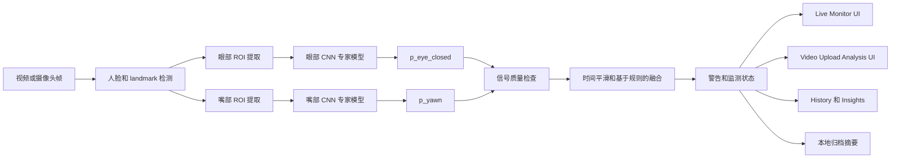

# VisionGuard 技术学习指南

最后更新：2026-05-26

## 1. 本指南的目的

本指南面向第一次接触 VisionGuard 项目的读者，帮助你在深入阅读代码之前，先理解项目背景、系统架构、深度学习流程、运行时逻辑、主要开发阶段，以及推荐的仓库阅读路径。

这不是 API 参考文档，也不会逐个函数解释代码。它的目标是说明各个模块如何协作，以及为什么本项目采用模块化监测系统，而不是一个单一的黑盒分类器。

## 2. 项目概览

VisionGuard 是一个模块化的驾驶员疲劳检测与监测系统。它使用深度学习模型识别与疲劳相关的视觉线索，然后通过基于规则的时序融合（rule-based temporal fusion），把逐帧证据转换成监测状态和警告候选状态。

系统重点关注两个视觉线索：

| 线索 | 专家模型任务 | 运行时输出 |
| --- | --- | --- |
| 眼部状态 | 闭眼 vs 睁眼分类 | `p_eye_closed` |
| 嘴部 / 打哈欠状态 | 未打哈欠 vs 打哈欠分类 | `p_yawn` |

这些概率本身不会被当作最终驾驶员状态真值。它们是证据信号。运行时层会检查人脸和感兴趣区域（ROI, Region of Interest）是否可靠，对证据进行时间平滑，并结合眼部和嘴部证据，输出正常监测、眼部警告候选、嘴部警告候选、高置信警告候选或信号不可靠等状态。

## 3. 问题定义

驾驶员疲劳很难从单张图像中可靠判断，因为很多短暂视觉模式是正常现象。一次眨眼可能在一两帧里看起来像闭眼；说话、转头或光照变化会影响嘴部区域；摄像头也可能短暂丢失人脸或产生不稳定 landmarks。

因此，VisionGuard 把疲劳监测视为一个视觉证据问题：

- 检测与疲劳相关的视觉线索，例如持续闭眼和打哈欠。
- 将信号质量问题与疲劳证据分开处理。
- 减少短暂眨眼或短暂嘴部动作造成的误报。
- 输出可解释的警告候选状态，而不是宣称临床诊断或确定性的驾驶员状态标签。

当前系统支持实时摄像头监测和上传视频分析，也会存储紧凑的本地摘要，用于 History 和 Insights 页面。

## 4. 为什么采用模块化流程

VisionGuard 有意设计为模块化系统。它不是一个单一的 drowsy / not-drowsy 分类器。

模块化设计的优势包括：

- 闭眼和打哈欠是不同的视觉任务，可以分别使用不同数据集、裁剪策略、模型选择和错误分析。
- 专家模型输出更容易检查。开发者可以判断一次警告来自眼部证据、嘴部证据还是信号质量问题。
- 运行时规则可以处理时间维度。单帧通常有歧义，但一段序列可以体现持续闭眼、近期打哈欠或追踪不可靠。
- 安全边界更清楚。系统可以输出“信号不可靠”，而不是把人脸缺失误认为疲劳。
- UI 可以展示基于证据的监测状态，而不夸大为最终驾驶员状态真值。

这种结构也更利于迭代。眼部专家模型、嘴部专家模型、时序逻辑、UI 和归档模块都可以在保持接口稳定的前提下独立演进。

## 5. 高层架构

主要数据流如下：



从代码层面看，系统可以分为以下几层：

| 层 | 主要职责 | 代表位置 |
| --- | --- | --- |
| 数据和预处理 | 构建 manifest、重建帧、裁剪 ROI、创建防泄漏 split | `src/data/`, `src/preprocessing/` |
| 模型训练 | 训练并比较眼部和嘴部 CNN 专家模型 | `src/training/` |
| 运行时证据 | 从实时帧或上传视频中提取 ROI 并执行专家模型推理 | `src/runtime/` |
| 后端 API | 提供上传分析、实时帧分析和本地归档接口 | `src/backend/app.py` |
| 前端 UI | 展示 Live Monitor、Video Upload Analysis、History 和 Insights | `SystemUI/` |
| 本地归档 | 在 SQLite 中存储紧凑分析摘要 | `src/backend/local_archive.py` |

## 6. 数据集层

VisionGuard 使用不同数据集解决不同视觉问题。

### YawDD / YawDD+ Dash

YawDD 和重建后的 YawDD+ Dash 数据用于嘴部 / 打哈欠专家模型。任务是二分类：

- `no_yawn`
- `yawn`

项目会重建可用的逐帧数据，使用人脸 landmarks 和 fallback 逻辑提取嘴部裁剪图，并构建 subject-level 的训练 / 验证 / 测试划分。文档记录的 YawDD Dash 嘴部裁剪流程在质量过滤后产生约 64,202 张可训练嘴部裁剪图。subject-level split 使用 20 个训练 subjects、4 个验证 subjects 和 5 个测试 subjects。

### MRL Eye

MRL Eye 用于眼部开闭专家模型。任务是二分类：

- 闭眼
- 睁眼

项目在训练前构建 manifest 和 subject-level split。文档记录的划分包含 25 个训练 subjects、6 个验证 subjects、6 个测试 subjects，总计约 84,898 张图像。

### NTHUDDD2

NTHUDDD2 曾作为数据集调研的一部分被探索，但不是当前工作系统的主要实现方向。当前架构依赖 MRL Eye 眼部专家模型、YawDD / YawDD+ Dash 嘴部专家模型和运行时融合。

### 为什么 subject-level split 很重要

Subject-level split 指同一个人的图像或视频帧不会同时出现在训练集和测试集中。这很重要，因为人脸、眼部和嘴部图像都可能包含身份相关模式。如果同一个 subject 同时出现在训练和测试中，模型可能看起来很强，但实际上是在识别这个人的外观，而不是学习稳健的视觉线索。

对于 VisionGuard，防止数据泄漏是专家模型指标可信度的核心。它不能保证运行时系统完美，但能让训练评估更可信。

## 7. 深度学习模型层

深度学习层使用迁移学习（transfer learning）。项目不是从零训练大型 CNN，而是从预训练图像分类 backbone 出发，并将它们适配到较小的专家任务。

### 眼部专家模型

眼部模型预测眼部裁剪图是闭眼还是睁眼。

| 项目 | 内容 |
| --- | --- |
| 数据集 | MRL Eye |
| 任务 | 闭眼 vs 睁眼分类 |
| 输出 | `p_eye_closed` |
| 选定模型 | MobileNetV2 |
| 文档结果 | 约 98.63% test accuracy，98.63% macro F1，98.52% closed-eye recall |

MobileNetV2 被选中，是因为它在专家任务上表现强，同时适合面向实时系统的使用场景。

### 嘴部 / 打哈欠专家模型

嘴部模型预测嘴部裁剪图是否表现为打哈欠。

| 项目 | 内容 |
| --- | --- |
| 数据集 | YawDD / YawDD+ Dash |
| 任务 | 未打哈欠 vs 打哈欠分类 |
| 输出 | `p_yawn` |
| 选定模型 | ResNet18 |
| 文档结果 | 约 99.37% test accuracy，97.18% yawn F1 |

ResNet18 是基于文档中的训练和验证结果被选为嘴部 / 打哈欠分支模型。

### 指标边界

这些指标是专家模型在各自测试划分上的结果。它们不是最终系统级疲劳检测准确率。完整运行时系统还加入了人脸检测、ROI 提取、信号质量处理、时间平滑和融合逻辑，这是另一个评估问题。

正确解读方式是：

- 眼部专家模型擅长把准备好的眼部裁剪图分类为睁眼或闭眼。
- 嘴部专家模型擅长把准备好的嘴部裁剪图分类为未打哈欠或打哈欠。
- 完整 VisionGuard 系统产生的是与疲劳相关的视觉线索监测和警告候选状态，而不是确定性的驾驶员状态诊断。

## 8. 运行时证据层

运行时层把实时帧或上传视频帧转换为证据信号。

对每个采样帧，系统会尝试：

1. 检测人脸。
2. 定位 landmarks。
3. 提取眼部和嘴部 ROI。
4. 检查提取区域是否可用。
5. 运行眼部和嘴部专家模型。
6. 生成逐帧证据，例如 `p_eye_closed`、`p_yawn` 和信号质量标记。

这一层很重要，因为模型训练通常使用准备好的裁剪图，而运行时输入更复杂。实际使用中，驾驶员可能移动，光照可能变化，摄像头可能丢失人脸，landmarks 也可能失败。VisionGuard 将这些情况视为信号质量问题，而不是自动视为疲劳证据。

对于 Live Monitor，前端会保持摄像头采样，并向后端 realtime endpoint 发送帧。Minimal Live Monitor Mode 只是显示模式：它隐藏原始摄像头预览和额外面板，但保持采样、后端 realtime 调用、警告 overlay、声音提醒和 critical warning acknowledgement 行为继续运行。

## 9. 时序逻辑和融合层

逐帧概率是有噪声的。因此 VisionGuard 使用时序逻辑和基于规则的融合。

### 眼部证据

闭眼本身还不够。一次眨眼可能在很短时间内产生较高的 `p_eye_closed`。运行时会使用 rolling evidence、连续帧行为和类似 PERCLOS 的逻辑寻找持续闭眼模式。PERCLOS-like evidence 指系统关注最近时间窗口中有多大比例看起来是闭眼，而不是对单帧做出反应。

### 嘴部证据

嘴部动作同样有歧义。说话、表情和短暂张嘴并不等于打哈欠。嘴部分支产生 `p_yawn`，运行时会在时间上考虑近期打哈欠证据，而不是独立对待每一帧。

### 信号质量

人脸不可见和 ROI 失败会被单独处理。这可以避免把缺失或不可靠的视觉输入误判为疲劳证据。

### 融合

融合层结合眼部证据、嘴部证据和信号质量，输出监测状态。文档中的 Stage 13-15 采用分层、质量感知的规则集合。高层逻辑包括：

- 持续闭眼可以产生眼部警告候选。
- 近期打哈欠证据可以产生嘴部警告候选。
- 眼部和嘴部证据同时出现可以产生更高置信的警告候选。
- 人脸或 ROI 可靠性差可以产生信号不可靠状态。

这是基于规则的时序融合，不是训练出来的融合模型。

## 10. 系统实现层

VisionGuard 包含 Python 后端和 Next.js 前端。

### 后端

后端是 `src/backend/app.py` 下的 FastAPI 应用。它提供：

- 上传视频分析。
- 实时 live-frame 分析。
- 实时 session 生命周期和 summary。
- 本地 archive health、record list、record creation、review update 和 export。

本地归档逻辑位于 `src/backend/local_archive.py`。默认 SQLite 文件是 `data/visionguard_archive.sqlite`。archive 只存储紧凑摘要，不应存储原始摄像头帧、原始上传视频、base64 payload、blob 或大型二进制内容。

### 前端

前端是 `SystemUI/` 下的 Next.js App Router 应用。

| 路由 | 产品区域 | 用途 |
| --- | --- | --- |
| `/` | Live Monitor | 实时摄像头监测、风险仪表、警告、当前 session 证据 |
| `/video-upload` | Video Upload Analysis | 上传视频，运行后端分析，检查警告区间和证据 |
| `/history-48h` | History | 回顾近期 Live Monitor sessions、alerts 和紧凑 archive summaries；默认仍是最近 48 小时 |
| `/insights` | Insights | 汇总 Live Monitor alerts 的产品 analytics、alert mix、time-of-day 和 signal-quality patterns |

History 和 Insights 当前应被理解为 Live Monitor runtime records 的产品视图。Video Upload Analysis 可以生成独立的分析结果和 artifact，但除非实现明确改变，不应把上传视频结果当成 History/Insights 的 Live Monitor 统计。

Live Monitor 页面包含 Drowsiness Risk gauge、实时证据、警告 overlay、声音行为和 session/history 写入。Minimal Live Monitor Mode 会让 Drowsiness Risk gauge 成为主要可见 UI，同时隐藏原始摄像头预览、recent events、charts 和额外 dashboard panels。

### 部署上下文

当前远程访问方案允许托管在 Vercel 的前端通过 Cloudflare Quick Tunnel 调用本地 FastAPI 后端。这适合演示和外部测试：

```text
Browser -> Vercel frontend -> Cloudflare Quick Tunnel -> local FastAPI backend -> local models/archive
```

Quick Tunnel URL 会变化，后端仍然运行在本地。当前限制主要是 tunnel 稳定性和本地服务可用性，而不是核心模型管线。这不应被描述为完全云原生的生产部署。

## 11. 阶段式项目进展

下表以学习指南的粒度总结已记录的项目进展。对于文档较少的早期数据工作，只做谨慎概括。

| 阶段 / 区域 | 目的 | 主要输出 | 为什么重要 |
| --- | --- | --- | --- |
| 数据集检查和准备 | 理解可用疲劳相关数据集及标签 | 数据集说明、原始组织、可行方向 | 确定哪些视觉线索可以训练和评估 |
| YawDD / YawDD+ Dash 重建 | 为嘴部 / 打哈欠工作重建可用逐帧 dash 数据 | 重建的带标签帧 | 为嘴部专家模型训练提供基础 |
| 嘴部裁剪预处理 | 从重建的 YawDD Dash 帧中提取嘴部 ROI | 可训练嘴部裁剪数据集 | 将完整帧转换为嘴部 CNN 需要的输入 |
| YawDD subject-level split | 按 subject 划分嘴部数据 | 训练 / 验证 / 测试 subjects 和泄漏检查 | 防止身份泄漏 |
| 嘴部 / 打哈欠训练 | 训练并比较 no-yawn vs yawn CNN backbone | 选定 ResNet18 嘴部专家模型 | 产生运行时 `p_yawn` 证据 |
| MRL Eye 检查和 manifest | 构建干净眼部图像 manifest | 带标签 MRL Eye metadata | 为眼部任务做可复现训练准备 |
| MRL Eye subject-level split | 按 subject 划分眼部数据 | 训练 / 验证 / 测试 subjects 和泄漏检查 | 防止 subject overlap 造成指标虚高 |
| MRL Eye 训练和选择 | 训练并比较眼部专家模型 | 选定 MobileNetV2 眼部专家模型 | 产生运行时 `p_eye_closed` 证据 |
| 运行时眼部 ROI 一致性验证 | 检查运行时眼部裁剪是否与训练假设兼容 | 眼部 ROI 验证证据 | 连接训练裁剪和真实运行时帧 |
| 眼部时序分析 | 探索持续闭眼和 PERCLOS-like 行为 | 眼部证据时间线和 alert-rule candidates | 减少短暂眨眼误报 |
| 眼部 alert rule 选择 | 选择质量门控的时序眼部规则 | 眼部警告候选逻辑 | 使眼部警告更保守、更可解释 |
| 嘴眼融合设计 | 设计质量感知融合规则 | F5-style rule set | 定义眼部、嘴部和信号质量如何互动 |
| 运行时嘴部 / 打哈欠验证 | 在运行时视频证据上验证嘴部推理 | 运行时 `p_yawn` 时间线 | 检查嘴部专家模型在静态裁剪之外是否合理 |
| 真实同步融合验证 | 在同一视频上结合真实眼部和嘴部证据 | 融合状态时间线 | 在没有合成嘴部决策的情况下测试集成逻辑 |
| 最终集成包 | 汇总选定模型、规则和边界 | 集成报告 | 为系统开发提供稳定证据包 |
| Video Upload Analysis MVP | 在上传视频上运行后端管线 | `/api/analyze-video`、警告区间、keyframes、UI evidence | 将模型和融合工作变成可用的视频证据分析工作流 |
| 上传解释优化 | 校准上传视频证据展示和措辞 | 更安全的 interval summaries 和 evidence panels | 防止过度声明，提升分析输出可读性 |
| Live Monitor 实时原型 | 加入实时摄像头采样和后端帧调用 | 带当前 session 证据的 Live Monitor 路由 | 从离线上传扩展到实时监测 |
| Live Monitor 警告行为 | 添加 overlay、声音提醒、critical-warning acknowledgement 和风险显示 | 面向用户的实时警告工作流 | 在保留运行时逻辑的同时让监测可操作 |
| 本地账号和 app-shell 基础 | 添加本地 MVP identity、导航、theme 和 notifications | Dashboard shell 和 local user state | 改善产品结构，但不宣称生产认证 |
| Live Monitor history 写入 | 持久化紧凑本地 session/event 摘要 | History-ready local records | 让近期实时监测活动能在 live 页面之外查看 |
| History / Insights 拆分 | 将 runtime history 与分析式 insights 分离 | `/history-48h` 和 `/insights` 路由 | 让 UI 更容易导航和理解 |
| 本地后端 SQLite archive | 通过 FastAPI 存储紧凑摘要 | `data/visionguard_archive.sqlite` 和 archive endpoints | 提供后端持有的本地 archive，但不存储 raw media |
| Settings 和 Minimal Live Monitor Mode | 为简化 live view 添加显示设置 | Settings popover 和 minimal live layout | 保持实时监测活跃，同时让 risk gauge 成为主要可见 UI |
| 远程访问 / 部署准备 | 用 tunnel 连接 hosted frontend 和 local backend | Vercel frontend + Cloudflare Quick Tunnel workflow | 支持外部测试，同时保持非生产边界清晰 |

## 12. 仓库学习路径

初学者不要一开始逐函数阅读。更有效的方式是先建立“证据流”心智模型，再沿着数据、模型、运行时、后端、前端、部署和报告边界逐层深入。

| 顺序 | 学习主题 | 重点文件 | 内容简要 / 目的 |
| --- | --- | --- | --- |
| 1 | 当前项目全貌和边界 | `docs/AI_PROJECT_CONTEXT.md`; `docs/PROJECT_CURRENT_STATUS.md`; 本文件 `docs/tech_learning/PROJECT_LEARNING_GUIDE_ZH.md` | 先确认 VisionGuard 是 modular monitoring system，不是单一 `drowsy / not-drowsy` classifier；明确 eye specialist、mouth/yawn specialist、runtime fusion、前后端和部署状态。 |
| 2 | 仓库结构和读代码入口 | `docs/PROJECT_STRUCTURE.md`; `Makefile`; `SystemUI/package.json` | 建立目录地图：`src/runtime/`、`src/backend/`、`SystemUI/`、`artifacts/`、`outputs/`、`report_assets/` 和 `docs/` 分别负责什么。 |
| 3 | 初学者路线和术语 | `docs/tech_learning/BEGINNER_ROADMAP_AND_GLOSSARY_ZH.md`; `docs/tech_learning/BEGINNER_ROADMAP_AND_GLOSSARY.md` | 快速认识核心术语，如 `p_eye_closed`、`p_yawn`、ROI、MediaPipe、temporal fusion、warning-candidate、SQLite archive、localStorage。 |
| 4 | 数据预处理总览 | `docs/tech_learning/DATA_PREPROCESSING_TECHNICAL_GUIDE_ZH.md`; `docs/tech_learning/DATA_PREPROCESSING_TECHNICAL_GUIDE.md` | 理解原始数据如何变成 trainable manifests、mouth crops、eye manifests 和 subject-level split；重点学习为什么避免 subject leakage。 |
| 5 | 嘴部 / 打哈欠数据和 artifacts | `artifacts/preprocessed/yawdd_dash_mouth/preprocessing_summary.json`; `artifacts/recovered_stage7_mouth_yawn/README_stage7_training.md`; `artifacts/recovered_stage7_mouth_yawn/metrics_summary.json` | 查看 YawDD/YAWDD+ Dash mouth/yawn 数据如何重建、裁剪、训练和恢复；确认 label mapping 是 `0 = no_yawn`, `1 = yawn`。 |
| 6 | 眼部数据和 artifacts | `outputs/mrl_eye/README.md`; `outputs/mrl_eye/results/mrl_eye_stage9b_model_selection.json`; `outputs/mrl_eye/results/mrl_eye_metrics_summary.json`; `outputs/mrl_eye/checkpoints/best_mobilenet_v2_mrl_eye.pt` | 查看 MRL Eye 训练结果、模型选择和最终 checkpoint；确认 label mapping 是 `0 = closed`, `1 = open`，runtime eye model 是 MobileNetV2。 |
| 7 | 模型训练过程 | `docs/tech_learning/MODEL_TRAINING_TECHNICAL_GUIDE_ZH.md`; `docs/tech_learning/MODEL_TRAINING_TECHNICAL_GUIDE.md`; `colab_file/stage7_yawdd_training_r.ipynb`; `src/training/train_classifier.py`; `src/training/train_mrl_eye_baselines.py` | 学习 transfer learning、CNN backbone、loss、optimizer、scheduler、early stopping 和 checkpoint 保存；特别区分 Stage 7 completed Colab run 的 `8 / 2` 与 local script default 的 `12 / 3`。 |
| 8 | 模型评估和选择 | `docs/tech_learning/MODEL_EVALUATION_AND_SELECTION_GUIDE_ZH.md`; `docs/tech_learning/MODEL_EVALUATION_AND_SELECTION_GUIDE.md`; `outputs/mrl_eye/results/*.json`; `report_assets/mouth_yawn_evaluation_refresh/metrics/resnet18_metrics_summary.json` | 学习 confusion matrix、precision、recall、F1、ROC/AUC 和 model selection；理解为什么 eye runtime 选 MobileNetV2、mouth/yawn runtime 选 ResNet18，EfficientNet-B0 只是 comparison model。 |
| 9 | 运行时推理和 temporal fusion | `docs/tech_learning/RUNTIME_INFERENCE_AND_TEMPORAL_FUSION_GUIDE_ZH.md`; `docs/tech_learning/RUNTIME_INFERENCE_AND_TEMPORAL_FUSION_GUIDE.md`; `src/runtime/realtime_frame_inference.py`; `src/runtime/realtime_temporal_state.py`; `src/runtime/system_video_upload_pipeline.py` | 把 `p_eye_closed`、`p_yawn`、signal quality、rolling window、debounce/cooldown 和 warning-candidate state 连起来；明确这是 rule-based fusion，不是训练出来的 fusion classifier。 |
| 10 | 分阶段 runtime 证据报告 | `docs/stages/stage10/STAGE10_RUNTIME_EYE_ROI_DESIGN.md`; `docs/stages/stage10/STAGE10_11_MULTI_VIDEO_VALIDATION_LOG.md`; `docs/stages/stage13/STAGE13_MOUTH_EYE_FUSION_DESIGN.md`; `docs/stages/stage14/STAGE14_MOUTH_YAWN_RUNTIME_LOG.md`; `docs/stages/stage15/STAGE15_REAL_MOUTH_EYE_FUSION_LOG.md`; `outputs/stage15_real_mouth_eye_fusion/stage15_real_fusion_summary.json` | 阅读眼部 ROI 一致性、眼部时序、嘴眼融合、真实同步融合等证据链；理解研究验证如何支持后续系统集成。 |
| 11 | Video Upload Analysis 系统化 | `docs/stages/stage17/STAGE17_VIDEO_UPLOAD_RESULT_SCHEMA.md`; `docs/stages/stage17/STAGE17_3_VIDEO_UPLOAD_UI_PAGE_REPORT.md`; `docs/stages/stage17/STAGE17_5_VIDEO_UPLOAD_UI_EVIDENCE_REVIEW_PAGE.md`; `src/runtime/keyframe_extractor.py`; `outputs/system_video_upload_runs/*/summary.json` | 理解上传视频如何生成 summary、timeline、alert intervals、keyframes 和 backend-generated evidence figures；注意它是 runtime evidence demonstration，不是 ground-truth accuracy report。 |
| 12 | 后端 API 和本地 archive | `src/backend/app.py`; `src/backend/local_archive.py`; `docs/LOCAL_BACKEND_ARCHIVE.md`; `docs/stages/stage17/STAGE17_3_LOCAL_LAUNCH_GUIDE.md` | 学习 FastAPI endpoints、realtime session、video upload run artifacts、SQLite archive 和 write-token 边界；确认 archive 存 compact summaries，不存 raw frames/videos/base64/blob。 |
| 13 | 前端产品 UI flow | `docs/tech_learning/FRONTEND_PRODUCT_AND_UI_FLOW_GUIDE_ZH.md`; `docs/tech_learning/FRONTEND_PRODUCT_AND_UI_FLOW_GUIDE.md`; `SystemUI/src/app/page.tsx`; `SystemUI/src/app/video-upload/page.tsx`; `SystemUI/src/app/history-48h/page.tsx`; `SystemUI/src/app/insights/page.tsx`; `SystemUI/src/components/dashboard/LiveMonitorPage.tsx`; `SystemUI/src/components/video-upload/VideoUploadAnalysis.tsx` | 学习 Live Monitor、Video Upload Analysis、History、Insights 如何呈现 runtime evidence；理解 Minimal Live Monitor Mode 只改变显示，不改变推理、声音或 warning logic。 |
| 14 | History / Insights 数据边界 | `SystemUI/src/components/history-48h/History48hPage.tsx`; `SystemUI/src/components/insights/InsightsPage.tsx`; `SystemUI/src/lib/history48hStorage.ts`; `SystemUI/src/lib/liveMonitorHistoryIngestion.ts`; `SystemUI/src/lib/insightsUtils.ts` | 确认 History/Insights 当前主要总结 Live Monitor records；不要把 Video Upload results 默认当作 History/Insights 的 Live Monitor statistics；它们是 product analytics，不是 model evaluation。 |
| 15 | 本地状态、settings 和 notifications | `SystemUI/src/lib/authStore.tsx`; `SystemUI/src/lib/settingsStore.tsx`; `SystemUI/src/lib/notificationStore.tsx`; `SystemUI/src/components/dashboard/UserProfileMenu.tsx` | 理解 local MVP account、theme/settings、Minimal Live Monitor Mode 和 Notification Center；这些是本地 UI 状态，不是 production auth、cloud sync 或模型逻辑。 |
| 16 | 本地运行、远程测试和部署边界 | `docs/tech_learning/DEPLOYMENT_AND_LOCAL_OPERATION_GUIDE_ZH.md`; `docs/tech_learning/DEPLOYMENT_AND_LOCAL_OPERATION_GUIDE.md`; `docs/DEPLOYMENT_RUNBOOK.md`; `docs/DAILY_STARTUP_CHECKLIST.md`; `docs/archive/deployment/TUNNEL_DIAGNOSTIC_REPORT.md`; `scripts/deployment_preflight.sh` | 学习本地 backend、Next.js frontend、Vercel frontend 和 Cloudflare Quick Tunnel 的关系；明确当前是 external-access testing，不是完整 cloud-native backend deployment。 |
| 17 | 测试、排错和安全验证 | `docs/tech_learning/TESTING_VALIDATION_AND_TROUBLESHOOTING_GUIDE_ZH.md`; `docs/tech_learning/TESTING_VALIDATION_AND_TROUBLESHOOTING_GUIDE.md`; `docs/archive/audits/stage17_video_upload_mvp_2026-05-09/stage17_systemui_backend_audit.md` | 学习如何验证 backend health、upload analysis、Live Monitor、History/Insights、build/lint 和部署连接；同时避免通过删除 archive/localStorage 或改 thresholds 来“修”问题。 |
| 18 | 报告证据和声明边界 | `docs/tech_learning/REPORT_EVIDENCE_AND_CLAIMS_BOUNDARY_GUIDE_ZH.md`; `docs/tech_learning/REPORT_EVIDENCE_AND_CLAIMS_BOUNDARY_GUIDE.md`; `docs/final/final_report.md`; `docs/final/final_report_en.md`; `report_assets/all_figures/`; `report_assets/mouth_yawn_evaluation_refresh/` | 学习哪些结果可以支持数据、模型、runtime 或 UI 论点；避免把 specialist metrics、Video Upload intervals、History/Insights charts 写成 final full-system drowsiness accuracy。 |

如果只是快速接手项目，建议先读 1、2、3、9、13、16、18；如果要写报告或答辩，再补读 4 到 8 和 10 到 12。阅读代码时也建议按同样顺序：先 evidence flow，再 runtime/backend/frontend，最后看具体函数实现。

## 13. 关键技术经验

### 数据泄漏防护

Subject-level split 对人脸、眼部和嘴部数据集非常关键。它防止同一个人的视觉身份同时出现在训练集和测试集中。

### 迁移学习

项目使用预训练 CNN backbone，并将其适配到专家二分类任务。这在数据集规模小于从零训练大型 CNN 所需规模时很实用。

### 专家模型评估

高专家模型指标有价值，但只描述模型在定义好的划分和准备好的裁剪图上的表现。运行时监测还依赖摄像头质量、人脸检测、ROI 提取、帧采样和时序逻辑。

### 运行时分布偏移

训练裁剪图和实时摄像头帧并不完全相同。需要运行时验证来检查训练好的专家模型在真实视频生成的裁剪图上是否仍然合理。

### 信号质量

看不到人脸与看到疲劳证据是两件不同的事。VisionGuard 将信号质量作为独立概念，避免追踪失败变成错误疲劳证据。

### 时间平滑

单帧不足以支持稳健监测。时间平滑有助于区分眨眼和持续闭眼，也有助于区分短暂嘴部动作和更有意义的打哈欠证据。

### 模块化系统设计

将专家模型、运行时证据提取、时序融合、后端服务、前端视图和 archive 存储分开，可以让系统更容易调试，也更容易负责任地描述。

### 保守声明

系统应被描述为与疲劳相关的视觉线索监测系统，输出基于证据的警告状态。它不应被描述为医疗设备、生产安全保证或驾驶员状态的最终裁判。

## 14. 当前限制和声明边界

VisionGuard 有清晰边界：

- 它没有最终系统级疲劳检测准确率声明。
- 它不是医疗诊断系统。
- 它不是生产安全保证。
- 专家模型指标不等于完整运行时系统性能。
- 本地 MVP 账号 / profile 层不是生产认证。
- 本地 SQLite archive 不是云数据库。
- archive 只存储紧凑摘要，不应存储原始摄像头帧、原始上传视频、base64 payload、blob 或大型二进制内容。
- Quick Tunnel 适合外部测试，但不是稳定的生产基础设施。
- 当前远程访问设置依赖本地后端、本地模型 checkpoints、本地 archive 和当前 tunnel URL 可用。

这些边界并不削弱项目的学习价值。它们是负责任工程表达的一部分。

## 15. 术语表

| 术语 | 含义 |
| --- | --- |
| ROI | Region of Interest，感兴趣区域。图像中的裁剪区域，例如眼部裁剪或嘴部裁剪，用作模型输入。 |
| `p_eye_closed` | 眼部专家模型估计眼部裁剪图为闭眼的概率。 |
| `p_yawn` | 嘴部专家模型估计嘴部裁剪图表现为打哈欠的概率。 |
| PERCLOS-like evidence | 一种时间窗口式证据，观察最近一段时间有多少比例的证据表示闭眼。VisionGuard 保守地将这个思想用于时序逻辑。 |
| Signal quality | 人脸、landmarks 和 ROI 是否足够可靠，可用于解释的状态信息。 |
| Warning candidate / alert | 由证据和规则产生的监测状态。它不是临床诊断，也不是保证正确的驾驶员状态真值。 |
| Temporal smoothing | 跨多帧组合证据，避免系统对单个噪声帧过度反应。 |
| Fusion | 将眼部证据、嘴部证据和信号质量合并成监测状态。 |
| Subject-level split | 每个人只出现在一个 split 中的训练 / 验证 / 测试划分方式，用于减少身份泄漏。 |
| Transfer learning | 从预训练模型出发，将其适配到新任务，例如睁眼 vs 闭眼分类。 |
| Checkpoint | 训练过程中保存的模型状态，之后可加载用于推理。 |
| Archive | 基于本地 SQLite 的紧凑分析摘要、Live Monitor history records 和可选技术元数据存储。它不是 raw media storage，也不是模型评估数据库。 |
