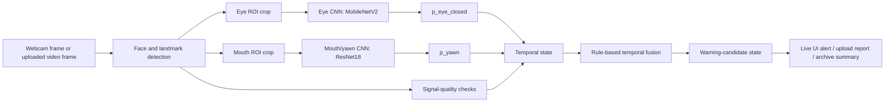

# Runtime Inference and Temporal Fusion Technical Guide

## 1. Purpose of This Document

This guide explains what happens after model training and model selection in VisionGuard: how webcam or video frames are converted into runtime evidence, and how temporal rules convert that evidence into warning-candidate states.

It connects with the existing learning documents:

- Project overview: `docs/tech_learning/PROJECT_LEARNING_GUIDE.md`
- Data preprocessing: `docs/tech_learning/DATA_PREPROCESSING_TECHNICAL_GUIDE.md`
- Model training: `docs/tech_learning/MODEL_TRAINING_TECHNICAL_GUIDE.md`
- Model evaluation and selection: `docs/tech_learning/MODEL_EVALUATION_AND_SELECTION_GUIDE.md`

This is not another training document and not a new experimental results report. It focuses on:

```text
trained specialist CNNs + video frames
-> ROI extraction
-> p_eye_closed / p_yawn
-> signal quality
-> temporal state
-> rule-based fusion
-> warning-candidate states
```

The most important boundary is that VisionGuard is not a single `drowsy / not-drowsy` classifier. The eye and mouth models output visual-evidence probabilities. The final runtime output is rule-based warning-candidate evidence, not a medical diagnosis, safety certification, or labelled video-level drowsiness accuracy.

## 2. Where Runtime Inference Fits in VisionGuard

The high-level runtime chain is:



Key points:

- The eye model does not directly predict drowsiness; it outputs `p_eye_closed`.
- The mouth/yawn model does not directly predict drowsiness; it outputs `p_yawn`.
- The fusion layer is not a trained neural network. It is rule-based temporal fusion.
- A warning-candidate state means an attention-worthy pattern of visual evidence, not a ground-truth drowsiness label.

Source: `src/runtime/realtime_frame_inference.py`, `src/runtime/realtime_temporal_state.py`, `src/runtime/system_video_upload_pipeline.py`

## 3. Runtime Inputs

VisionGuard has two main runtime input modes: Live Monitor and Video Upload Analysis.

### 3.1 Live Monitor Input

Live Monitor is the realtime webcam flow. The frontend captures frames from the browser webcam and sends JPEG frames to the backend. The backend runs face/landmark detection, ROI extraction, CNN inference, and then passes the frame-level result into a session-local temporal state object.

Confirmed realtime API endpoints:

| Endpoint | Purpose |
|---|---|
| `POST /api/realtime/session/start` | Create a realtime session and initialize `RealtimeTemporalState` |
| `POST /api/realtime/frame` | Receive one JPEG frame, run frame inference, and update temporal state |
| `POST /api/realtime/session/stop` | Stop a realtime session and freeze temporal state |
| `GET /api/realtime/health` | Check realtime service and model-loading status |

Source: `src/backend/app.py`

Confirmed frontend Live Monitor behavior:

- The default sampling FPS is 2.
- Frames are resized to a maximum sampling size of about `640 x 360`, then sent as JPEG with quality `0.85`.
- Minimal Live Monitor Mode only changes display layout: it hides the camera preview, recent events, charts, and extra panels. It does not disable frame sampling, backend realtime requests, warning overlays, or sound alerts.

Source: `SystemUI/src/components/dashboard/LiveVideoCard.tsx`, `SystemUI/src/components/dashboard/LiveMonitorPage.tsx`, `SystemUI/src/lib/settingsStore.tsx`

### 3.2 Video Upload Input

Video Upload Analysis is the offline analysis flow. After a user uploads a video, the backend pipeline samples video frames, runs eye and mouth specialist inference over the sampled frames, and produces warning intervals, keyframes, evidence figures, and report artifacts.

Confirmed upload API endpoints:

| Endpoint | Purpose |
|---|---|
| `POST /api/analyze-video` | Upload and analyze a video |
| `GET /api/runs/{session_id}/summary` | Read analysis summary |
| `GET /api/runs/{session_id}/timeline` | Read timeline CSV |
| `GET /api/runs/{session_id}/keyframes` | Read keyframe metadata |
| `GET /api/runs/{session_id}/files/{relative_path}` | Safely read a run artifact file |

Source: `src/backend/app.py`

The upload pipeline has these confirmed backend defaults:

| Parameter | Default | Meaning |
|---|---:|---|
| `--sample-every-n-frames` | `5` | Sample every 5 frames |
| `--max-frames` | `300` | Analyze at most 300 sampled frames |
| `--yawn-threshold` | `0.50` | Yawn evidence threshold |
| `--recent-yawn-window-sec` | `8.0` | Upload recent-yawn context window |

Source: `src/runtime/system_video_upload_pipeline.py`, `src/backend/app.py`

Realtime processing and upload analysis differ:

- Live Monitor continuously receives browser frames and updates session state incrementally.
- Video Upload processes an existing video in one run and outputs a full timeline, figures, keyframes, and a report.
- Both use eye/mouth specialist evidence, but they should not be assumed to have identical rule implementations. Realtime state is centered in `realtime_temporal_state.py`; upload analysis is centered in `system_video_upload_pipeline.py`.

## 4. Face Detection and Landmark Extraction

The specialist CNNs cannot reliably classify eye or mouth states directly from an arbitrary full frame. The system first needs to locate the face and facial landmarks, then crop the eye ROI and mouth ROI.

The project uses MediaPipe Face Landmarker / Face Mesh style processing:

- detect a face;
- return facial landmarks;
- crop left and right eye ROIs from eye landmarks;
- crop the mouth ROI from mouth landmarks;
- if landmarks are missing or the ROI is invalid, that specialist evidence should be treated as unavailable rather than forced into a “normal” or “fatigue” interpretation.

Confirmed MediaPipe settings include:

| Setting | Value |
|---|---:|
| `num_faces` | `1` |
| `min_face_detection_confidence` | `0.3` |
| `min_face_presence_confidence` | `0.3` |
| `min_tracking_confidence` | `0.3` |

Source: `src/runtime/stage10_eye_roi_consistency.py`, `src/runtime/stage14_mouth_yawn_runtime.py`

Signal quality matters here. No detected face, unstable landmarks, out-of-bounds ROI crops, or failed crops do not mean “the driver is not tired.” They mean the current frame does not provide reliable visual evidence.

## 5. Eye ROI Runtime Pipeline

The eye runtime pipeline extracts eye evidence from a webcam or video frame and produces `p_eye_closed`.

Confirmed flow:

1. Use MediaPipe landmarks to locate the left and right eye areas.
2. Crop eye ROIs using eye bounding boxes.
3. Convert each eye ROI to an RGB/PIL image.
4. Apply image transforms consistent with training/evaluation.
5. Feed the crop into the MobileNetV2 eye-state specialist.
6. Apply softmax to logits.
7. Use the probability of class `0` as `p_eye_closed`.
8. If both eyes are available, runtime uses the mean of available eye probabilities as `mean_p_eye_closed`.

Confirmed label mapping:

| Class index | Label |
|---:|---|
| `0` | `closed` |
| `1` | `open` |

Source: `src/runtime/stage10_eye_roi_consistency.py`, `src/runtime/realtime_frame_inference.py`

Confirmed model and checkpoint:

| Item | Value |
|---|---|
| Runtime eye model | MobileNetV2 |
| Checkpoint | `outputs/mrl_eye/checkpoints/best_mobilenet_v2_mrl_eye.pt` |
| Runtime output | `p_eye_closed` |

Source: `src/runtime/realtime_frame_inference.py`, `outputs/mrl_eye/checkpoints/best_mobilenet_v2_mrl_eye.pt`

`p_eye_closed` is a probability/confidence-style value for eye-closure evidence. It is not a fatigue probability. High `p_eye_closed` can be caused by actual closed eyes, squinting, strong shadows, glasses reflection, ROI shift, poor lighting, or head-pose-related crop errors.

## 6. Mouth ROI Runtime Pipeline

The mouth runtime pipeline extracts mouth/yawn evidence from a frame and produces `p_yawn`.

Confirmed flow:

1. Use MediaPipe landmarks to locate the mouth/lower-face area.
2. Crop the mouth ROI using a mouth bounding box.
3. Convert the mouth ROI to an RGB/PIL image.
4. Resize and normalize the crop to match model input.
5. Feed the crop into the ResNet18 mouth/yawn specialist.
6. Apply softmax to logits.
7. Use the probability of class `1` as `p_yawn`.

Confirmed label mapping:

| Class index | Label |
|---:|---|
| `0` | `no_yawn` |
| `1` | `yawn` |

Source: `src/runtime/stage14_mouth_yawn_runtime.py`, `src/runtime/realtime_frame_inference.py`

Confirmed model and checkpoint:

| Item | Value |
|---|---|
| Runtime mouth/yawn model | ResNet18 |
| Checkpoint | `checkpoints/resnet18_best.pt` |
| Runtime output | `p_yawn` |

Source: `src/runtime/realtime_frame_inference.py`, `src/runtime/stage14_mouth_yawn_runtime.py`

`p_yawn` is yawn visual evidence, not complete fatigue proof. High `p_yawn` can be caused by actual yawning, talking, open mouth, smiling, head pose, mouth ROI crop errors, or domain shift between training data and real webcam data.

## 7. Model Probability Outputs

In this project, specialist CNN outputs are interpreted after softmax:

- eye model: `softmax(logits)[0] -> p_eye_closed`
- mouth model: `softmax(logits)[1] -> p_yawn`

Beginners often misread probability outputs. Model probability is not objective truth. It is the model’s confidence for the current input crop, affected by training data, crop quality, lighting, pose, occlusion, and domain shift.

For that reason, VisionGuard does not use a single-frame `p_eye_closed` or `p_yawn` to declare that a driver is tired. The system places frame-level evidence into temporal state, checks whether evidence is sustained, whether other evidence is present, and whether signal quality is reliable before generating a warning-candidate state.

## 8. Signal Quality Checks

Signal quality is a first-class part of the runtime system, not merely debug information.

Confirmed realtime frame-inference signal statuses include:

| Status | Meaning |
|---|---|
| `ok` | Both eye ROI and mouth ROI are available |
| `partial` | Only one of eye or mouth ROI is available |
| `roi_unavailable` | A face was detected, but both eye and mouth ROIs are unavailable |
| `no_face` | No reliable face was detected |

Source: `src/runtime/realtime_frame_inference.py`

`realtime_temporal_state.py` also treats these cases as signal failure:

- no face detected;
- tracking failure;
- required ROI unavailable;
- `signal_quality.status` is not `ok`.

Source: `src/runtime/realtime_temporal_state.py`

Poor signal quality means the current visual evidence is unreliable. It should not be interpreted as “safe” or “fatigued.” This is why camera signal interruption is treated as its own alert type in History and Insights.

## 9. Why Single-Frame Classification Is Not Enough

Single-frame CNN classification is not stable enough for realtime driving contexts because:

- a normal blink can create closed-eye frames;
- an open-mouth frame may be speech or expression, not yawning;
- webcam FPS and network timing can vary;
- ROI crops can briefly fail because of pose, lighting, or occlusion;
- probabilities fluctuate frame by frame;
- fatigue-related cues are temporal patterns, not purely instant events.

This is why the system needs temporal smoothing, rolling windows, debounce, cooldown, and sustained evidence gates. These do not “increase model accuracy.” They form more conservative and interpretable warning-candidate states from noisy frame-level evidence.

## 10. Temporal State

Temporal state is the runtime memory for one session. It helps the system answer:

- Has eye-closure evidence persisted across recent frames?
- Has yawn evidence appeared recently?
- Is signal failure frequent?
- Has the current eye warning interval reached the sustained gate?
- Should a warning-candidate state be entered, held, or exited?

Each Live Monitor session creates its own `RealtimeTemporalState`, so different camera start/stop periods do not share old counters or recent evidence.

Confirmed realtime temporal state fields include:

| State field | Role |
|---|---|
| `frames` | Rolling buffer for recent frame-level evidence |
| `mouth_active` | Whether mouth/yawn evidence is currently active |
| `last_yawn_monotonic` | Time of the most recent yawn evidence |
| `eye_warning_active` | Whether an eye warning interval is currently active |
| `current_eye_warning_interval_start` | Start time of the current eye interval |
| `current_eye_warning_frames` | Number of frames accumulated in the current eye interval |
| `current_eye_warning_peak_p_eye_closed` | Highest eye-closed probability in the current interval |
| `current_eye_warning_peak_strength` | Highest eye evidence strength in the current interval |
| `last_sustained_eye_warning_end_monotonic` | End time of the most recent sustained eye warning |

Source: `src/runtime/realtime_temporal_state.py`

The upload pipeline does not use the exact same incremental session object. Instead, it processes a full video timeline: eye timeline, mouth timeline, alignment, fusion, intervals, figures, and keyframes.

Source: `src/runtime/system_video_upload_pipeline.py`

## 11. Rule-Based Temporal Fusion

Rule-based fusion is the core of this guide. It means the system does not train a new fusion neural network. Instead, it uses human-designed, interpretable rules to combine `p_eye_closed`, `p_yawn`, signal quality, and temporal context into warning-candidate states.

### 11.1 Realtime confirmed thresholds

Confirmed realtime thresholds:

| Item | Value | Meaning |
|---|---:|---|
| `EYE_CLOSED_THRESHOLD` | `0.50` | Single-frame eye closed binary threshold |
| `EYE_WARNING_ENTER_ROLLING_MEAN` | `0.60` | Rolling eye closed ratio needed to enter eye warning |
| `EYE_WARNING_ENTER_CONSECUTIVE_FRAMES` | `2` | Consecutive frames needed to enter eye warning |
| `EYE_WARNING_EXIT_ROLLING_MEAN` | `0.40` | Rolling mean below this can exit eye warning |
| `EYE_WARNING_EXIT_CONSECUTIVE_FRAMES` | `2` | Consecutive frames needed to exit eye warning |
| `SUSTAINED_EYE_WARNING_MIN_SECONDS` | `1.0` | Minimum duration for sustained eye warning |
| `SUSTAINED_EYE_WARNING_MIN_FRAMES` | `5` | Minimum sampled frames for sustained eye warning |
| `YAWN_ON_THRESHOLD` | `0.50` | Threshold to activate mouth/yawn evidence |
| `YAWN_OFF_THRESHOLD` | `0.35` | Candidate threshold to deactivate mouth evidence |
| `YAWN_OFF_CONSECUTIVE_FRAMES` | `2` | Consecutive off frames needed to deactivate mouth evidence |
| `MOUTH_ACTIVE_MAX_HOLD_SECONDS` | `1.5` | Maximum hold time when mouth evidence becomes temporarily unavailable |
| `RECENT_YAWN_CONTEXT_SECONDS` | `4.0` | Recent-yawn fusion context window |
| `RECENT_YAWN_REMINDER_SECONDS` | `8.0` | Recent-yawn display reminder window |
| `ROLLING_WINDOW_FRAMES` | `5` | Rolling evidence window |
| `SIGNAL_FAILURE_RATIO_THRESHOLD` | `0.20` | Recent signal-failure ratio above this is unreliable |

Source: `src/runtime/realtime_temporal_state.py`

### 11.2 Eye evidence strength

Realtime frame inference and the upload pipeline both use graded eye evidence:

| Strength | Condition |
|---|---|
| `strong_eye_closure_candidate` | `p_eye_closed >= 0.85` |
| `moderate_eye_closure_candidate` | `p_eye_closed >= 0.70` |
| `weak_reduced_eye_openness_candidate` | `p_eye_closed >= 0.50` |
| `normal_open` | below `0.50` |

Source: `src/runtime/realtime_frame_inference.py`, `src/runtime/system_video_upload_pipeline.py`

### 11.3 Realtime fusion logic

Realtime fusion can be summarized as:

1. Compute the rolling eye closed ratio over the most recent 5 frames.
2. Enter eye warning if the rolling mean reaches `0.60`, signal is not unreliable, and the condition holds for 2 consecutive frames.
3. Exit eye warning if the rolling mean falls below `0.40` for 2 consecutive frames.
4. Treat an eye interval as sustained if it lasts at least `1.0s` or contains at least `5` frames.
5. Activate mouth evidence when `p_yawn >= 0.50`.
6. Deactivate mouth evidence after `p_yawn < 0.35` for 2 consecutive frames; if mouth ROI becomes temporarily unavailable, hold mouth evidence for at most `1.5s`.
7. Use recent yawn context for fusion within 4 seconds; use a display reminder window for 8 seconds.
8. High-confidence state requires recent yawn, eye warning, sustained eye warning, and moderate/strong eye evidence.
9. If signal is unreliable and mouth is not active, the state can become `signal_unreliable`.

Source: `src/runtime/realtime_temporal_state.py`

### 11.4 Upload fusion logic

The upload pipeline uses the fusion rule name:

```text
F5_tiered_quality_aware_fusion
```

The Stage13 baseline F5 logic includes:

| Condition | Output state |
|---|---|
| eye unreliable and no recent yawn | `signal_unreliable` |
| eye unreliable and recent yawn | `mouth_warning_candidate` |
| eye warning and recent yawn | `high_confidence_drowsiness_candidate` |
| eye warning | `eye_warning_candidate` |
| recent yawn | `mouth_warning_candidate` |
| otherwise | `normal` |

Source: `src/runtime/stage13_mouth_eye_fusion_design.py`

The upload pipeline then applies a sustained eye gate and Stage17.5 eye evidence strength gate. In other words, a high-confidence candidate produced by the baseline F5 rule can still be suppressed back to a more conservative state if sustained/strength conditions are not met.

Source: `src/runtime/system_video_upload_pipeline.py`

## 12. Realtime Live Monitor Runtime Flow

The Live Monitor end-to-end flow is:

1. The user clicks Start Camera.
2. The frontend opens the webcam through `getUserMedia`.
3. The frontend calls `/api/realtime/session/start`.
4. The frontend samples frames from the video element at the configured sampling FPS.
5. Each frame is resized and sent as JPEG to `/api/realtime/frame`.
6. The backend runs `RealtimeFrameInferenceService.analyze_frame`.
7. The backend passes the frame result to `RealtimeTemporalState.update_from_frame`.
8. The backend returns frame-level evidence and temporal state.
9. The frontend maps fusion state to alert type.
10. The frontend runs debounce/cooldown, risk display, overlay, sound alert, and local history ingestion.
11. When the user stops the camera, the frontend calls `/api/realtime/session/stop` and updates the current drive session.

Source: `src/backend/app.py`, `src/runtime/realtime_frame_inference.py`, `src/runtime/realtime_temporal_state.py`, `SystemUI/src/components/dashboard/LiveVideoCard.tsx`, `SystemUI/src/components/dashboard/LiveMonitorPage.tsx`

Frontend alert debounce/cooldown is UI behavior. It does not change backend model or fusion rules:

| Alert type | Cooldown |
|---|---:|
| eye warning | `8000ms` |
| mouth warning | `8000ms` |
| high confidence | `10000ms` |
| signal quality | `5000ms` |

Other confirmed values:

- alert debounce: `1.0s`
- normal clear: `2.0s`

Source: `SystemUI/src/lib/liveMonitorAlertUtils.ts`

The risk gauge is also a UI display score, not model probability:

| UI state | Display score |
|---|---:|
| critical/high confidence/sustained eye | `92` |
| eye warning | `74` |
| mouth warning | `55` |
| signal check | `30` |
| monitoring low | `20` |
| idle | `0` |

Source: `SystemUI/src/lib/liveMonitorRiskUtils.ts`

## 13. Video Upload Runtime Flow

The Video Upload Analysis end-to-end flow is:

1. The user uploads a video to `/api/analyze-video`.
2. The backend creates `outputs/system_video_upload_runs/{session_id}/`.
3. The backend calls `src/runtime/system_video_upload_pipeline.py`.
4. The pipeline runs Stage10 eye ROI / MobileNetV2 inference.
5. The pipeline runs Stage11 eye temporal analysis.
6. The pipeline runs Stage14 mouth/yawn / ResNet18 inference.
7. The pipeline aligns the eye timeline and mouth timeline.
8. The pipeline applies the Stage13 F5 fusion rule.
9. The pipeline applies the sustained eye gate and Stage17.5 strength gate.
10. The pipeline generates warning intervals.
11. The pipeline generates backend evidence figures:
    - `figures/fusion_timeline.png`
    - `figures/p_eye_closed_over_time.png`
    - `figures/p_yawn_over_time.png`
12. The pipeline extracts keyframes.
13. The pipeline writes summary JSON, timeline CSV, fusion summary, Markdown report, and manifest.
14. The frontend displays Summary, Alert Intervals, Evidence Figures, Keyframes, and Technical Details.

Source: `src/runtime/system_video_upload_pipeline.py`, `src/runtime/keyframe_extractor.py`, `src/backend/app.py`, `SystemUI/src/components/video-upload/VideoUploadAnalysis.tsx`

Evidence Figures are backend-generated artifact images. They are not frontend-redrawn Recharts/canvas charts. They help interpret how runtime evidence changes over time, but they are not model accuracy figures.

## 14. Runtime Artifacts and Outputs

| Output | Generated by | Used by | Meaning | What it does not prove |
|---|---|---|---|---|
| `p_eye_closed` | `realtime_frame_inference.py`, upload eye stage | temporal state, upload timeline | Eye-closure visual evidence | Does not prove fatigue |
| `p_yawn` | `realtime_frame_inference.py`, Stage14 | temporal state, upload timeline | Yawn visual evidence | Does not prove fatigue |
| signal quality | frame inference / temporal state | UI, fusion, History/Insights | Reliability of current visual signal | Does not mean safe or fatigued |
| rolling eye state | `realtime_temporal_state.py` | realtime fusion | Recent-window eye evidence pattern | Not ground truth |
| warning-candidate state | realtime temporal state / upload fusion | UI, intervals, history summaries | Rule-generated attention state | Not a manually labelled event |
| alert interval | upload pipeline | upload table/report | Continuous warning-candidate timeline segment | Not a true drowsiness segment |
| keyframe | `keyframe_extractor.py` | upload gallery/report | Representative frame from an interval | Does not prove model correctness |
| evidence figure | upload pipeline | upload Evidence Figures | Probability/state changes over time | Not an accuracy figure |
| summary JSON | upload pipeline | frontend/API | Lightweight summary of one analysis | Not a model evaluation metric |
| local history record | frontend ingestion | History/Insights | Live Monitor stable alert summary | Not a model evaluation report |
| SQLite archive record | backend local archive | History/Insights/archive fallback | Lightweight archive summary | Should not contain raw frames/video/base64/blob |

Archive safety source: `src/backend/local_archive.py`, `docs/LOCAL_BACKEND_ARCHIVE.md`

Be precise about storage: archive, History, and Insights do not store raw webcam frames, uploaded videos, base64, or blobs. However, a local Video Upload run artifact directory may contain the uploaded input file and keyframe images for that analysis run. Do not rewrite “archive does not store raw media” as “uploaded video artifacts never appear anywhere locally.”

Source: `src/backend/app.py`, `src/runtime/system_video_upload_pipeline.py`, `docs/LOCAL_BACKEND_ARCHIVE.md`

## 15. Runtime Limitations and Failure Cases

Common limitations include:

- face not detected;
- partial face;
- large head pose;
- glasses/reflection;
- low light or backlight;
- motion blur;
- squinting;
- talking/smiling/open mouth but not yawn;
- poor webcam position;
- low FPS / irregular sampling;
- ROI crop misalignment;
- mismatch between training datasets and real webcam domain;
- subject appearance distribution shift.

These limitations mean runtime warning-candidate output is evidence-based monitoring, not final safety certification. High probability and high-confidence candidates should still be interpreted carefully.

## 16. Relationship Between Runtime Evidence and History/Insights

The current History and Insights product pages mainly summarize Live Monitor records, not Video Upload Analysis statistics.

Confirmed evidence:

- History default filter source is `live_monitor`.
- History backend archive requests use `source: "live_monitor"`.
- History filters its store through `liveMonitorOnly(...)`.
- Insights also uses `liveMonitorOnly(...)` and requests archive records with `source: "live_monitor"`.
- Video Upload archive payload uses `event_type: "upload_analysis"`, and records with `record_type === "video_run"` are not mapped into history events/sessions by `archiveRecordsToHistoryStore`.

Source: `SystemUI/src/components/history-48h/History48hPage.tsx`, `SystemUI/src/components/insights/InsightsPage.tsx`, `SystemUI/src/lib/backendArchiveApi.ts`, `SystemUI/src/lib/liveMonitorHistoryIngestion.ts`

Therefore:

- Stable Live Monitor alerts can enter History/Insights.
- Video Upload Analysis can exist as separate analysis artifacts and archive summaries.
- Unless the implementation explicitly changes, Video Upload results should not be treated as Live Monitor statistics inside History/Insights.
- History/Insights are product analytics pages, not model accuracy reports.

## 17. What Runtime Inference Does Not Prove

Avoid these overclaims:

- `p_eye_closed` does not prove driver fatigue.
- `p_yawn` does not prove driver fatigue.
- A warning-candidate interval is not a ground-truth drowsiness segment.
- An upload evidence figure is not a model evaluation figure.
- A History/Insights chart is not model accuracy.
- A UI risk score is not drowsiness probability.
- High specialist accuracy is not full-system drowsiness accuracy.
- No reliable signal is not the same as no fatigue.
- An alert is not a medical diagnosis or safety certification.

A more accurate wording is:

> VisionGuard produces rule-based fatigue-related warning-candidate evidence from specialist visual cues and temporal context. These outputs are intended for awareness and interpretation, not for medical diagnosis or guaranteed driving safety.

## 18. Beginner Checklist

After reading this guide, you should be able to answer:

- What happens to one frame after it enters the backend?
- Why does the system need face landmarks and ROIs instead of feeding the whole frame directly into a model?
- What is the difference between `p_eye_closed` and drowsiness?
- What is the difference between `p_yawn` and drowsiness?
- Why is single-frame classification not enough?
- What does temporal state store?
- How is rule-based fusion different from a trained fusion model?
- How are Live Monitor and Video Upload Analysis similar and different?
- Why are History and Insights not model evaluation reports?
- Why is signal quality interruption not a synonym for either “safe” or “fatigued”?

## 19. Common Mistakes

Common mistakes include:

- treating one closed-eye frame as drowsiness;
- treating one yawn frame as drowsiness;
- calling `p_eye_closed` fatigue probability;
- calling `p_yawn` fatigue probability;
- treating warning-candidate intervals as labelled ground truth;
- reporting specialist model metrics as full-system accuracy;
- treating the UI risk score as model probability;
- ignoring signal quality;
- assuming Live Monitor and Video Upload use identical rule implementations without checking the code;
- changing thresholds while writing documentation;
- replacing backend-generated evidence figures with frontend-only charts;
- describing rule-based fusion as a trained fusion classifier;
- mixing Video Upload records into History/Insights Live Monitor analytics.

## 20. Source-of-Truth File Table

| File | Facts used in this guide |
|---|---|
| `src/runtime/realtime_frame_inference.py` | Realtime frame-level face/ROI/CNN inference, `p_eye_closed`, `p_yawn`, signal status, model checkpoints |
| `src/runtime/realtime_temporal_state.py` | Realtime rolling window, thresholds, temporal state, fusion state |
| `src/runtime/stage10_eye_roi_consistency.py` | Eye ROI, MobileNetV2, MRL Eye label mapping, transform |
| `src/runtime/stage14_mouth_yawn_runtime.py` | Mouth ROI, ResNet18, YawDD/YAWDD+ label mapping, `p_yawn` |
| `src/runtime/stage13_mouth_eye_fusion_design.py` | Upload F5 tiered quality-aware fusion baseline |
| `src/runtime/system_video_upload_pipeline.py` | Upload sampling, Stage10/11/14/13/17 pipeline, figures, summary artifacts |
| `src/runtime/keyframe_extractor.py` | Upload keyframe selection and metadata |
| `src/backend/app.py` | Backend realtime/upload API endpoints and run artifact routing |
| `SystemUI/src/components/dashboard/LiveVideoCard.tsx` | Frontend webcam capture, JPEG sampling, minimal display behavior |
| `SystemUI/src/components/dashboard/LiveMonitorPage.tsx` | Live Monitor session/history/archive integration |
| `SystemUI/src/lib/liveMonitorAlertUtils.ts` | Frontend alert debounce/cooldown mapping |
| `SystemUI/src/lib/liveMonitorRiskUtils.ts` | UI risk display score mapping |
| `SystemUI/src/lib/liveMonitorHistoryIngestion.ts` | Stable Live Monitor alert to History record ingestion |
| `SystemUI/src/components/history-48h/History48hPage.tsx` | History uses Live Monitor source filtering |
| `SystemUI/src/components/insights/InsightsPage.tsx` | Insights uses Live Monitor source filtering |
| `SystemUI/src/lib/backendArchiveApi.ts` | Archive record mapping and upload analysis record distinction |
| `src/backend/local_archive.py` | Backend archive payload safety constraints |

## 21. Facts Not Fully Confirmed From Current Files

These points should not be claimed casually:

- No trained fusion neural network was found; the confirmed implementation is rule-based fusion.
- No complete manually labelled video-level drowsiness ground-truth evaluation was confirmed from the runtime files.
- There is no evidence that History/Insights are model accuracy reports; they are Live Monitor history analytics.
- There is no evidence that upload evidence figures should be treated as ROC/PR/accuracy figures.
- Final real-world safety effectiveness would require additional labelled video-level evaluation and cannot be inferred from specialist image-level metrics alone.
