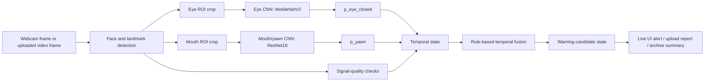

# Runtime Inference and Temporal Fusion Technical Guide

中文标题：运行时推理与时间融合技术指南

## 1. 本文目的

本文解释 VisionGuard 在模型训练和模型选择之后，如何把摄像头或视频帧转换成运行时证据，再通过时间规则生成 warning-candidate 状态。

它承接已有学习文档：

- 项目总览：`docs/tech_learning/PROJECT_LEARNING_GUIDE_ZH.md`
- 数据预处理：`docs/tech_learning/DATA_PREPROCESSING_TECHNICAL_GUIDE_ZH.md`
- 模型训练：`docs/tech_learning/MODEL_TRAINING_TECHNICAL_GUIDE_ZH.md`
- 模型评估与选择：`docs/tech_learning/MODEL_EVALUATION_AND_SELECTION_GUIDE_ZH.md`

本文不是训练文档，也不是新的实验结果报告。它关注的是：

```text
训练好的 specialist CNN + 视频帧
-> ROI 提取
-> p_eye_closed / p_yawn
-> signal quality
-> temporal state
-> rule-based fusion
-> warning-candidate 状态
```

最重要的边界是：VisionGuard 不是单一的 `drowsy / not-drowsy` 分类器。眼部模型和嘴部模型输出的是视觉证据概率；最终 runtime 输出是基于规则的 warning-candidate evidence，不是医学诊断、驾驶安全认证，也不是有人工真值标注的视频级 drowsiness accuracy。

## 2. Runtime Inference 在 VisionGuard 中的位置

VisionGuard 的完整运行链路可以概括为：



关键理解：

- 眼部模型不直接预测“疲劳”，它输出 `p_eye_closed`。
- 嘴部模型不直接预测“疲劳”，它输出 `p_yawn`。
- 融合层不是一个训练好的神经网络，而是规则驱动的 temporal fusion。
- warning-candidate 状态表示“需要注意的视觉证据模式”，不是 ground-truth drowsiness 标签。

Source: `src/runtime/realtime_frame_inference.py`, `src/runtime/realtime_temporal_state.py`, `src/runtime/system_video_upload_pipeline.py`

## 3. Runtime 输入

VisionGuard 有两个主要 runtime 输入场景：Live Monitor 和 Video Upload Analysis。

### 3.1 Live Monitor 输入

Live Monitor 是实时摄像头流程。前端从浏览器 webcam 捕获帧，把 JPEG frame 发送给后端；后端对每一帧进行 face/landmark 检测、ROI 提取、CNN 推理，然后把 frame-level 结果交给 session-local temporal state 进行更新。

确认的实时 API：

| Endpoint | 作用 |
|---|---|
| `POST /api/realtime/session/start` | 创建一个实时 session，并初始化 `RealtimeTemporalState` |
| `POST /api/realtime/frame` | 接收单帧 JPEG，执行 frame inference，并更新 temporal state |
| `POST /api/realtime/session/stop` | 结束实时 session，冻结 temporal state |
| `GET /api/realtime/health` | 检查 realtime 服务和模型加载状态 |

Source: `src/backend/app.py`

前端 Live Monitor 的关键行为：

- 默认 sampling FPS 为 2。
- 每帧会缩放到最大约 `640 x 360` 的采样尺寸，再以 JPEG quality `0.85` 发送。
- Minimal Live Monitor Mode 只改变显示布局：隐藏 camera preview、recent events、charts 和额外面板；不关闭采样、不关闭后端 realtime 请求、不关闭 warning overlays、不关闭 sound alerts。

Source: `SystemUI/src/components/dashboard/LiveVideoCard.tsx`, `SystemUI/src/components/dashboard/LiveMonitorPage.tsx`, `SystemUI/src/lib/settingsStore.tsx`

### 3.2 Video Upload 输入

Video Upload Analysis 是离线分析流程。用户上传视频后，后端运行 upload pipeline，从视频中采样帧，对采样帧做眼部和嘴部 specialist inference，再生成 warning intervals、keyframes、evidence figures 和报告 artifact。

确认的上传 API：

| Endpoint | 作用 |
|---|---|
| `POST /api/analyze-video` | 上传并分析视频 |
| `GET /api/runs/{session_id}/summary` | 读取分析 summary |
| `GET /api/runs/{session_id}/timeline` | 读取 timeline CSV |
| `GET /api/runs/{session_id}/keyframes` | 读取 keyframe metadata |
| `GET /api/runs/{session_id}/files/{relative_path}` | 安全读取 run artifact 文件 |

Source: `src/backend/app.py`

上传 pipeline 的默认后端参数包括：

| 参数 | 默认值 | 含义 |
|---|---:|---|
| `--sample-every-n-frames` | `5` | 每隔 5 帧采样一次 |
| `--max-frames` | `300` | 最多分析 300 个采样帧 |
| `--yawn-threshold` | `0.50` | yawn frame 证据阈值 |
| `--recent-yawn-window-sec` | `8.0` | 上传端 recent-yawn 上下文窗口 |

Source: `src/runtime/system_video_upload_pipeline.py`, `src/backend/app.py`

实时流程和上传流程的区别：

- Live Monitor 是持续接收浏览器帧，session state 随时间增量更新。
- Video Upload 是一次性处理一个已有视频，并输出完整 timeline、figures、keyframes 和 report。
- 两者都使用 eye/mouth specialist evidence，但不应假设两者每个规则实现完全相同；实时端核心状态在 `realtime_temporal_state.py`，上传端核心 pipeline 在 `system_video_upload_pipeline.py`。

## 4. Face Detection 和 Landmark Extraction

CNN specialist 不能直接从任意完整帧中稳定判断眼睛或嘴部状态。系统必须先找到人脸和关键 landmark，再裁剪出 eye ROI 和 mouth ROI。

项目中使用 MediaPipe Face Landmarker / Face Mesh 思路：

- 检测人脸；
- 返回人脸 landmark；
- 根据 eye landmark 提取左眼和右眼 ROI；
- 根据 mouth landmark 提取嘴部 ROI；
- 如果 landmark 不可用或 ROI 无效，则该 specialist 的证据应被视为不可用，而不是强行当作“正常”或“疲劳”。

已确认的 MediaPipe 配置包括：

| 设置 | 值 |
|---|---:|
| `num_faces` | `1` |
| `min_face_detection_confidence` | `0.3` |
| `min_face_presence_confidence` | `0.3` |
| `min_tracking_confidence` | `0.3` |

Source: `src/runtime/stage10_eye_roi_consistency.py`, `src/runtime/stage14_mouth_yawn_runtime.py`

这里的 signal quality 很重要：没有检测到脸、landmark 不稳定、ROI 超出边界或裁剪失败，都不等于“驾驶员没有疲劳”。它只表示当前帧的视觉证据不可靠。

## 5. Eye ROI Runtime Pipeline

眼部 runtime pipeline 的目标是从摄像头或视频帧中提取眼部证据，并得到 `p_eye_closed`。

确认流程：

1. 使用 MediaPipe landmark 找到左右眼区域。
2. 使用 eye bounding box 裁剪眼部 ROI。
3. 将 eye ROI 转成 RGB/PIL 图像。
4. 使用和训练/评估一致的图像 transform。
5. 输入 MobileNetV2 eye-state specialist。
6. 对 logits 做 softmax。
7. 取 class `0` 的概率作为 `p_eye_closed`。
8. 如果左右眼都可用，runtime 使用可用眼睛概率的平均值作为 `mean_p_eye_closed`。

确认的 label mapping：

| Class index | Label |
|---:|---|
| `0` | `closed` |
| `1` | `open` |

Source: `src/runtime/stage10_eye_roi_consistency.py`, `src/runtime/realtime_frame_inference.py`

确认的模型和 checkpoint：

| 项目 | 值 |
|---|---|
| Runtime eye model | MobileNetV2 |
| Checkpoint | `outputs/mrl_eye/checkpoints/best_mobilenet_v2_mrl_eye.pt` |
| Runtime output | `p_eye_closed` |

Source: `src/runtime/realtime_frame_inference.py`, `outputs/mrl_eye/checkpoints/best_mobilenet_v2_mrl_eye.pt`

`p_eye_closed` 是“眼睛闭合证据”的概率/置信度式输出，不是“疲劳概率”。高 `p_eye_closed` 可能来自真实闭眼，也可能来自眯眼、强阴影、眼镜反光、ROI 偏移、低光照或头部姿态导致的裁剪误差。

## 6. Mouth ROI Runtime Pipeline

嘴部 runtime pipeline 的目标是从帧中提取嘴部/yawn 证据，并得到 `p_yawn`。

确认流程：

1. 使用 MediaPipe landmark 找到 mouth/lower-face 区域。
2. 使用 mouth bounding box 裁剪 mouth ROI。
3. 将 mouth ROI 转成 RGB/PIL 图像。
4. resize 到模型输入尺寸并做 ImageNet normalization。
5. 输入 ResNet18 mouth/yawn specialist。
6. 对 logits 做 softmax。
7. 取 class `1` 的概率作为 `p_yawn`。

确认的 label mapping：

| Class index | Label |
|---:|---|
| `0` | `no_yawn` |
| `1` | `yawn` |

Source: `src/runtime/stage14_mouth_yawn_runtime.py`, `src/runtime/realtime_frame_inference.py`

确认的模型和 checkpoint：

| 项目 | 值 |
|---|---|
| Runtime mouth/yawn model | ResNet18 |
| Checkpoint | `checkpoints/resnet18_best.pt` |
| Runtime output | `p_yawn` |

Source: `src/runtime/realtime_frame_inference.py`, `src/runtime/stage14_mouth_yawn_runtime.py`

`p_yawn` 是 yawning visual evidence，不是完整 fatigue proof。高 `p_yawn` 可能来自真实打哈欠，也可能来自说话、张嘴、笑、头部姿态、嘴部 ROI 裁剪错误或训练域与真实 webcam 域之间的差异。

## 7. Model Probability Outputs

在本项目中，specialist CNN 的输出经过 softmax 后解释为 class probability：

- eye model: `softmax(logits)[0] -> p_eye_closed`
- mouth model: `softmax(logits)[1] -> p_yawn`

初学者容易误解 probability。模型 probability 不是客观真值，而是模型在当前输入 crop 上的分类置信度。它受到训练数据、裁剪质量、光照、姿态、遮挡和 domain shift 的影响。

因此，VisionGuard 不使用单帧 `p_eye_closed` 或单帧 `p_yawn` 直接宣布驾驶员疲劳。系统会把 frame-level evidence 放进 temporal state 中，观察证据是否持续、是否与其他证据同时出现、信号是否可靠，再生成 warning-candidate 状态。

## 8. Signal Quality Checks

Signal quality 是 runtime 系统的一等逻辑，不是附属 debug 信息。

实时 frame inference 中确认的 signal status 包括：

| Status | 含义 |
|---|---|
| `ok` | eye ROI 和 mouth ROI 都可用 |
| `partial` | eye 或 mouth 中只有一类 ROI 可用 |
| `roi_unavailable` | 检测到脸，但 eye/mouth ROI 都不可用 |
| `no_face` | 没有可靠检测到人脸 |

Source: `src/runtime/realtime_frame_inference.py`

`realtime_temporal_state.py` 中还会把以下情况视为 signal failure：

- 未检测到脸；
- tracking failure；
- required ROI unavailable；
- `signal_quality.status` 不是 `ok`。

Source: `src/runtime/realtime_temporal_state.py`

信号质量差的含义是“当前视觉证据不可靠”。它不应该被解读为“安全”，也不应该被解读为“疲劳”。这也是 History/Insights 中会把 camera signal interruption 作为单独 alert 类型展示的原因。

## 9. 为什么单帧分类不够

单帧 CNN 分类对实时驾驶场景不够稳定，原因包括：

- 一次正常眨眼可能产生闭眼帧；
- 一个张嘴帧可能只是说话或表情，不一定是打哈欠；
- webcam 帧率和网络传输可能不稳定；
- ROI 裁剪可能因为头部姿态、光照或遮挡而短暂失败；
- probability 会逐帧波动；
- fatigue-related cue 更像时间模式，而不是单帧事件。

因此系统需要 temporal smoothing、rolling window、debounce、cooldown 和 sustained evidence gate。它们的作用不是“提高模型准确率”，而是在 noisy frame-level evidence 上形成更保守、更可解释的 warning-candidate 状态。

## 10. Temporal State

Temporal state 是“某个 session 最近一段时间的运行时记忆”。它让系统能够回答：

- 最近几帧眼睛闭合证据是否持续？
- 最近是否出现 yawn evidence？
- signal failure 是否频繁？
- 当前 eye warning interval 是否已经达到 sustained gate？
- 是否应该进入、保持或退出某个 warning-candidate 状态？

实时端每个 Live Monitor session 都创建自己的 `RealtimeTemporalState`。这样不同摄像头开启/停止周期不会共享旧的 counters 或 recent evidence。

确认的 realtime temporal state 字段包括：

| State field | 作用 |
|---|---|
| `frames` | 保存最近 frame-level evidence 的 rolling buffer |
| `mouth_active` | 当前是否处于 mouth/yawn evidence active 状态 |
| `last_yawn_monotonic` | 最近一次 yawn evidence 的时间 |
| `eye_warning_active` | 当前是否处于 eye warning interval |
| `current_eye_warning_interval_start` | 当前 eye interval 起始时间 |
| `current_eye_warning_frames` | 当前 eye interval 内累计帧数 |
| `current_eye_warning_peak_p_eye_closed` | 当前 interval 中最高 eye-closed probability |
| `current_eye_warning_peak_strength` | 当前 interval 中最高 eye evidence strength |
| `last_sustained_eye_warning_end_monotonic` | 最近一次 sustained eye warning 结束时间 |

Source: `src/runtime/realtime_temporal_state.py`

上传端不是用完全相同的 session object 增量更新，而是在完整视频 timeline 上运行 pipeline：先生成 eye timeline 和 mouth timeline，再 align、fusion、interval、figure 和 keyframe。

Source: `src/runtime/system_video_upload_pipeline.py`

## 11. Rule-Based Temporal Fusion

Rule-based fusion 是本文的核心。它的意思是：系统不是训练一个新的 fusion neural network，而是用人工设计的、可解释的规则，把 `p_eye_closed`、`p_yawn`、signal quality 和时间上下文组合成 warning-candidate state。

### 11.1 Realtime confirmed thresholds

实时端确认的关键阈值如下：

| 项目 | 值 | 含义 |
|---|---:|---|
| `EYE_CLOSED_THRESHOLD` | `0.50` | 单帧 eye closed binary threshold |
| `EYE_WARNING_ENTER_ROLLING_MEAN` | `0.60` | rolling eye closed ratio 达到该值可进入 eye warning |
| `EYE_WARNING_ENTER_CONSECUTIVE_FRAMES` | `2` | 进入 eye warning 需要连续满足的帧数 |
| `EYE_WARNING_EXIT_ROLLING_MEAN` | `0.40` | rolling mean 低于该值可退出 eye warning |
| `EYE_WARNING_EXIT_CONSECUTIVE_FRAMES` | `2` | 退出 eye warning 需要连续满足的帧数 |
| `SUSTAINED_EYE_WARNING_MIN_SECONDS` | `1.0` | sustained eye warning 的最小时长门槛 |
| `SUSTAINED_EYE_WARNING_MIN_FRAMES` | `5` | sustained eye warning 的最小帧数门槛 |
| `YAWN_ON_THRESHOLD` | `0.50` | mouth active/yawn evidence 开启阈值 |
| `YAWN_OFF_THRESHOLD` | `0.35` | mouth active 退出候选阈值 |
| `YAWN_OFF_CONSECUTIVE_FRAMES` | `2` | mouth active 退出需要连续 off frames |
| `MOUTH_ACTIVE_MAX_HOLD_SECONDS` | `1.5` | mouth evidence 暂时缺失时最多保持时间 |
| `RECENT_YAWN_CONTEXT_SECONDS` | `4.0` | recent yawn fusion context window |
| `RECENT_YAWN_REMINDER_SECONDS` | `8.0` | recent yawn display reminder window |
| `ROLLING_WINDOW_FRAMES` | `5` | rolling evidence window |
| `SIGNAL_FAILURE_RATIO_THRESHOLD` | `0.20` | 最近窗口 signal failure ratio 超过该值视为 unreliable |

Source: `src/runtime/realtime_temporal_state.py`

### 11.2 Eye evidence strength

实时 frame inference 和上传 pipeline 都使用了分级 eye evidence 思路：

| Strength | 条件 |
|---|---|
| `strong_eye_closure_candidate` | `p_eye_closed >= 0.85` |
| `moderate_eye_closure_candidate` | `p_eye_closed >= 0.70` |
| `weak_reduced_eye_openness_candidate` | `p_eye_closed >= 0.50` |
| `normal_open` | 低于 `0.50` |

Source: `src/runtime/realtime_frame_inference.py`, `src/runtime/system_video_upload_pipeline.py`

### 11.3 Realtime fusion logic

实时端的核心融合逻辑可以概括为：

1. 从最近 5 帧计算 rolling eye closed ratio。
2. 如果 rolling mean 达到 `0.60` 且 signal 不 unreliable，并连续满足 2 帧，则进入 eye warning candidate。
3. 如果 rolling mean 低于 `0.40` 并连续满足 2 帧，则退出 eye warning candidate。
4. 如果 eye interval 达到 `1.0s` 或 `5` 帧，则视为 sustained eye warning。
5. 如果 `p_yawn >= 0.50`，mouth evidence 进入 active 状态。
6. mouth active 会在 `p_yawn < 0.35` 连续 2 帧后退出；如果 mouth ROI 暂时不可用，最多保持 `1.5s`。
7. recent yawn context 在 4 秒内可用于 fusion；8 秒内可用于 display reminder。
8. high-confidence 状态要求 recent yawn、eye warning、sustained eye warning，以及 moderate/strong eye evidence 同时满足。
9. 如果 signal unreliable 且 mouth 不 active，状态可转为 `signal_unreliable`。

Source: `src/runtime/realtime_temporal_state.py`

### 11.4 Upload fusion logic

上传 pipeline 的融合规则名为：

```text
F5_tiered_quality_aware_fusion
```

Stage13 的基础 F5 逻辑包括：

| 条件 | 输出状态 |
|---|---|
| eye unreliable 且没有 recent yawn | `signal_unreliable` |
| eye unreliable 且有 recent yawn | `mouth_warning_candidate` |
| eye warning 且有 recent yawn | `high_confidence_drowsiness_candidate` |
| eye warning | `eye_warning_candidate` |
| recent yawn | `mouth_warning_candidate` |
| 其他 | `normal` |

Source: `src/runtime/stage13_mouth_eye_fusion_design.py`

上传 pipeline 后续还会应用 sustained eye gate 和 Stage17.5 eye evidence strength gate。也就是说，基础 F5 规则产生 high-confidence candidate 后，仍可能因为 sustained/strength 条件不够而被抑制回更保守的状态。

Source: `src/runtime/system_video_upload_pipeline.py`

## 12. Realtime Live Monitor Runtime Flow

Live Monitor 的 end-to-end 流程如下：

1. 用户点击 Start Camera。
2. 前端通过 `getUserMedia` 打开摄像头。
3. 前端调用 `/api/realtime/session/start` 创建 session。
4. 前端按 sampling FPS 从 video element 抽取 frame。
5. frame 被缩放并以 JPEG 发送到 `/api/realtime/frame`。
6. 后端对 frame 运行 `RealtimeFrameInferenceService.analyze_frame`。
7. 后端将 frame result 传给 `RealtimeTemporalState.update_from_frame`。
8. 后端返回 frame-level evidence 和 temporal state。
9. 前端把 fusion state 映射为 alert type。
10. 前端执行 debounce/cooldown、risk display、overlay、sound alert 和 local history ingestion。
11. 用户停止摄像头时，前端调用 `/api/realtime/session/stop`，并更新当前 drive session。

Source: `src/backend/app.py`, `src/runtime/realtime_frame_inference.py`, `src/runtime/realtime_temporal_state.py`, `SystemUI/src/components/dashboard/LiveVideoCard.tsx`, `SystemUI/src/components/dashboard/LiveMonitorPage.tsx`

前端 alert debounce/cooldown 是 UI 行为，不改变后端模型或 fusion 规则：

| Alert type | Cooldown |
|---|---:|
| eye warning | `8000ms` |
| mouth warning | `8000ms` |
| high confidence | `10000ms` |
| signal quality | `5000ms` |

其他确认值：

- alert debounce: `1.0s`
- normal clear: `2.0s`

Source: `SystemUI/src/lib/liveMonitorAlertUtils.ts`

风险仪表盘分数也是 UI display score，不是模型 probability：

| UI state | Display score |
|---|---:|
| critical/high confidence/sustained eye | `92` |
| eye warning | `74` |
| mouth warning | `55` |
| signal check | `30` |
| monitoring low | `20` |
| idle | `0` |

Source: `SystemUI/src/lib/liveMonitorRiskUtils.ts`

## 13. Video Upload Runtime Flow

Video Upload Analysis 的 end-to-end 流程如下：

1. 用户上传视频到 `/api/analyze-video`。
2. 后端创建 `outputs/system_video_upload_runs/{session_id}/`。
3. 后端调用 `src/runtime/system_video_upload_pipeline.py`。
4. pipeline 运行 Stage10 eye ROI / MobileNetV2 inference。
5. pipeline 运行 Stage11 eye temporal analysis。
6. pipeline 运行 Stage14 mouth/yawn / ResNet18 inference。
7. pipeline 对齐 eye timeline 和 mouth timeline。
8. pipeline 应用 Stage13 F5 fusion rule。
9. pipeline 应用 sustained eye gate 和 Stage17.5 strength gate。
10. pipeline 生成 warning intervals。
11. pipeline 生成 backend evidence figures：
    - `figures/fusion_timeline.png`
    - `figures/p_eye_closed_over_time.png`
    - `figures/p_yawn_over_time.png`
12. pipeline 提取 keyframes。
13. pipeline 写出 summary JSON、timeline CSV、fusion summary、Markdown report 和 manifest。
14. 前端展示 summary、Alert Intervals、Evidence Figures、Keyframes 和 Technical Details。

Source: `src/runtime/system_video_upload_pipeline.py`, `src/runtime/keyframe_extractor.py`, `src/backend/app.py`, `SystemUI/src/components/video-upload/VideoUploadAnalysis.tsx`

Evidence Figures 是后端生成的 artifact image，不是前端重新画的 Recharts/canvas chart。它们用于解释 runtime evidence 随时间变化，而不是模型准确率图。

## 14. Runtime Artifacts and Outputs

| Output | 生成位置 | 使用位置 | 含义 | 不证明什么 |
|---|---|---|---|---|
| `p_eye_closed` | `realtime_frame_inference.py`, upload eye stage | temporal state, upload timeline | 眼睛闭合视觉证据 | 不证明 fatigue |
| `p_yawn` | `realtime_frame_inference.py`, Stage14 | temporal state, upload timeline | yawn 视觉证据 | 不证明 fatigue |
| signal quality | frame inference / temporal state | UI, fusion, History/Insights | 当前视觉信号可靠性 | 不等于安全或疲劳 |
| rolling eye state | `realtime_temporal_state.py` | realtime fusion | 最近窗口 eye evidence 模式 | 不等于 ground truth |
| warning-candidate state | realtime temporal state / upload fusion | UI, intervals, history summaries | 规则生成的注意状态 | 不等于人工标注事件 |
| alert interval | upload pipeline | upload table/report | 一段连续 warning-candidate timeline | 不等于真实 drowsiness segment |
| keyframe | `keyframe_extractor.py` | upload gallery/report | interval 中代表性帧 | 不证明模型正确 |
| evidence figure | upload pipeline | upload Evidence Figures | probability 和 state 随时间变化 | 不是 accuracy figure |
| summary JSON | upload pipeline | frontend/API | 一次分析的轻量 summary | 不保存为模型评估指标 |
| local history record | frontend ingestion | History/Insights | Live Monitor stable alert summary | 不是模型 evaluation report |
| SQLite archive record | backend local archive | History/Insights/archive fallback | 轻量归档 summary | 不应包含 raw frames/video/base64/blob |

Archive safety source: `src/backend/local_archive.py`, `docs/LOCAL_BACKEND_ARCHIVE.md`

需要精确区分：归档/History/Insights 不保存 raw webcam frames、uploaded videos、base64 或 blobs；但是 Video Upload 本地 run artifact 目录可能为了本次分析保存输入文件和 keyframes。不要把“archive 不保存 raw media”误写成“本地任何地方都不会出现上传视频 artifact”。

Source: `src/backend/app.py`, `src/runtime/system_video_upload_pipeline.py`, `docs/LOCAL_BACKEND_ARCHIVE.md`

## 15. Runtime Limitations and Failure Cases

常见限制包括：

- face not detected；
- partial face；
- head pose 太大；
- glasses/reflection；
- low light 或 backlight；
- motion blur；
- squinting；
- talking/smiling/open mouth but not yawn；
- webcam position 太低或太偏；
- low FPS / irregular sampling；
- ROI crop misalignment；
- training dataset 与真实 webcam domain 不一致；
- subject appearance distribution shift。

这些限制说明：runtime warning-candidate 是 evidence-based monitoring，不是 final safety certification。高 probability 和 high-confidence candidate 都应该谨慎解释。

## 16. Runtime Evidence 与 History/Insights 的关系

History 和 Insights 当前产品页面主要总结 Live Monitor records，而不是 Video Upload Analysis 的统计。

确认依据：

- History 默认 filter source 是 `live_monitor`。
- History 从 backend archive 拉取时使用 `source: "live_monitor"`。
- History 会通过 `liveMonitorOnly(...)` 过滤 store。
- Insights 同样使用 `liveMonitorOnly(...)`，并从 archive 请求 `source: "live_monitor"`。
- Video Upload archive payload 使用 `event_type: "upload_analysis"`，对应 `record_type === "video_run"` 的记录不会被 `archiveRecordsToHistoryStore` 映射为 history event/session。

Source: `SystemUI/src/components/history-48h/History48hPage.tsx`, `SystemUI/src/components/insights/InsightsPage.tsx`, `SystemUI/src/lib/backendArchiveApi.ts`, `SystemUI/src/lib/liveMonitorHistoryIngestion.ts`

因此：

- Live Monitor stable alerts 可以进入 History/Insights。
- Video Upload Analysis 结果可以作为独立分析 artifact 和 archive summary 存在。
- 除非实现明确改变，否则不要把 Video Upload 的分析结果当作 History/Insights 的 Live Monitor 统计。
- History/Insights 是产品 analytics 页面，不是 model accuracy 报告。

## 17. Runtime Inference 不证明什么

必须避免以下过度结论：

- `p_eye_closed` 不证明驾驶员疲劳；
- `p_yawn` 不证明驾驶员疲劳；
- warning-candidate interval 不等于 ground-truth drowsiness segment；
- upload evidence figure 不等于 model evaluation figure；
- History/Insights chart 不等于模型准确率；
- UI risk score 不等于 drowsiness probability；
- high specialist accuracy 不等于 full-system drowsiness accuracy；
- 没有可靠信号不等于没有疲劳；
- 一个 alert 不等于医疗诊断或安全认证。

更准确的表述是：

> VisionGuard produces rule-based fatigue-related warning-candidate evidence from specialist visual cues and temporal context. These outputs are intended for awareness and interpretation, not for medical diagnosis or guaranteed driving safety.

## 18. 初学者检查清单

学习完本文后，应该能回答：

- 一个 frame 进入后端后经历了哪些步骤？
- 为什么需要 face landmark 和 ROI，而不是直接把整帧喂给模型？
- `p_eye_closed` 和 drowsiness 有什么区别？
- `p_yawn` 和 drowsiness 有什么区别？
- 为什么单帧分类不够？
- temporal state 保存了什么？
- rule-based fusion 和 trained fusion model 有什么区别？
- Live Monitor 和 Video Upload Analysis 的 runtime 路径哪里相同、哪里不同？
- 为什么 History/Insights 不是模型评估报告？
- 为什么 signal quality interruption 不是“安全”或“疲劳”的同义词？

## 19. 常见错误

常见错误包括：

- 把一个 closed-eye frame 当作 drowsiness；
- 把一个 yawn frame 当作 drowsiness；
- 把 `p_eye_closed` 写成 fatigue probability；
- 把 `p_yawn` 写成 fatigue probability；
- 把 warning-candidate interval 当作人工真值；
- 把 specialist model metrics 当作 full-system accuracy；
- 把 UI risk score 当作模型输出概率；
- 忽略 signal quality；
- 假设 Live Monitor 和 Video Upload 的规则实现完全相同而不查代码；
- 在写文档时随意改 threshold；
- 用前端自制图替代 backend-generated evidence figures；
- 把 rule-based fusion 描述成 trained fusion classifier；
- 把 Video Upload records 混入 History/Insights Live Monitor analytics。

## 20. Source-of-truth 文件表

| 文件 | 本文使用的事实 |
|---|---|
| `src/runtime/realtime_frame_inference.py` | realtime frame-level face/ROI/CNN inference、`p_eye_closed`、`p_yawn`、signal status、模型 checkpoint |
| `src/runtime/realtime_temporal_state.py` | realtime rolling window、threshold、temporal state、fusion state |
| `src/runtime/stage10_eye_roi_consistency.py` | eye ROI、MobileNetV2、MRL Eye label mapping、transform |
| `src/runtime/stage14_mouth_yawn_runtime.py` | mouth ROI、ResNet18、YawDD/YAWDD+ label mapping、`p_yawn` |
| `src/runtime/stage13_mouth_eye_fusion_design.py` | upload F5 tiered quality-aware fusion baseline |
| `src/runtime/system_video_upload_pipeline.py` | upload sampling、Stage10/11/14/13/17 pipeline、figures、summary artifacts |
| `src/runtime/keyframe_extractor.py` | upload keyframe selection and metadata |
| `src/backend/app.py` | backend realtime/upload API endpoints and run artifact routing |
| `SystemUI/src/components/dashboard/LiveVideoCard.tsx` | frontend webcam capture, JPEG sampling, minimal display behavior |
| `SystemUI/src/components/dashboard/LiveMonitorPage.tsx` | Live Monitor session/history/archive integration |
| `SystemUI/src/lib/liveMonitorAlertUtils.ts` | frontend alert debounce/cooldown mapping |
| `SystemUI/src/lib/liveMonitorRiskUtils.ts` | UI risk display score mapping |
| `SystemUI/src/lib/liveMonitorHistoryIngestion.ts` | stable Live Monitor alert to History record ingestion |
| `SystemUI/src/components/history-48h/History48hPage.tsx` | History uses Live Monitor source filtering |
| `SystemUI/src/components/insights/InsightsPage.tsx` | Insights uses Live Monitor source filtering |
| `SystemUI/src/lib/backendArchiveApi.ts` | archive record mapping, upload analysis record distinction |
| `src/backend/local_archive.py` | backend archive payload safety constraints |

## 21. 无法从当前文件完全确认的事项

以下事项不应在报告中随意声称：

- 没有找到 trained fusion neural network；当前可确认的是 rule-based fusion。
- 没有从 runtime 文件中确认存在完整人工标注的视频级 drowsiness ground truth evaluation。
- 没有证据表明 History/Insights 是模型准确率报告；它们是 Live Monitor history analytics。
- 没有证据支持把 upload evidence figures 当作 ROC/PR/accuracy figure。
- real-world webcam 下的最终安全有效性需要额外的、带真值标注的视频级评估，不能由 specialist image-level metrics 推出。
