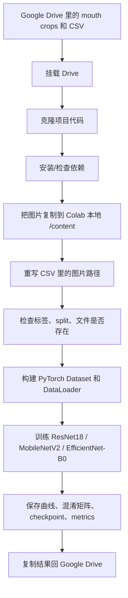

# Stage 7 YawDD+ Dash mouth-crop notebook 技术学习文档

对应 notebook：

`colab_file/stage7_yawdd_training_r.ipynb`

这份文档把你当作刚开始接触深度学习和 Colab 的读者来讲。目标不是只告诉你“代码做了什么”，而是让你理解每一步为什么要这样做、背后的技术是什么、如果以后你看到类似代码应该怎么读。

## 1. 这个 notebook 在项目里的位置

Stage 7 是项目里的“嘴部打哈欠识别模型训练”阶段。

前面的 Stage 1-6 已经完成了这些事情：

- 从 YawDD / YawDD+ Dash 数据里找到可用的视频和标注。
- 用人脸关键点或 fallback 方法裁出嘴部区域。
- 把嘴部小图保存成 `mouth_crops`。
- 生成 CSV manifest，也就是记录每张图路径、标签、subject、split 的表。
- 做好 subject-level 的 train / val / test split。

Stage 7 不再重新裁图，也不重新划分数据。它只做一件事：

训练三个 CNN 图片分类模型，让模型看一张嘴部 crop，判断它是：

- `no_yawn`
- `yawn`

这就是一个二分类任务。输入是一张图片，输出是两个类别中的一个。

## 2. 整体流程

可以把 notebook 想成下面这条流水线：



核心思想是：Drive 用来长期保存文件，`/content/` 用来临时高速训练。

## 3. 先理解几个关键词

### 3.1 CNN 是什么

CNN，全称 Convolutional Neural Network，中文常叫卷积神经网络。它特别适合处理图片，因为它会学习图片里的局部模式，比如边缘、纹理、形状，再一步步组合成更高层的视觉特征。

在这个 notebook 里，CNN 看的不是整张脸，而是已经裁好的嘴部图片。

### 3.2 二分类

二分类就是模型只需要在两个类别里选一个。

这里的类别是：

| 类别名 | 数字编号 | 含义 |
|---|---:|---|
| `no_yawn` | 0 | 没有打哈欠 |
| `yawn` | 1 | 打哈欠 |

代码里用数字编号训练模型，因为神经网络和 loss function 需要数字标签。

### 3.3 train / val / test

数据被分成三份：

| split | 用途 |
|---|---|
| train | 训练模型，让模型更新参数 |
| val | 验证模型，用来决定哪个 epoch 最好、什么时候 early stopping |
| test | 最后评估，不参与训练和调参 |

这个 notebook 使用 subject-level split，也就是同一个人的图片不会同时出现在训练集和测试集里。这样比随机图片划分更严格，因为模型不能靠记住某个人的嘴型来拿高分。

### 3.4 epoch 和 batch

一个 epoch 表示模型完整看完一遍训练集。

batch size 表示每次送进模型多少张图片。这里默认是 `32`，如果显存不够会降到 `16`。

### 3.5 pretrained weights

pretrained weights 是别人已经在大数据集上训练好的模型权重。这里使用 ImageNet 预训练权重。

好处是：模型已经学会了很多通用视觉特征，比如边缘、纹理、形状。我们只需要把最后一层改成两个输出，然后在自己的嘴部数据上微调。

### 3.6 freeze backbone

一个 CNN 通常可以分成两部分：

- backbone：前面的大部分网络，负责提取图片特征。
- classifier head：最后的分类层，负责把特征变成类别分数。

这个 notebook 先冻结 backbone，只训练最后的分类层。这样比较稳定。之后再解冻 backbone，让整个模型一起微调。

### 3.7 loss、optimizer、learning rate

loss 是模型错得有多严重。loss 越低，通常说明模型越好。

optimizer 是更新模型参数的算法。这里用 Adam。

learning rate 是每次更新参数的步子大小。这里是 `1e-4`，也就是 `0.0001`。

### 3.8 early stopping

训练不是越久越好。训练太久可能会过拟合，也就是模型把训练集记住了，但泛化到新 subject 时变差。

early stopping 的意思是：如果验证集表现连续几轮没有提升，就提前停止训练。

### 3.9 confusion matrix

混淆矩阵用来检查模型错在哪里。对二分类来说，它能告诉你：

- 真实 `no_yawn` 被预测成 `no_yawn` 的数量。
- 真实 `no_yawn` 被预测成 `yawn` 的数量。
- 真实 `yawn` 被预测成 `no_yawn` 的数量。
- 真实 `yawn` 被预测成 `yawn` 的数量。

只看 accuracy 不够，因为如果 `no_yawn` 图片特别多，模型可能偏向预测 `no_yawn`。

## 4. 代码单元逐个解释

下面按 notebook 的 code cell 顺序解释。

## Cell 2：运行环境和路径配置

这个 cell 做的是“把后面会用到的路径和训练参数先写好”。

主要变量：

| 变量 | 含义 |
|---|---|
| `REPO_URL` | GitHub 仓库地址 |
| `REPO_BRANCH` | 要克隆的分支，这里是 `main` |
| `REPO_DIR` | Colab 里项目代码放在哪里 |
| `DRIVE_PROJECT_ROOT` | Google Drive 中项目根目录 |
| `LOCAL_STAGE7_ROOT` | Colab 本地临时工作目录 |
| `LOCAL_MOUTH_CROPS_DIR` | 本地 mouth crop 图片目录 |
| `LOCAL_TRAINABLE_MANIFEST` | 本地 trainable manifest CSV |
| `LOCAL_SPLIT_MANIFEST` | 本地 split manifest CSV |
| `LOCAL_OUTPUT_ROOT` | 本地训练输出目录 |
| `DRIVE_RESULTS_DIR` | 结果 CSV / JSON 回存到 Drive 的位置 |
| `DRIVE_FIGURES_DIR` | 图片结果回存到 Drive 的位置 |
| `DRIVE_CHECKPOINT_DIR` | 模型权重回存到 Drive 的位置 |
| `DRIVE_REPORTS_DIR` | markdown summary 回存到 Drive 的位置 |

这里还有一些训练超参数：

| 参数 | 值 | 含义 |
|---|---:|---|
| `SEED` | 42 | 固定随机种子，减少每次运行差异 |
| `DEFAULT_IMAGE_SIZE` | 224 | 输入图片统一 resize 到 224x224 |
| `DEFAULT_BATCH_SIZE` | 32 | 每次训练 32 张图片 |
| `DEFAULT_EPOCHS` | 8 | 最多训练 8 个 epoch |
| `DEFAULT_FREEZE_EPOCHS` | 1 | 第 1 个 epoch 只训练分类头 |
| `DEFAULT_PATIENCE` | 2 | 验证集 2 次不提升就 early stop |
| `DEFAULT_LR` | 1e-4 | 学习率 |
| `NUM_WORKERS` | 2 | DataLoader 读取数据的子进程数量 |

`FORCE_RECLONE_REPO` 和 `FORCE_RECOPY_DATA` 是开关：

- `False`：如果已有文件，就复用，节省时间。
- `True`：强制重新克隆或重新复制。

## Cell 3：挂载 Google Drive

```python
from google.colab import drive
drive.mount('/content/drive')
```

Colab 默认看不到你的 Google Drive 文件。执行 `drive.mount` 后，Drive 会出现在 `/content/drive` 下面。

输出里显示：

```text
Drive already mounted at /content/drive
Drive project root: /content/drive/MyDrive/Drowsiness_Detection_Colab
```

这说明 Drive 已经挂载成功。

## Cell 4：克隆或复用项目代码

这个 cell 做三件事：

1. 如果 `FORCE_RECLONE_REPO = True`，并且 repo 已经存在，就删除旧 repo。
2. 如果 repo 不存在，就用 `git clone` 下载。
3. 切换工作目录到 `REPO_DIR`，并把它加入 `sys.path`。

`sys.path.insert(0, str(REPO_DIR))` 的作用是让 Python 可以 import 项目里的模块。

输出：

```text
Working directory: /content/Drowsiness-Detection
```

这说明当前 notebook 后续代码是在项目目录下运行。

## Cell 5：安装依赖

这个 cell 会读取仓库里的 `requirements.txt`，然后安装缺失依赖。

它故意跳过 `torch` 和 `torchvision`：

```python
if package_name in {"torch", "torchvision"}:
    continue
```

原因是 Colab 通常已经预装了 PyTorch，而且 Colab 的 PyTorch 版本通常和 GPU/CUDA 环境匹配。如果随便重装，反而可能把 GPU 环境弄坏。

后面又检查：

```python
for module_name in ["torch", "torchvision"]:
```

如果真的没有 PyTorch，再安装。

输出：

```text
Dependency setup finished.
```

表示依赖检查结束。

## Cell 6：打印运行环境

这个 cell 打印：

- Python 版本
- 操作系统平台
- PyTorch 版本
- Torchvision 版本
- CUDA 是否可用
- GPU 型号
- 各个 Drive 路径

这次运行的输出显示：

```text
CUDA available: True
GPU: NVIDIA A100-SXM4-40GB
```

这说明训练跑在 GPU 上，而且是 A100。A100 是很强的 GPU，所以训练会比较快。

## Cell 8：检查 Drive 输入是否存在

这个 cell 检查四个关键路径：

- Drive 项目根目录
- Drive 上的 mouth crop 图片目录
- trainable manifest
- split manifest

如果任何一个不存在，就抛出 `FileNotFoundError`，直接停止。

这一步很重要，因为后面训练依赖这些文件。如果不提前检查，错误可能会在很后面才出现，排查更麻烦。

## Cell 9：复制 mouth crop 图片到 Colab 本地

Google Drive 适合长期保存，但读取大量小图片很慢。训练时每个 batch 都要读很多图片，如果一直从 Drive 读，会拖慢训练。

所以这个 cell 把图片从 Drive 复制到 `/content/`：

```python
shutil.copytree(DRIVE_MOUTH_CROPS_DIR, LOCAL_MOUTH_CROPS_DIR)
```

它先数图片数量：

```python
expected_drive_count = sum(1 for _ in DRIVE_MOUTH_CROPS_DIR.rglob("*.jpg"))
local_count = sum(1 for _ in LOCAL_MOUTH_CROPS_DIR.rglob("*.jpg"))
```

这次输出：

```text
Drive mouth-crop jpg count: 64202
Local mouth-crop jpg count before copy: 0
Copying mouth crops from Drive to local Colab storage...
Local mouth-crop jpg count after copy: 64202
```

说明一共有 `64,202` 张嘴部 crop，复制后本地数量和 Drive 数量一致。

## Cell 10：复制并重写 manifest 路径

CSV manifest 里保存了图片路径。但原始路径可能指向 Drive，例如：

```text
/content/drive/MyDrive/Drowsiness_Detection_Colab/...
```

训练时图片已经复制到：

```text
/content/Drowsiness_Detection_Colab_local/...
```

所以必须把 CSV 里的路径改成本地路径，否则 Dataset 打开图片会找不到文件，或者继续从慢速 Drive 读取。

### `remap_to_local`

这个函数负责把旧路径变成新路径。

它处理几种情况：

1. 路径已经是本地路径：直接返回。
2. 路径以 Drive 项目根目录开头：取相对路径，然后拼到本地项目根目录。
3. 路径里包含 `mouth_crops/`：取后面的部分，拼到本地 mouth crop 目录。
4. 文件名是两个 manifest 文件之一：返回本地 manifest 路径。
5. 路径里出现 `data/`、`manifests/`、`outputs/` 等 marker：从 marker 开始截取，再拼到本地根目录。
6. 都不匹配：原样返回。

### `rewrite_manifest`

这个函数读取 CSV，每一行都检查这些字段：

- `image_path`
- `mouth_crop_path`
- `processed_path`
- `original_path`
- `raw_video_path`
- `annotation_txt_path`

如果字段存在，就调用 `remap_to_local` 改路径。

这次输出：

```text
Rewrote local trainable manifest with 64202 rows
Rewrote local split manifest with 64202 rows
```

说明两个 CSV 都有 `64,202` 行，并且已经写成本地版本。

## Cell 11：打印本地路径和样例文件

这个 cell 是调试用的。它检查：

- 本地 mouth crop 目录是否存在。
- 本地 manifest 是否存在。
- 前几个 subject 文件夹是什么。
- 前几张 jpg 的实际路径是什么。

这一步没有训练逻辑，但对排错很有帮助。比如如果路径重写错了，你会很快看到本地文件不存在。

## Cell 12：训练前 sanity check

sanity check 就是正式训练前的小检查。

这个 cell 做了几件事。

### 检查标签

```python
label_set = {row["label"] for row in split_manifest_rows}
assert label_set == {"no_yawn", "yawn"}
```

如果 CSV 里出现了别的标签，训练会停止。

### 检查失败 crop

```python
failed_rows = [row for row in trainable_manifest_rows if row.get("crop_method") == "failed"]
assert len(failed_rows) == 0
```

训练集里不应该包含裁图失败的样本。

### 检查图片文件是否真的存在

```python
missing_processed = [
    row["processed_path"]
    for row in split_manifest_rows
    if not Path(row["processed_path"]).is_file()
]
```

如果 CSV 里写了某张图片路径，但磁盘上找不到这张图，训练会停止。

### 统计 split 和标签数量

这次输出：

| split | 图片数 | subject 数 |
|---|---:|---:|
| train | 44,156 | 20 |
| val | 8,892 | 4 |
| test | 11,154 | 5 |

标签分布：

| split | no_yawn | yawn |
|---|---:|---:|
| train | 39,345 | 4,811 |
| val | 7,902 | 990 |
| test | 9,924 | 1,230 |

这里可以看到 `no_yawn` 明显更多，所以后面使用 weighted cross entropy 来减轻类别不平衡。

## Cell 14：训练工具函数

这是整个 notebook 最核心的准备部分。

### 标签映射

```python
LABEL_TO_INDEX = {"no_yawn": 0, "yawn": 1}
INDEX_TO_LABEL = {v: k for k, v in LABEL_TO_INDEX.items()}
```

模型不能直接理解字符串标签，所以要把标签转成数字。

### 三个模型

```python
MODEL_ROWS = [
    ("CNN-1 (ResNet18)", "resnet18"),
    ("CNN-2 (MobileNetV2)", "mobilenet_v2"),
    ("CNN-3 (EfficientNet-B0)", "efficientnet_b0"),
]
```

这三个都是常见 CNN backbone：

| 模型 | 特点 |
|---|---|
| ResNet18 | 结构经典，比较稳，参数量适中 |
| MobileNetV2 | 轻量，适合移动端或实时系统 |
| EfficientNet-B0 | 参数效率高，通常在准确率和计算量之间表现好 |

### `set_seed`

这个函数固定随机种子：

```python
random.seed(seed)
np.random.seed(seed)
torch.manual_seed(seed)
torch.cuda.manual_seed_all(seed)
```

训练深度学习模型时有很多随机过程，比如初始化、shuffle、augmentation。固定 seed 可以让结果更容易复现，但不能保证 100% 完全一致。

### `select_device`

如果有 GPU，就用 `cuda`；否则用 CPU。

这次输出：

```text
Training device: cuda
```

说明训练使用 GPU。

### `MouthCropDataset`

PyTorch 训练通常需要自定义 Dataset。

这个类有三个关键部分：

```python
def __init__(self, rows, transform=None)
```

保存 CSV 行和图片变换方法。

```python
def __len__(self)
```

告诉 PyTorch 数据集有多少张图片。

```python
def __getitem__(self, idx)
```

根据索引读取一张图片，转换成 RGB，做 transform，然后返回：

- image tensor
- label tensor

模型每次训练拿到的就是 Dataset 返回的这些 tensor。

### 读取 split rows

```python
ROWS_BY_SPLIT = {"train": [], "val": [], "test": []}
for row in SPLIT_ROWS:
    ROWS_BY_SPLIT[row["split"]].append(row)
```

这一步把 CSV 行按 split 分组。

### `build_transforms`

这里定义图片预处理。

训练集 transform：

- resize 到 `224 x 224`
- 随机旋转 8 度
- 轻微仿射缩放
- 亮度/对比度扰动
- 转成 tensor
- ImageNet normalization

验证和测试 transform：

- resize 到 `224 x 224`
- 转成 tensor
- normalization

为什么训练集有随机增强，验证/测试没有？

训练增强是为了让模型看见更多轻微变化，提高泛化能力。验证和测试要稳定，所以不能随机变。

### ImageNet normalization

```python
Normalize(mean=[0.485, 0.456, 0.406], std=[0.229, 0.224, 0.225])
```

这是 ImageNet 预训练模型常用的标准化参数。因为 backbone 是在 ImageNet 上预训练的，所以输入图片最好用同样的 normalization。

### `make_loaders`

DataLoader 负责把 Dataset 变成 batch。

这里构建了四个 loader：

| loader | 用途 |
|---|---|
| `train` | 训练，使用随机增强和 shuffle |
| `train_eval` | 评估训练集，使用确定性 transform |
| `val` | 验证 |
| `test` | 测试 |

`shuffle=(split_name == "train")` 表示只有训练集打乱顺序。

`pin_memory=torch.cuda.is_available()` 可以让 CPU 到 GPU 的数据传输更快。

### `build_model`

这个函数根据名字创建模型。

ResNet18：

```python
model.fc = nn.Linear(model.fc.in_features, 2)
```

ResNet 的最后分类层叫 `fc`，原本输出 ImageNet 的 1000 类。这里改成输出 2 类。

MobileNetV2 和 EfficientNet-B0：

```python
model.classifier[-1] = nn.Linear(..., 2)
```

它们的最后分类层在 `classifier` 里，也改成 2 类。

如果下载预训练权重失败，代码会 fallback 到随机初始化。不过这次运行里 MobileNetV2 和 EfficientNet-B0 都成功下载了权重。

### `set_backbone_trainable`

这个函数控制哪些参数可以训练。

```python
for param in model.parameters():
    param.requires_grad = trainable
```

如果 `trainable=False`，所有参数先冻结。

然后无论如何都把分类头打开：

```python
for param in model.fc.parameters():
    param.requires_grad = True
```

这样第一个 epoch 只训练最后的分类层。

### `class_weights`

因为 `no_yawn` 比 `yawn` 多很多，普通 loss 可能偏向多数类。

这个函数根据类别数量计算权重：

```python
weights = counts.sum() / np.maximum(counts, 1)
weights = weights / weights.mean()
```

样本少的类别得到更高权重。这样模型把少数类 `yawn` 分错时，loss 会更大。

### `run_epoch`

这个函数可以训练，也可以验证。

关键判断是：

```python
train_mode = optimizer is not None
```

如果传了 optimizer，就是训练模式：

- forward
- 计算 loss
- `zero_grad`
- `backward`
- `optimizer.step`

如果没有 optimizer，就是评估模式：

- 只 forward
- 不更新参数

返回：

- 平均 loss
- accuracy

### `evaluate_split`

这个函数完整跑一个 split，收集所有预测，然后计算：

- accuracy
- precision
- recall
- F1
- confusion matrix

这里 binary 指标把 `yawn` 当作 positive class：

```python
pos_label=1
```

所以 precision / recall / F1 主要是针对 `yawn` 这一类。

### 绘图函数

`plot_training_curve` 保存训练曲线：

- train accuracy
- validation accuracy
- train loss
- validation loss

`plot_confusion_matrix` 保存测试集混淆矩阵图。

这些图保存在本地 output 目录，最后再复制回 Drive。

## Cell 15：单个模型训练函数

`train_one_model` 是训练一个模型的完整流程。

### 重新固定 seed

```python
set_seed(SEED)
```

每个模型开始训练前都固定随机种子，让比较更公平。

### 构建 DataLoader

```python
loaders = make_loaders(...)
```

这里会为 train / val / test 准备 batch 数据。

### 创建模型并放到 GPU

```python
model, pretrained_used = build_model(...)
model = model.to(device)
```

`.to(device)` 的意思是把模型放到 GPU 或 CPU 上。

### OOM fallback

```python
if "out of memory" in str(exc).lower() and effective_batch_size > 16:
    effective_batch_size = 16
```

如果显存爆了，就把 batch size 从 32 降到 16 再试。

### loss function

```python
criterion = nn.CrossEntropyLoss(weight=class_weights(...))
```

CrossEntropyLoss 是多分类/二分类常用 loss。这里加了 class weight 来处理类别不平衡。

### 冻结 backbone

```python
set_backbone_trainable(model, model_name, trainable=False)
```

一开始只训练最后的分类层。

### optimizer 和 scheduler

```python
optimizer = torch.optim.Adam(...)
scheduler = ReduceLROnPlateau(...)
```

Adam 负责更新参数。

`ReduceLROnPlateau` 会在验证集表现停滞时降低学习率。这里监控的是验证 accuracy。

### 训练循环

```python
for epoch in range(1, epochs + 1):
```

每个 epoch 做：

1. 如果到了 `freeze_epochs + 1`，解冻 backbone。
2. 跑训练集。
3. 跑验证集。
4. 记录 history。
5. 如果验证集 accuracy 更好，就保存当前模型参数。
6. 如果连续 `patience` 次没有提升，就 early stop。

### 保存最佳模型

```python
best_state = deepcopy(model.state_dict())
```

`state_dict` 是模型参数字典。`deepcopy` 是为了保存当时那一刻的参数，不被后续训练覆盖。

训练结束后：

```python
model.load_state_dict(best_state)
```

把模型恢复到验证集最好的那个 epoch。

### 测试集评估和保存 artifact

训练完成后，对 test split 评估，并保存：

- training curve
- confusion matrix
- `.pt` checkpoint
- history JSON
- metrics JSON

checkpoint 里保存：

- 模型名字
- 模型参数
- 训练历史
- best epoch
- label mapping
- image size
- batch size
- 是否用了预训练权重

## Cell 16：训练三个 baseline

这个 cell 按顺序训练：

1. ResNet18
2. MobileNetV2
3. EfficientNet-B0

每个模型调用一次 `train_one_model`。

这次运行情况：

### ResNet18

```text
best validation accuracy: 0.9885
early stopping at epoch 6
```

ResNet18 在第 4 个 epoch 达到最佳验证集 accuracy。

### MobileNetV2

```text
best validation accuracy: 0.9848
early stopping at epoch 6
```

MobileNetV2 比较轻量，但这次测试结果略低。

### EfficientNet-B0

```text
best validation accuracy: 0.9908
early stopping at epoch 5
```

EfficientNet-B0 的验证 accuracy 最高，但最终测试 accuracy 不是最高。

## Cell 17：保存结果表

这个 cell 把三个模型的结果整理成 DataFrame，然后保存：

- `initial_results.csv`
- `metrics_summary.json`

这次结果：

| 模型 | Train accuracy | Val accuracy | Test accuracy | Precision | Recall | F1 |
|---|---:|---:|---:|---:|---:|---:|
| ResNet18 | 0.989175 | 0.988529 | 0.993724 | 0.964744 | 0.978862 | 0.971751 |
| MobileNetV2 | 0.989673 | 0.984818 | 0.987538 | 0.917368 | 0.974797 | 0.945211 |
| EfficientNet-B0 | 0.987635 | 0.990778 | 0.992021 | 0.948154 | 0.981301 | 0.964443 |

这里的 precision / recall / F1 是针对 `yawn` 类。

简单理解：

- ResNet18 测试 accuracy 最高。
- EfficientNet-B0 的 recall 最高，说明它找出 yawn 的能力略强。
- MobileNetV2 最轻量，但这次 F1 最低。

## Cell 18：生成 markdown summary

这个 cell 用 Python 字符串拼出 `initial_experiment_summary.md`。

它会：

1. 找 test accuracy 最高的模型。
2. 计算 train-validation gap。
3. 拼一个 markdown 报告。
4. 写到 `LOCAL_REPORTS_DIR`。

注意：这里的 summary 文本在 code cell 里面，所以如果只改 Markdown cell，不会改变这段自动生成报告的文本。

## Cell 19：复制输出回 Google Drive

训练输出先保存在 `/content/stage7_outputs`，这是临时目录。Colab 断开后这个目录会消失。

所以必须复制回 Drive：

```python
shutil.copy2(src, DRIVE_RESULTS_DIR / src.name)
```

复制的内容包括：

- results
- figures
- checkpoints
- reports

输出显示目标目录：

```text
/content/drive/MyDrive/Drowsiness_Detection_Colab/outputs/results
/content/drive/MyDrive/Drowsiness_Detection_Colab/outputs/figures
/content/drive/MyDrive/Drowsiness_Detection_Colab/outputs/checkpoints
/content/drive/MyDrive/Drowsiness_Detection_Colab/outputs/reports
```

## Cell 20：最终检查

这个 cell 从 Drive 读取最终 CSV，然后 display。

它还检查：

```python
stage7_success = final_results_path.exists() and summary_report_path.exists()
```

这次输出：

```text
Stage 7 completion status: SUCCESS
```

说明结果 CSV 和 summary report 都存在。

## 5. 这次运行的重点结果怎么理解

### 数据规模

总 mouth crop 数量：

```text
64,202
```

split：

| split | 图片数 |
|---|---:|
| train | 44,156 |
| val | 8,892 |
| test | 11,154 |

subject-level split：

| split | subject 数 |
|---|---:|
| train | 20 |
| val | 4 |
| test | 5 |

### 类别不平衡

训练集：

| 类别 | 数量 |
|---|---:|
| no_yawn | 39,345 |
| yawn | 4,811 |

`no_yawn` 大约是 `yawn` 的 8 倍，所以 class weight 很重要。

### 哪个模型最好

如果只看 test accuracy：

1. ResNet18：0.993724
2. EfficientNet-B0：0.992021
3. MobileNetV2：0.987538

如果看 yawn F1：

1. ResNet18：0.971751
2. EfficientNet-B0：0.964443
3. MobileNetV2：0.945211

所以这次 Stage 7 结果里，ResNet18 是最稳的 baseline。

## 6. 常见问题

### 为什么不直接从 Drive 训练？

因为 Drive 读取大量小图片很慢。训练过程会反复读取图片，直接从 Drive 读会拖慢训练。

### 为什么要重写 manifest 路径？

因为图片从 Drive 复制到了 `/content/`，CSV 里的路径也必须跟着换。不然 Dataset 会去旧路径找图。

### 为什么训练集用了 augmentation，验证和测试不用？

训练集 augmentation 是为了让模型更抗扰动。验证/测试要衡量真实表现，所以不能加随机变化。

### 为什么要 subject-level split？

因为同一个人的嘴部形状、拍摄角度、光照可能很相似。如果同一个 subject 同时出现在 train 和 test，模型可能只是记住了人，而不是真的学会 yawn。

### 为什么 accuracy 高还要看 precision / recall / F1？

因为类别不平衡。`no_yawn` 很多，如果模型偏向预测 `no_yawn`，accuracy 可能仍然好看，但对真正重要的 `yawn` 类不一定好。

### 为什么要保存 checkpoint？

checkpoint 是模型权重。以后做推理或继续实验时，不需要重新训练，可以直接加载这个 `.pt` 文件。

## 7. 读这个 notebook 时的思维方式

可以按下面顺序理解：

1. 先确认数据在哪里。
2. 再确认 CSV 路径是否和图片实际位置一致。
3. 再看 Dataset 怎么把一行 CSV 变成一张图片和一个标签。
4. 再看模型最后一层怎么改成二分类。
5. 再看训练循环如何更新模型。
6. 再看验证集如何选择 best epoch。
7. 最后看 test 指标和保存的 artifact。

如果你能顺着这 7 步讲清楚，这个 notebook 的核心逻辑就掌握了。

