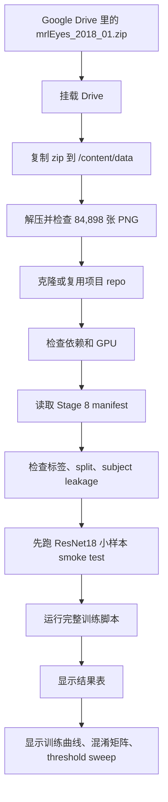

# Stage 9 MRL Eye open/closed notebook 技术学习文档

对应 notebook：

`colab_file/stage9_mrl_eye_training_r.ipynb`

对应训练脚本：

`src/training/train_mrl_eye_baselines.py`

这份文档按技术小白能读懂的方式解释。你可以把它当成“从零读懂 Stage 9 notebook 和训练脚本”的学习笔记。

## 1. 这个 notebook 解决什么问题

Stage 9 训练的是眼睛状态模型。

它不是完整的疲劳驾驶分类器。它只判断一张眼部图片是：

- `closed`：闭眼
- `open`：睁眼

模型最后会输出两个概率：

- `p_eye_closed`
- `p_eye_open`

后续阶段可以把每一帧的 `p_eye_closed` 连起来，做时间平滑、PERCLOS 类似规则、或者和嘴部打哈欠模型融合。

简单说：

```text
一张眼睛图片 -> CNN 模型 -> 闭眼概率 / 睁眼概率
```

## 2. Stage 9 和 Stage 7 的区别

Stage 7 是嘴部 crop 的训练，标签是 `no_yawn` / `yawn`。

Stage 9 是眼睛 crop 的训练，标签是 `closed` / `open`。

| 项目 | Stage 7 | Stage 9 |
|---|---|---|
| 数据 | YawDD+ Dash mouth crops | MRL Eye |
| 目标 | 嘴部是否打哈欠 | 眼睛是否闭合 |
| 标签 | `no_yawn`, `yawn` | `closed`, `open` |
| 模型 | ResNet18, MobileNetV2, EfficientNet-B0 | ResNet18, MobileNetV2, EfficientNet-B0 |
| 主要输出 | mouth/yawn classifier | eye open/closed specialist |

Stage 9 的 notebook 代码比 Stage 7 少，因为真正复杂的训练逻辑放在了外部脚本 `src/training/train_mrl_eye_baselines.py` 里。notebook 主要负责在 Colab 上准备数据、调用脚本、展示结果。

## 3. 整体流程



## 4. 先理解几个关键概念

### 4.1 MRL Eye 数据集

MRL Eye 是一个眼睛开闭状态数据集。这个项目里使用的是一个 zip：

```text
data/mrlEyes_2018_01.zip
```

解压后应该有：

- `annotation.txt`
- subject 文件夹，比如 `s0001`、`s0011`、`s0037`
- 一共 `84,898` 张 PNG 图片

notebook 会专门检查这些内容是否完整。

### 4.2 标签：0 和 1 的含义

Stage 9 里标签固定为：

| 数字 | 名称 | 含义 |
|---:|---|---|
| 0 | `closed` | 闭眼 |
| 1 | `open` | 睁眼 |

这点很重要，因为很多二分类任务默认把 1 当 positive class。但这里我们真正关心的是 `closed`，它的标签是 0。

模型输出 softmax 后有两个概率：

```text
probs[:, 0] = p_eye_closed
probs[:, 1] = p_eye_open
```

### 4.3 false open 和 false closed

Stage 9 很关注两个错误：

| 错误名 | 含义 | 风险 |
|---|---|---|
| false open | 真实是闭眼，但模型预测成睁眼 | 可能漏掉闭眼事件 |
| false closed | 真实是睁眼，但模型预测成闭眼 | 可能误报闭眼 |

在疲劳预警里，false open 特别值得关注，因为它会把真正的闭眼看成睁眼，可能掩盖风险。

### 4.4 threshold 是什么

默认分类方式是 argmax：

```text
哪个概率大，就预测哪个类别
```

比如：

```text
p_eye_closed = 0.62
p_eye_open = 0.38
```

argmax 会预测 `closed`。

但 Stage 9 还做 threshold sweep：

```python
y_pred = np.where(p_closed >= threshold, 0, 1)
```

意思是：

- 如果 `p_eye_closed >= threshold`，预测闭眼。
- 否则预测睁眼。

threshold 越低，模型越容易预测闭眼，closed recall 往往更高，但误报闭眼也可能增加。

threshold 越高，模型越谨慎预测闭眼，误报可能减少，但可能漏掉闭眼。

### 4.5 macro F1

macro F1 是把每个类别的 F1 平均起来。它不会因为某个类别样本多就偏向那个类别。

对于 open/closed 这种二分类，macro F1 比单纯 accuracy 更能反映两类是否都学得好。

### 4.6 smoke test

smoke test 是小规模试跑。它不追求好结果，只检查流程能不能跑通。

Stage 9 先用 ResNet18、1 个 epoch、每个 split 最多 128 张图跑一下。如果这一步都失败，说明路径、依赖、GPU 或训练脚本可能有问题。

## 5. notebook 代码单元逐个解释

## Cell 2：运行配置

这个 cell 定义路径和训练参数。

主要路径：

| 变量 | 含义 |
|---|---|
| `DRIVE_ROOT` | Google Drive 里的项目根目录 |
| `REPO_DIR` | Drive 里保存 repo 的目录 |
| `DRIVE_ZIP` | MRL Eye zip 在 Drive 里的路径 |
| `LOCAL_DATA_DIR` | Colab 本地数据目录 |
| `LOCAL_ZIP` | 复制到本地后的 zip 路径 |
| `MANIFEST` | Stage 8 生成的 split manifest |
| `OUTPUT_DIR` | 完整训练输出目录 |
| `DEBUG_OUTPUT_DIR` | smoke test 输出目录 |

训练参数：

| 参数 | 值 | 含义 |
|---|---:|---|
| `MODELS` | 3 个模型 | ResNet18、MobileNetV2、EfficientNet-B0 |
| `EPOCHS` | 10 | 每个模型最多训练 10 个 epoch |
| `BATCH_SIZE` | 64 | 每次送进模型 64 张图片 |
| `IMAGE_SIZE` | 224 | 输入图片尺寸 |
| `NUM_WORKERS` | 2 | DataLoader 读取图片的进程数 |
| `SEED` | 42 | 固定随机种子 |

注意：

```python
MANIFEST = Path("artifacts/mappings/mrl_eye_trainable_with_split.csv")
```

这个路径是相对于 repo 目录的。后面代码会 `os.chdir(REPO_DIR)`，所以这个相对路径才会成立。

## Cell 3：挂载 Google Drive

```python
from google.colab import drive
drive.mount("/content/drive")
```

这一步让 Colab 可以访问 Drive 中的数据和输出目录。

输出：

```text
Mounted at /content/drive
Drive project root: /content/drive/MyDrive/Drowsiness_Detection_Colab
```

说明 Drive 已挂载。

## Cell 5：复制 MRL Eye zip 到 Colab 本地

这个 cell 做几件事。

### 创建本地目录

```python
LOCAL_DATA_DIR.mkdir(parents=True, exist_ok=True)
OUTPUT_DIR.mkdir(parents=True, exist_ok=True)
DEBUG_OUTPUT_DIR.mkdir(parents=True, exist_ok=True)
```

如果目录不存在就创建。

### 检查 Drive zip 是否存在

```python
if not DRIVE_ZIP.exists():
    raise FileNotFoundError(...)
```

如果 zip 不存在，直接停止。

### 复制 zip

```python
shutil.copy2(DRIVE_ZIP, LOCAL_ZIP)
```

和 Stage 7 一样，训练时最好从 `/content/` 本地读取，而不是一直从 Drive 读。

这次输出：

```text
Copy complete in 0.13 minutes
LOCAL_ZIP size GB: 0.3564
```

### 检查 zip 里面的 PNG 数量

```python
with zipfile.ZipFile(LOCAL_ZIP, "r") as z:
    names = z.namelist()
    pngs = [name for name in names if name.lower().endswith(".png")]
```

这一步不解压，只是检查 zip 内部文件列表。

它还专门数了 `s0011` 的 PNG 数量，因为有些数据问题可能只影响某个 subject 文件夹。

## Cell 6：解压并验证完整性

这个 cell 很重要，它确保 MRL Eye 数据真的可用。

### `EXPECTED_TOTAL_IMAGES`

```python
EXPECTED_TOTAL_IMAGES = 84898
```

项目预期 MRL Eye 应该有 `84,898` 张 PNG。

### `find_mrl_eye_root`

这个函数尝试寻找真正的数据根目录。

它检查几个可能位置：

```python
base_dir / "mrlEyes_2018_01"
base_dir / "dataset" / "mrlEyes_2018_01"
base_dir / "mrlEyes_2018_01" / "mrlEyes_2018_01"
```

为什么要这样写？

因为不同 zip 解压方式可能多包一层文件夹。这个函数让代码更稳，不用手动改路径。

它判断一个目录是不是 MRL Eye root 的条件是：

- 有 `annotation.txt`
- 有 `s0001`
- 有 `s0037`

### `count_pngs`

统计目录下所有 PNG 文件。

### `subject_png_count`

统计某个 subject 文件夹下的 PNG 数。

### `is_complete_mrl_eye_root`

这个函数检查：

- `annotation.txt` 是否存在
- `s0001` 是否有图
- `s0011` 是否有图
- `s0037` 是否有图
- 总 PNG 数是否等于 `84,898`

如果本地数据不完整，会删除不完整目录并重新解压。

这次输出：

```text
MRL Eye root not found.
Local MRL Eye extraction is missing or incomplete. Re-extracting locally...
Extraction complete in 0.31 minutes
MRL Eye completeness checks: {'annotation.txt': True, 's0001_pngs': 3242, 's0011_pngs': 1648, 's0037_pngs': 10257, 'total_png': 84898}
Final DATA_ROOT: /content/data/mrlEyes_2018_01
```

这说明：

- 一开始本地没找到完整数据。
- 代码重新解压。
- 解压后完整。
- 最终数据根目录是 `/content/data/mrlEyes_2018_01`。

## Cell 7：克隆或复用 repo

这个 cell 和 Stage 7 类似。

如果 repo 不存在，就 clone：

```python
git clone --branch main ...
```

如果存在，就复用。

然后：

```python
os.chdir(REPO_DIR)
sys.path.insert(0, str(REPO_DIR))
```

切换到 repo 目录，并让 Python 能找到项目源码。

这次输出：

```text
Repository already exists at /content/drive/MyDrive/Drowsiness_Detection_Colab/repo. Reusing it.
Working directory: /content/drive/MyDrive/Drowsiness_Detection_Colab/repo
```

## Cell 8：检查依赖和 GPU

这个 cell 检查并安装：

- pandas
- scikit-learn
- matplotlib
- tqdm

然后 import PyTorch 和 torchvision，并打印 GPU 信息。

这次输出：

```text
Torch: 2.10.0+cu128
Torchvision: 0.25.0+cu128
CUDA available: True
GPU: Tesla T4
```

说明使用的是 Tesla T4 GPU。T4 比 A100 慢，但跑这个任务仍然可用。

## Cell 10：验证训练输入

这个 cell 检查两个关键输入：

- `DATA_ROOT_STR`：本地解压后的 MRL Eye 目录
- `MANIFEST`：Stage 8 生成的 manifest

输出：

```text
Resolved DATA_ROOT: /content/data/mrlEyes_2018_01 -> OK
Stage 8 manifest: artifacts/mappings/mrl_eye_trainable_with_split.csv -> OK
```

说明路径都存在。

## Cell 11：manifest 小检查

这个 cell 读取 manifest：

```python
df = pd.read_csv(MANIFEST, dtype={"subject_id": str, "sensor_id": str})
```

它把 `subject_id` 和 `sensor_id` 作为字符串读入，避免类似 `001` 被变成数字 `1`。

### 检查行数和列

这次输出：

```text
Rows: 84898
```

刚好对应完整 PNG 数。

manifest 包含这些重要列：

- `image_path`
- `relative_path`
- `filename`
- `subject_id`
- `label`
- `label_name`
- `split`

### 检查标签

输出：

```text
0 closed
1 open
```

说明标签映射正确。

### 检查 split/class 数量

| split | closed | open |
|---|---:|---:|
| train | 29,310 | 29,672 |
| val | 6,333 | 6,696 |
| test | 6,303 | 6,584 |

这个数据比 Stage 7 平衡很多，closed 和 open 数量接近。

### 检查 subject leakage

```python
assert (df.groupby("subject_id")["split"].nunique() == 1).all()
```

意思是：每个 subject 只能属于一个 split。

如果同一个 subject 同时出现在 train 和 test，就说明发生了 subject leakage，评估会变得不可信。

## Cell 12：smoke test

这个 cell 构造命令：

```text
python src/training/train_mrl_eye_baselines.py
  --models resnet18
  --epochs 1
  --batch-size 16
  --max-samples-per-split 128
  --manifest artifacts/mappings/mrl_eye_trainable_with_split.csv
  --data-root /content/data/mrlEyes_2018_01
  --output-dir .../outputs/mrl_eye_debug
  --require-pretrained
```

关键点：

- 只训练 `resnet18`
- 只跑 1 个 epoch
- 每个 split 最多 128 张图
- 输出到 debug 目录
- 必须加载 pretrained weights

`subprocess.run(smoke_cmd, check=True)` 的意思是：运行这个命令，如果返回码不是 0，就抛出错误并停止。

这次返回：

```text
returncode=0
```

说明 smoke test 成功。

## Cell 14：完整训练

这个 cell 构造完整训练命令：

```text
python src/training/train_mrl_eye_baselines.py
  --models resnet18 mobilenet_v2 efficientnet_b0
  --epochs 10
  --batch-size 64
  --image-size 224
  --num-workers 2
  --seed 42
  --manifest artifacts/mappings/mrl_eye_trainable_with_split.csv
  --data-root /content/data/mrlEyes_2018_01
  --output-dir .../outputs/mrl_eye
  --require-pretrained
```

这一步真正训练三个模型。

返回：

```text
returncode=0
```

说明训练脚本成功跑完。

## Cell 15：显示最终指标表

这个 cell 读取：

```text
outputs/mrl_eye/results/mrl_eye_initial_results.csv
```

并展示几个关键列。

这次结果：

| model | best_val_macro_f1 | test_accuracy | test_macro_f1 | test_recall_closed | false_open | false_closed |
|---|---:|---:|---:|---:|---:|---:|
| resnet18 | 0.983722 | 0.984636 | 0.984629 | 0.985880 | 89 | 109 |
| mobilenet_v2 | 0.979108 | 0.986265 | 0.986258 | 0.985245 | 93 | 84 |
| efficientnet_b0 | 0.979115 | 0.986188 | 0.986179 | 0.982389 | 111 | 67 |

如果只看 test macro F1：

1. MobileNetV2：0.986258
2. EfficientNet-B0：0.986179
3. ResNet18：0.984629

但如果看 false open：

1. ResNet18：89
2. MobileNetV2：93
3. EfficientNet-B0：111

所以选择模型时不能只看一个指标。对于闭眼检测，false open 会漏掉闭眼，因此也要重点看。

## Cell 16：显示训练曲线和混淆矩阵

这个 cell 对每个模型展示：

- training curve
- test confusion matrix

路径格式：

```text
figures/{model_name}_training_curve.png
figures/{model_name}_confusion_matrix.png
```

训练曲线帮助看：

- loss 是否下降
- validation macro F1 是否稳定
- 是否出现过拟合

混淆矩阵帮助看：

- 闭眼预测错了多少
- 睁眼预测错了多少

## Cell 17：查看 threshold sweep

这个 cell 读取每个模型的：

```text
{model_name}_val_threshold_sweep.csv
{model_name}_test_threshold_sweep.csv
```

每个 threshold 都会显示：

- accuracy
- macro F1
- precision_closed
- recall_closed
- f1_closed
- precision_open
- recall_open
- f1_open
- false_open_count
- false_closed_count

为什么要看 threshold sweep？

因为眼部闭合模型后续要进入时间融合。如果希望更少漏掉闭眼，可以选择一个更偏向 closed recall 的 threshold。但 threshold 不能用 test set 调，只能用 validation set 选。

这次三个模型都选择了 validation threshold `0.30` 作为候选 threshold。

应用到 test 后：

| model | selected threshold | test macro F1 | test recall_closed | false_open |
|---|---:|---:|---:|---:|
| resnet18 | 0.30 | 0.976021 | 0.990798 | 58 |
| mobilenet_v2 | 0.30 | 0.984786 | 0.987942 | 76 |
| efficientnet_b0 | 0.30 | 0.985173 | 0.986514 | 85 |

可以看到 threshold 0.30 通常提高了 closed recall，并减少 false open，但也可能降低整体 macro F1。

## 6. 训练脚本 `train_mrl_eye_baselines.py` 的核心逻辑

Stage 9 notebook 只是调用脚本，所以真正训练细节在 `src/training/train_mrl_eye_baselines.py`。

下面按脚本内部功能解释。

## 6.1 全局设置

脚本开头设置：

```python
LABEL_TO_NAME = {0: "closed", 1: "open"}
NAME_TO_LABEL = {"closed": 0, "open": 1}
MODEL_NAMES = {"resnet18", "mobilenet_v2", "efficientnet_b0"}
SPLITS = ("train", "val", "test")
THRESHOLDS = [0.30, 0.35, ..., 0.70]
```

这些定义了：

- 支持哪些模型
- 支持哪些 split
- 标签编号
- threshold sweep 的候选阈值

## 6.2 `set_seed`

```python
torch.backends.cudnn.benchmark = False
torch.backends.cudnn.deterministic = True
```

这比 Stage 7 更严格。它要求 cuDNN 尽量使用确定性算法，减少随机性。

好处是结果更可复现。

代价是有时速度会慢一点。

## 6.3 `ensure_output_dirs`

这个函数创建输出目录：

| 子目录 | 内容 |
|---|---|
| `results` | CSV / JSON 指标 |
| `reports` | markdown summary |
| `figures` | 曲线、混淆矩阵、PR 曲线 |
| `checkpoints` | 模型权重 |
| `error_analysis` | 错误样本 contact sheet |

## 6.4 路径解析：`resolve_image_path`

manifest 里的路径可能来自不同机器，不一定能直接用。

这个函数会优先使用：

```python
data_root / relative_path
```

如果找不到，会尝试处理这些情况：

- `relative_path` 里有 `dataset/`
- `relative_path` 里有 `mrlEyes_2018_01/`
- `image_path` 本身是可用绝对路径

这个函数的目的就是：尽可能把 manifest 中的路径修正到当前 Colab 的本地解压目录。

## 6.5 `load_manifest`

这个函数负责读取和验证 manifest。

它会：

1. 检查 CSV 是否存在。
2. 检查必要列：`label`、`split`、`subject_id`。
3. 检查至少有 `image_path` 或 `relative_path`。
4. 只保留 `train`、`val`、`test`。
5. 把 label 转成 int。
6. 确认 label 只有 0 和 1。
7. 如果有 `label_name`，确认它和 label 一致。
8. 解析每一张图片的真实路径。
9. 检查所有图片路径都存在。
10. 如果是 smoke test，可按 split 抽样。

### smoke test 抽样

如果传了：

```text
--max-samples-per-split 128
```

脚本会每个 split 最多取 128 张图，而且尽量每个类别都取一些。这样小测试能快速跑完。

## 6.6 `MRLEyeDataset`

这个 Dataset 每次返回：

```python
return image, label_tensor, index_tensor
```

为什么多返回一个 `index`？

因为后面做 error analysis 时，需要知道预测错的是 test set 里的哪一行，从而找回原始图片路径、subject、标签等信息。

## 6.7 图片 transform

训练 transform：

- `RandomResizedCrop`
- `RandomRotation`
- `RandomAffine`
- `RandomHorizontalFlip`
- `ColorJitter`
- `GaussianBlur`
- `ToTensor`
- ImageNet Normalize

这些增强模拟：

- 眼睛位置轻微变化
- 光照变化
- 轻微模糊
- 水平翻转

验证/测试 transform：

- resize 到 `image_size + 16`
- center crop 到 `image_size`
- ToTensor
- Normalize

验证/测试不能使用随机增强，否则每次结果可能不同。

## 6.8 `make_loaders`

构建四个 DataLoader：

| loader | 数据 | transform | shuffle |
|---|---|---|---|
| `train` | train | 随机增强 | True |
| `train_eval` | train | 确定性 | False |
| `val` | val | 确定性 | False |
| `test` | test | 确定性 | False |

`train_eval` 的意义是：训练完成后用稳定 transform 重新评估训练集，而不是用随机增强的训练 loader。

## 6.9 `build_model`

和 Stage 7 类似，它创建三个模型之一：

- ResNet18：替换 `model.fc`
- MobileNetV2：替换 `model.classifier[-1]`
- EfficientNet-B0：替换 `model.classifier[-1]`

`--require-pretrained` 表示如果预训练权重加载失败，就直接停止，不允许随机初始化。

这样可以保证三组 baseline 都是基于 ImageNet 预训练，不会混入随机初始化结果。

## 6.10 `compute_class_weights`

这个函数根据训练集 closed/open 数量计算 class weights。

MRL Eye 的 closed/open 比较平衡，但加权 loss 仍然能保证两类都被认真对待。

如果训练集缺少某一类，脚本会直接停止：

```python
if (counts == 0).any():
    raise SystemExit(...)
```

## 6.11 混合精度 AMP

脚本里有：

```python
torch.cuda.amp.autocast
torch.cuda.amp.GradScaler
```

AMP 是 Automatic Mixed Precision。它让部分计算用更低精度执行，从而：

- 节省显存
- 提高 GPU 训练速度

`GradScaler` 用来避免低精度训练时梯度太小导致数值下溢。

如果没有 GPU，就不用 AMP。

## 6.12 `train_one_epoch`

这个函数训练一个 epoch。

核心流程：

1. 设置模型为训练模式：`model.train()`。
2. 遍历 batch。
3. 图片和标签放到 GPU。
4. 清空旧梯度：`optimizer.zero_grad(set_to_none=True)`。
5. forward 得到 logits。
6. 计算 loss。
7. backward 反向传播。
8. optimizer 更新参数。
9. 累计 loss 和 accuracy。

返回：

- 平均训练 loss
- batch-level 训练 accuracy

## 6.13 `predict`

这个函数不训练，只预测。

它使用：

```python
@torch.no_grad()
```

表示不记录梯度，省内存、省时间。

它返回：

- `y_true`：真实标签
- `y_pred`：预测标签
- `probs`：softmax 概率
- `indices`：样本索引

`probs` 很关键，因为 threshold sweep 需要用 `p_eye_closed = probs[:, 0]`。

## 6.14 `metrics_from_predictions`

这个函数计算评估指标。

包括：

- accuracy
- macro precision
- macro recall
- macro F1
- weighted F1
- closed precision/recall/F1
- open precision/recall/F1
- confusion matrix
- false open count
- false closed count

混淆矩阵使用标签顺序 `[0, 1]`，也就是：

```text
row 0 = true closed
row 1 = true open
col 0 = predicted closed
col 1 = predicted open
```

所以：

```python
false_open_count = cm[0, 1]
false_closed_count = cm[1, 0]
```

## 6.15 `threshold_sweep`

这个函数遍历：

```python
0.30, 0.35, ..., 0.70
```

对每个 threshold 做：

```python
y_pred = np.where(p_closed >= threshold, 0, 1)
```

然后计算指标。

输出保存成 CSV，方便后面分析。

## 6.16 `select_candidate_threshold`

这个函数只用 validation sweep 选择候选 threshold。

逻辑大概是：

1. 找到默认 threshold `0.50` 的 validation 表现。
2. 找到 validation macro F1 的最大值。
3. 找所有“macro F1 距离最大值不超过 0.02，且 closed recall 不低于默认 0.50”的 threshold。
4. 如果有候选，就选 closed recall 最高的。
5. 如果没有，就选 macro F1 最高的。

这样做的目的：

- 不只追求最高 macro F1。
- 也尽量提高 closed-eye recall。
- 但 threshold 只能从 validation 选，不能用 test 作弊。

## 6.17 错误样本 contact sheet

脚本会把预测错的样本做成 contact sheet 图片。

两种：

- false open：真实闭眼，预测睁眼
- false closed：真实睁眼，预测闭眼

这些图片保存在：

```text
outputs/mrl_eye/error_analysis/
```

看这些图可以帮助判断：

- 是不是标注本身有噪声。
- 是不是眼镜、反光、低光照导致错误。
- 是不是 crop 质量不好。

## 6.18 `train_model`

这是训练单个模型的主函数。

流程：

1. 构建 DataLoader。
2. 创建模型并加载预训练权重。
3. 计算 class weights。
4. 设置 loss。
5. 初始化 checkpoint 路径。
6. 训练若干 epoch。
7. 每个 epoch 用 val macro F1 选择最佳模型。
8. 如果 validation macro F1 不提升，就 early stopping。
9. 加载最佳模型。
10. 对 train / val / test 重新评估。
11. 做 threshold sweep。
12. 保存 history、metrics、图、checkpoint、错误样本图。
13. 返回 summary row。

### 冻结和解冻

脚本里：

```python
frozen = epoch <= args.freeze_epochs
```

默认 `freeze_epochs = 1`，所以第 1 个 epoch 只训练分类头，从第 2 个 epoch 开始微调整个模型。

### 最佳模型标准

Stage 9 用：

```python
best_val_macro_f1
```

作为选最佳 checkpoint 的指标。

这比 Stage 7 的 validation accuracy 更适合 open/closed，因为它更关注两类平衡表现。

## 6.19 `write_combined_outputs`

三个模型都训练完后，这个函数把结果汇总：

- `mrl_eye_initial_results.csv`
- `mrl_eye_metrics_summary.json`
- `mrl_eye_experiment_summary.md`

它还把每个模型的 threshold 选择写进 summary。

## 6.20 `parse_args` 和 `main`

`parse_args` 定义命令行参数，比如：

- `--manifest`
- `--data-root`
- `--output-dir`
- `--models`
- `--epochs`
- `--batch-size`
- `--require-pretrained`

`main` 是脚本入口：

1. 解析参数。
2. 检查模型名是否合法。
3. 设置随机种子。
4. 创建输出目录。
5. 选择 GPU/CPU。
6. 读取 manifest。
7. 逐个训练模型。
8. 写汇总输出。

## 7. 这次结果怎么读

### 默认 argmax 结果

| model | test macro F1 | test recall closed | false open | false closed |
|---|---:|---:|---:|---:|
| ResNet18 | 0.984629 | 0.985880 | 89 | 109 |
| MobileNetV2 | 0.986258 | 0.985245 | 93 | 84 |
| EfficientNet-B0 | 0.986179 | 0.982389 | 111 | 67 |

MobileNetV2 的 macro F1 最高，但 ResNet18 的 false open 最少。

### threshold 0.30 结果

| model | test macro F1 | test recall closed | false open |
|---|---:|---:|---:|
| ResNet18 | 0.976021 | 0.990798 | 58 |
| MobileNetV2 | 0.984786 | 0.987942 | 76 |
| EfficientNet-B0 | 0.985173 | 0.986514 | 85 |

降低 threshold 后，closed recall 提高，false open 减少。代价是某些模型的 macro F1 会下降。

这就是 threshold 的 trade-off：更敏感地抓闭眼，可能带来更多误报。

## 8. 常见问题

### 为什么要复制 zip 到 `/content/data`？

因为 Colab 本地磁盘读取更快。训练时会读取大量图片，如果直接从 Drive 读，速度会慢很多。

### 为什么要检查 PNG 数量是 84,898？

这是数据完整性检查。如果少图，训练结果可能不可信，路径也可能有问题。

### 为什么先 smoke test？

smoke test 能快速发现环境问题。比如：

- 权重下载失败
- manifest 路径错
- 图片路径错
- GPU/依赖问题

如果不先 smoke test，完整训练跑很久后才报错，会浪费时间。

### 为什么 Stage 9 使用外部脚本，而不是把所有训练代码写在 notebook 里？

外部脚本更适合长期维护：

- 可以在本地和 Colab 都运行。
- 可以用命令行参数切换设置。
- notebook 更清爽。
- 训练逻辑更容易复用和版本管理。

### 为什么要看 threshold sweep？

因为后续实时系统可能更关心“不要漏掉闭眼”。默认 argmax 不一定是最适合预警系统的阈值。

### 为什么不能用 test set 选择 threshold？

test set 应该只用于最终评估。如果用 test 来调 threshold，就等于把答案泄露给模型选择过程，结果会偏乐观。

### 为什么 false open 比 false closed 更敏感？

false open 是“真实闭眼却说睁眼”。在疲劳预警任务里，这会漏掉潜在风险。

false closed 是“真实睁眼却说闭眼”。这会导致误报，也不好，但通常更容易通过时间平滑减少。

## 9. 读这个 notebook 时的思维方式

你可以按这个顺序复述整个 Stage 9：

1. 先把 MRL Eye zip 从 Drive 复制到 Colab 本地。
2. 解压，并确认有 `84,898` 张 PNG。
3. 克隆或复用项目 repo。
4. 读取 Stage 8 manifest。
5. 确认 label 是 `0=closed, 1=open`。
6. 确认 subject 没有跨 split 泄漏。
7. 先跑 smoke test，确认训练脚本能跑。
8. 用同一个训练脚本训练三个 CNN。
9. 用 validation macro F1 选择最佳 checkpoint。
10. 用 test set 汇报最终表现。
11. 用 validation threshold sweep 选候选 threshold。
12. 查看 false open / false closed 和错误样本图。

如果你能把这 12 步讲清楚，就已经掌握了 Stage 9 的整体流程。

## 10. 这份 notebook 最重要的技术结论

Stage 9 训练得到的是“眼睛开闭状态模型”，不是完整疲劳检测模型。

它最有价值的输出不是单个图片的最终标签，而是每帧的：

```text
p_eye_closed
```

后续系统真正需要的是把这个概率放到时间轴上看：

- 连续闭眼多久？
- 一段时间内闭眼比例多少？
- 是否和打哈欠同时出现？
- 是否达到预警候选条件？

所以 Stage 9 是后续实时疲劳预警系统的一个基础模块。

